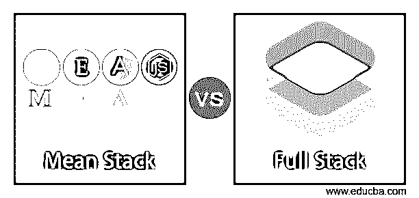
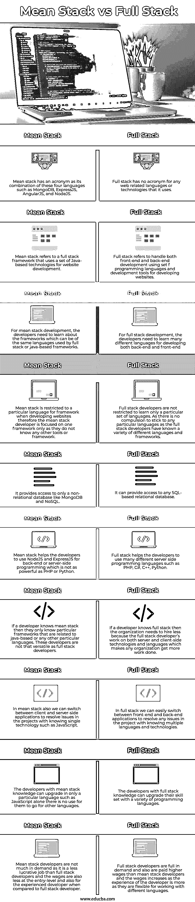

# 平均堆栈与全堆栈

> 原文：<https://www.educba.com/mean-stack-vs-full-stack/>

## 平均堆栈与全堆栈之间的差异

下面的文章提供了平均堆栈与全堆栈的概要。全栈开发定义为使用一组编程语言和工具来开发客户端和服务器端软件的按需软件，以处理两端软件，如 Python、PHP、HTML、JavaScript、Ruby、jQuery 等，用于开发网站开发中的前端和后端，这不是 web 技术的缩写，能够处理这些技术并在设计网站时实现其知识的开发人员称为全栈开发人员。Mean stack development 被定义为使用基于 Java 的技术和框架来开发网站的全栈框架的扩展版本，因此它是某些 web 技术的缩写，从事 MongoDB、AngularJS、ExpressJS 和 NodeJS 等技术的开发人员被称为 mean stack developers。

### 平均堆栈与完整堆栈之间的直接比较(信息图)

以下是平均堆栈与全堆栈之间的 10 大差异:

<small>网页开发、编程语言、软件测试&其他</small>

### 平均堆栈与全堆栈的主要区别

让我们讨论一下平均堆栈与全堆栈之间的一些主要差异:

*   **名称及栈的用法:**全栈通常是指懂得多种编程语言来处理客户端和服务器端的开发者。而 mean stack 是 web technologies 的首字母缩写，被认为是全栈的一个分支。
*   **数据库:** Full stack 可以访问任何基于 SQL 的关系数据库，开发人员可以从数据库中选择更多选项，可以轻松快速地完成项目。而 mean stack 只依赖于 MongoDB，因此开发人员需要学习这种非关系数据库的现代概念，它是开源的，更容易扩展数据。
*   **健壮的服务器端编程语言:**全栈开发使用了 PHP、Python、C#、C++、Java 等健壮的服务器端编程语言。而 mean stack 开发并不使用太多的服务器端编程语言，因为它可以使用诸如 JavaScript 之类的单一语言来完成，因此当使用服务器端编程语言时，它并不健壮。
*   **使用的几种语言:**在全栈开发中，开发人员知道许多不同的语言可以在前端和后端工作，也就是说，有单独的语言用于客户端和服务器端编程，如客户端 HTML、CSS、jQuery 等，服务器端有 PHP、Python、Ruby、C#、C++等，而在平均栈开发中，开发人员只知道一种技术或语言，即 JavaScript，它可以帮助开发人员在前端和后端工作。
*   **开发人员名称:**在任何组织中，如果开发人员是全栈开发人员，那么组织最好雇用这样的开发人员，因为他们也可以在不同的名称中工作，而如果开发人员是普通栈开发人员，那么组织限制他们只能在特定的领域或名称中工作。

### 平均堆栈与全堆栈比较表

让我们来讨论一下平均堆栈与全堆栈之间的主要比较:

| **Sr 号** | **平均堆栈** | **全栈** |
| One | Mean stack 有一个缩写词，是这四种语言如 MongoDB、ExpressJS、AngularJS 和 NodeJS 的组合。 | Full stack 对它使用的任何 web 相关语言或技术都没有缩写。 |
| Two | Mean stack 是指使用一套基于 Java 的技术进行网站开发的全栈框架。 | 全栈指的是使用一套用于开发网站的编程语言和开发工具来处理前端和后端开发。 |
| Three | 对于平均堆栈开发，开发人员需要了解框架，这些框架可以是全堆栈或基于 java 的框架所使用的相同语言。 | 对于全栈开发，开发人员需要学习许多不同的语言来开发后端和前端 |
| Four | 开发网站时，Mean stack 仅限于特定的框架语言，因此，mean stack 开发人员只专注于一个框架，因为他们不知道任何其他工具或框架。 | 全栈开发人员并不局限于只学习一组特定的语言。因为全栈开发人员都知道各种不同的语言和框架，所以没有必要坚持使用任何特定的语言。 |
| Five | 它只提供对 MongoDB 和 NoSQL 这样的非关系数据库的访问。 | 它可以提供对任何基于 SQL 的关系数据库的访问。 |
| Six | Mean stack 帮助开发人员使用 NodeJS 和 ExpressJS 进行后端或服务器端编程，这不如 PHP 或 Python 强大。 | 全栈帮助开发者使用许多不同的服务器端编程语言，如 PHP、C#、C++、Python。 |
| Seven | 如果开发人员知道 mean stack，那么他们只知道与基于 java 或任何其他特定语言相关的特定框架。这些开发人员不像全栈开发人员那样多才多艺。 | 如果一个开发人员了解全栈，那么组织需要雇用更少的人，因为全栈开发人员在服务器端和客户端技术和语言方面的工作可以让任何组织完成更多的工作。 |
| Eight | 在 mean stack 中，我们还可以在客户端和服务器端应用程序之间切换，通过了解单一技术(如 JavaScript)来解决项目中的问题。 | 在全栈中，我们可以轻松地在前端和后端应用程序之间切换，通过了解多种语言和技术来解决项目中的任何问题。 |
| Nine | 具有一般堆栈知识的开发人员只能升级特定的语言，例如 JavaScript，他们没有必要去升级其他语言。 | 拥有完整堆栈知识的开发人员可以用各种编程语言升级他们的技能。 |
| Ten | 意味着堆栈开发人员的需求不大，因为这是一个不如全栈开发人员有利可图的工作，而且与全栈开发人员相比，入门级和有经验的开发人员的工资也较低。 | 全栈开发人员需求量很大，工资也比一般的栈开发人员高，而且工资随着开发人员的经验增加而增加，因为他们可以灵活地使用不同的语言。 |

### 结论

在本文中，我们得出结论，当使用客户端和服务器端编程语言时，全栈和平均栈之间的差异并不大，这使得开发人员在了解不同的语言方面很健壮。在全栈中，开发人员知道许多语言，并且能够与任何语言一起工作，但是在普通栈中，他们坚持使用特定的语言或框架，这并不能使普通栈开发人员成为多才多艺的开发人员。

### 推荐文章

这是平均堆栈与全堆栈的指南。在这里，我们通过信息图和比较表来讨论平均堆栈和完整堆栈的主要区别。您也可以看看以下文章，了解更多信息–

1.  [堆栈 vs 队列](https://www.educba.com/stack-vs-queue/)
2.  [Shopify vs Squarespace](https://www.educba.com/shopify-vs-squarespace/)
3.  [Dynatrace vs 新遗迹](https://www.educba.com/dynatrace-vs-new-relic/)
4.  [围棋 vs 红宝石](https://www.educba.com/go-vs-ruby/)

