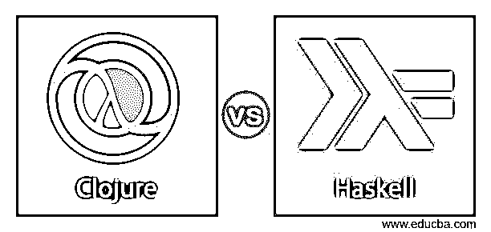
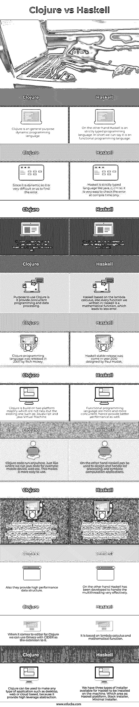
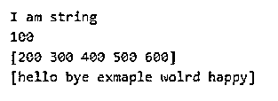

# Clojure vs Haskell

> 原文：<https://www.educba.com/clojure-vs-haskell/>

## Clojure 和 Haskell 的区别

下面的文章提供了 Clojure vs Haskell 的概要。Clojure 是一种编程语言，基于 java 平台。Clojure 是一种动态的现代编程语言，被许多程序员和组织使用，如沃尔玛、亚马逊等。另一方面，Haskell 也是一种通用编程语言，但它是一种函数式编程语言，它也基于 lambda 演算。它于 1990 年推出。如果我们用 Haskell 编写一个程序，它将总是以数学函数的形式表示，这些函数有它们的好处。

### Clojure 与 Haskell 的面对面比较(信息图)

以下是 Clojure 与 Haskell 之间的 11 大区别:

<small>网页开发、编程语言、软件测试&其他</small>

### Clojure 和 Haskell 的主要区别

让我们讨论一下 Clojure 和 Haskell 之间的一些主要区别:

因为现在我们已经知道两者都是通用编程语言。但是两者都基于不同的平台，在语法、特性等方面也有所不同。在这里，我们将了解它们是什么以及如何使用它们。我们还将看到它们的语法如何使用这两种语言定义函数和变量。

*   如果我们谈论 Clojure，它只利用了现有的平台。它没有任何新的平台，而是建立在现有的平台上，如 javascript 和 java 虚拟机。它基本上是为了提供高需求的并发编程和数据处理而设计的，也是影响应用程序性能的因素。如果我们谈论并发性，那么它就像任何普通的编程语言，如 Java、PHP 等。通过使用并发性，我们可以同时处理多个或几个线程，从而提高应用程序的性能。
*   另一方面，我们有 Haskell，它是一种纯粹的函数编程语言。基于数学函数用 Haskell 编写的函数，有利于减少错误。

如果我们使用这种语言，它会提供各种好处，如下所述:

1.  如果我们用 Haskell 编写任何应用程序，它将为我们提供更高的可靠性和更少的错误。
2.  通过使用它，我们可以提高开发人员的生产力。
3.  用 Haskell 编写的代码易于阅读、更新、易于维护，而且非常清晰。

*   Clojure 为我们提供了高性能的数据结构，这种数据结构本质上是不可变的，这意味着它们一旦被创建就不能被更改。如果我们试图创建它们的副本并试图修改它们，这是相当昂贵的。同样，在 Clojure 中，它们为我们提供了并发原语，这些原语可以用于我们需要处理几个线程并发环境。在 Clojure 中并发原语很容易利用多核。
*   正如我们现在已经知道的，Haskell 是函数式编程，所以这提供了易于维护的优势，并且在应用程序中具有高度的可修改性。Haskell 提供的另一个优势是，如果您想用 Haskell 开发规范或原型，那么它可以很容易地执行、调试和测试。

#### 示例 1: Clojure

下面你可以看到在 Clojure 中定义各种类型的简单和示例语法并打印它们。

**语法:**

`(println "I am string")
(println 100)
(println [200, 300 , 400, 500, 600])
(println ["hello", "bye", "exmaple", "wolrd", "happy"])`

**输出:**

#### 例子 2: Haskell

**语法:**

`main = putStrLn "i am string in haskell language"`

**输出:**

### Clojure vs Haskell 比较表

我们来讨论一下 Clojure 和 Haskell 的顶级对比:

| **Clojure** | 哈斯克尔 |
| Clojure 是一种通用动态编程语言。 | 另一方面，Haskell 是一种严格类型化的编程语言。简而言之，我们可以说它是一种函数式编程语言。 |
| 因为它是动态的，所以我们很难找到错误。 | Haskell 像 java、c、c++一样是严格类型的语言，所以只在编译时检查错误是非常容易的。 |
| 许多组织都使用 Clojure，如沃尔玛、Groupon、亚马逊等。 | 另一方面，Haskell 被 Wagon、thought-out 和 DoxIQ 使用。 |
| 使用 Clojure 的目的是它提供并发编程和数据处理。 | Haskell 基于 lambda 演算，而且我们用 Haskell 写的每个函数都是数学函数，这导致了更少的错误。 |
| Clojure 编程语言由 Rich Hickey 于 2007 年发布。 | Haskell 稳定版是在 2010 年由 Paul Hudak 设计的。 |
| Clojure 主要建立在两个平台上，这两个平台都不是新的，而是现有的，如:javaScript 和 Java 虚拟机。 | 函数式编程语言越来越并行，因此也提供了更好的性能。 |
| Clojure 代码可以在任何地方运行。就像我们运行 java 代码的地方，例如移动设备、web 等。这使得它更容易使用。 | 另一方面，Haskell 可以用来设计和处理列表处理和符号计算应用程序。 |
| 它也为我们提供了并发原语。这些原语可以在并发环境中进一步使用。这将有助于我们同时处理几个线程。因此也给了我们更好的性能。 | Some of the features which are provided by Haskell which make it better choice to use over Java, C and another programming like:模块化、懒惰、函数式语言、可维护性等等。 |
| 此外，它们还提供了高性能的数据结构。 | 另一方面，Haskell 被开发来非常有效地处理多线程。 |
| 说到 Clojure 的编辑器，我们可以使用 Emacs 和 CIDER 作为它的扩展。 | 它基于 lambda 微积分和数学函数。 |
| Clojure 可用于创建任何类型的应用程序，如桌面、web 或基于云的应用程序，因为它提供了高杠杆的抽象。 | 我们有三种类型的安装程序可供 Haskell 安装在机器上。Haskell 平台，堆栈安装程序，最小安装程序。 |

### 结论

正如我们在文章中所讨论的，两种语言相互之间都有一些优点和缺点。它们可以根据需要使用，一个是基于功能的，另一个是动态的。一个用于数据处理，另一个基于 lambda 演算。我们可以根据我们的要求和需要选择其中之一。

### 推荐文章

这是 Clojure vs Haskell 的指南。这里我们分别用信息图和比较表来讨论 Clojure 和 Haskell 的关键区别。您也可以看看以下文章，了解更多信息–

1.  [堆栈 vs 队列](https://www.educba.com/stack-vs-queue/)
2.  [Shopify vs Squarespace](https://www.educba.com/shopify-vs-squarespace/)
3.  [Dynatrace vs 新遗迹](https://www.educba.com/dynatrace-vs-new-relic/)
4.  [围棋 vs 红宝石](https://www.educba.com/go-vs-ruby/)

