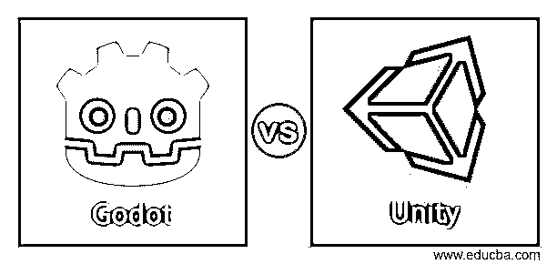
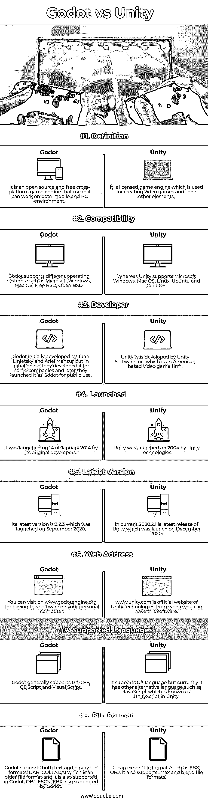

# 戈多 vs 统一

> 原文：<https://www.educba.com/godot-vs-unity/>

## 戈多与统一的区别

Godot vs Unity 现在在你的脑海中浮现，答案是两者都是用于设计和创作视频游戏的游戏引擎，但如果我们谈论 Godot，那么它是一个在跨平台上工作的开源游戏引擎，而 Unity 是授权的游戏引擎。Godot 由麻省理工学院授权发布，最初由 Linietsky 和 Ariel Manzur 为几家公司开发，但后来在 2014 年 1 月 14 日发布供公众使用。另一方面，Unity 是由 Unity 软件公司作为授权游戏引擎发布的。

### Godot 与 Unity 的正面比较(信息图)

以下是 Godot 和 Unity 的 8 大区别:

<small>网页开发、编程语言、软件测试&其他</small>

### 戈多与统一的主要区别

让我们讨论一下 Godot 和 Unity 之间的一些主要区别:

在这些软件的关键差异中，我们将获得关于两个软件的一些功能的信息，以便我们可以识别两个软件在不同方面的能力和工作能力。

在这里，我们可以看到这两个软件之间的一些细微差异，如下所示:

*   听起来不错，Godot 是免费使用的，并得到了麻省理工学院的许可，这意味着你必须在你的项目中使用版权麻省理工学院，最好的事情是，你不需要安装它，因为被许可的软件 Unity 对新用户是免费的，而且对初学者也有警告，你的收入或项目资金一年不能超过 10 万美元。有了 Unity 的这个有限免费版本，你可以在你的游戏设计工作中享受它的陪伴，但是这个免费版本提供的支持和服务可能有限。但是如果你想获得 Unity 提供的软件的所有服务，你必须每月支付 125 美元。
*   在 Unity Visual Studio 或 VS 中，代码是作为第三方工具工作的，而在 Godot 中，你可以找到用于 Android 导出的外部编辑器和 Android SDK。
*   Godot 在场景系统领域取得了成功，这意味着 Godot 拥有非常有效的场景系统，该系统拥有良好的节点集合，并且所有节点都有自己的用途，例如用于精灵、灯光、网格等等。在 Godot 中，节点以树形系统排列，你可以用不同的场景组成整个项目的场景，这些场景存储在不同的文件中。在 Unity 中，所有资源都嵌入在场景、组件以及用于链接它们的脚本中。
*   Godot 使用 Python-lite 脚本作为它的语言，C#作为额外的语言被添加来提高它的工作质量，你也可以在 Godot 中找到可视化编程语言。最初 Unity 有 UnityScript 和 Boo(和 Python 语言一样)作为它的支持语言，但是现在 C#也是它的附加语言。你可以在 it 开发语言中看到可视化脚本。
*   作为一个初学使用游戏引擎的人，Godot 的 GDScript 比其他游戏设计软件更容易帮助你开始学习。你可以选择 Unity，因为你在这个软件中发现了几乎相同的功能。

### Godot 与 Unity 对比表

让我们讨论一下 Godot 与 Unity 之间的顶级对比:

|  | **戈多** | **统一** |
| 定义 | 这是一个开源和免费的跨平台游戏引擎，这意味着它可以在移动和 PC 环境下工作。 | 它是授权的游戏引擎，用于创建视频游戏和其他元素。 |
| 和睦相处 | Godot 支持微软 Windows、Mac OS、免费 BSD、开放 BSD 等不同操作系统。 | 而 Unity 支持微软 Windows、Mac OS、Linux、Ubuntu 和 Cent OS。 |
| 开发者 | Godot 最初是由 Juan Linietsky 和 Ariel Manzur 开发的，但在最初阶段，他们为一些公司开发了它，后来他们将其作为 Godot 推出供公众使用。 | Unity 是由 Unity 软件公司开发的，该公司是一家美国视频游戏公司。 |
| 发射 | 它由最初的开发者于 2014 年 1 月 14 日推出。 | Unity 由 Unity Technologies 于 2004 年推出。 |
| 最新版本 | 其最新版本是 2020 年 9 月上线的 3.2.3。 | 目前的 2020.2.1 是 Unity 的最新版本，于 2020 年 12 月发布。 |
| 网址 | 你可以访问 www.godotengine.org，在你的个人电脑上安装这个软件。 | www.unity.com 是统一技术的官方网站，从那里你可以有这个软件。 |
| 支持的语言 | Godot 一般支持 C#、C++、GDScript、可视化脚本。 | 它支持 C#语言，但目前它有其他替代语言，如 JavaScript，在 Unity 中称为 UnityScript。 |
| 文件格式 | Godot 支持文本和二进制文件格式。DAE (COLLADA)是一种较旧的文件格式，它在 Godot 中也受支持。OBJ、ESCN、FBX 也得到戈多的支持。 | 它可以导出文件格式，如 FBX，OBJ。它还支持。max 和 blend 文件格式。 |

### 结论

今天看完这篇文章后，你会发现更多的信息，让你对这两个软件的特性有一个清晰的认识，这有助于我们选择其中一个软件来做游戏设计。现在你可以用你自己的观点来看待这些软件，并使用其中的任何一个。

### 推荐文章

这是戈多 vs 统一的指南。这里我们分别用信息图和比较表来讨论 Godot 和 Unity 的关键区别。您也可以看看以下文章，了解更多信息–

1.  [Alexa vs Siri](https://www.educba.com/alexa-vs-siri/)
2.  [SharePoint vs OneDrive](https://www.educba.com/sharepoint-vs-onedrive/)
3.  [Shopify vs Squarespace](https://www.educba.com/shopify-vs-squarespace/)
4.  [核心 Java vs Java](https://www.educba.com/core-java-vs-java/)

