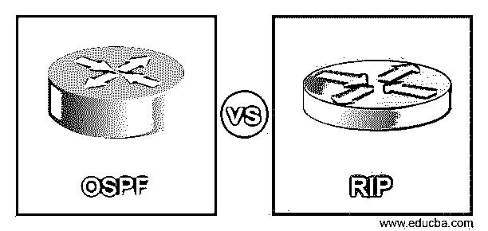
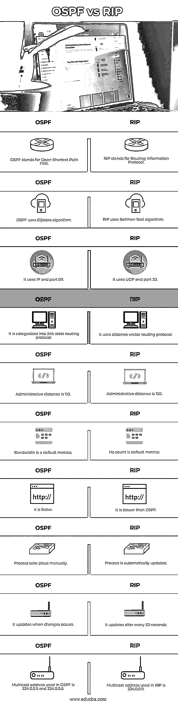

# OSPF 对瑞普

> 原文：<https://www.educba.com/ospf-vs-rip/>

## OSPF 与 RIP 的区别

下面的文章提供了 OSPF vs RIP 的概要。OSPF 和 RIP 是内部网关路由协议，它们在许多方面都有所不同。路由协议规定了路由器在与其它路由器交互以获取路径和维护路由表中的网络时必须遵守的规则。它们之间的主要区别是 OSPF 属于链路状态路由，而 RIP 属于矢量路由协议。

OSPF 代表开放最短路径优先，是一种链路状态和分层 IGP 路由协议算法。OSPF 增强了 RIP 的版本，包括负载均衡、多路径路由和最低成本路由等功能。它的负载平衡功能平均分配所有流量路由。为了促进增长和简化管理，OSPF 将网络和路由器划分为子集和区域。OSPF 涉及服务路由类型，这意味着可以根据服务的优先级或类型安装多条路由。路由是通过在路由器中维护具有链路状态信息的数据库来完成的，并且路由使用链路状态和 IP 地址计算的权重。为了更新数据库，链路状态从自治系统传送到路由器。之后，根据存储在数据库中的信息，每个路由器构建最短路径树作为根节点。OSPF 启用认证机制，它提供两种认证方法，即 MD5 算法和简单密码。OSPF 支持特定于子网的无类路由、特定于有类网络路由和主机。

<small>网页开发、编程语言、软件测试&其他</small>

RIP 代表路由信息协议，在本地网络中使用矢量路由协议。每 30 秒后，它会向所有活动接口发送路由表。为了找到最佳路由，它使用跳数。希望计数限制为 15。有两种类型的 RIP 版本 RIP 版本 1 和 RIP 版本 2。RIP 使用四种类型的计时器，即更新计时器、无效计时器、抑制计时器和刷新计时器。更新计时器指定路由器发送路由表更新频率。默认值为 30。无效计时器定义了路由在被视为无效之前可以保留在路由表中的时间，如果现在有新的更新知道该路由的话。默认值为 180 秒。抑制计时器定义禁止路由接收更新的时间。在抑制状态下，RIP 不会收到任何新的更新。刷新计时器定义当没有收到新的更新时，路由在被刷新之前可以在路由表中保留多长时间。默认值为 240 秒。

### OSPF 与 RIP 之间的直接对比(信息图)

以下是 OSPF 与 RIP 之间的 10 大差异:

### OSPF 与 RIP 的主要区别

让我们讨论一下 OSPF 与 RIP 之间的一些主要区别:

*   管理距离用于衡量路由器从邻居路由器收到的路由信息的真实性。此管理距离可以在 0 到 255 之间变化，其中 0 表示更可信的整数，255 表示不允许任何流量通过此路由。对于 RIP，管理值为 120，而对于 OSPF，管理值为 110。
*   在 OSPF，跳数没有限制，而在 RIP 中，跳数限制为 15。
*   相比之下，RIP 的收敛速度较慢，而 OSPF 的收敛速度很快。
*   OSPF 依靠带宽来确定路由的最佳路径，而 RIP 依靠跳数来确定最佳路径。
*   在路由总结中，允许使用单个路由 gable 条目来说明 IP 网络号的集合。OSPF 支持手动总结，而 RIP 支持自动总结。

### OSPF 与 RIP 对比表

我们来讨论一下 OSPF vs RIP 的顶级对比:

| **OSPF** | **RIP** |
| OSPF 主张开放最短路径优先。 | RIP 代表路由信息协议。 |
| OSPF 使用 Dijkstra 算法。 | RIP 使用贝尔曼福特算法。 |
| 它使用 IP 和端口 89。 | 它使用 UDP 和端口 20。 |
| 它分为链路状态路由协议。 | 它使用距离矢量路由协议。 |
| 管理距离是 110。 | 管理距离是 120。 |
| 带宽是默认的度量标准。 | Ho 计数是默认指标。 |
| 它更快。 | 它比 OSPF 慢。 |
| 过程手动进行。 | 流程会自动更新。 |
| 当发生变化时，它会更新。 | 它每 30 秒更新一次。 |
| OSPF 使用的组播地址是 224.0.0.5 和 224.0.0.6。 | RIP 中使用的组播地址是 224.0.0.9。 |

### 结论

OSPF 和 RIP 的主要区别在于，OSPF 属于链路状态路由，而 RIP 属于距离矢量路由。在本文中，我们已经借助比较表和主要差异介绍了 OSPF 和 RIP 之间的主要区别。

### 推荐文章

这是一个 OSPF vs RIP 的指南。在这里，我们分别用信息图和比较表来讨论 OSPF 和 RIP 的主要区别。您也可以看看以下文章，了解更多信息–

1.  [JavaScript vs JScript](https://www.educba.com/javascript-vs-jscript/)
2.  [CSS vs JavaScript](https://www.educba.com/css-vs-javascript/)
3.  [C# vs JavaScript](https://www.educba.com/c-sharp-vs-javascript/)
4.  [JavaScript vs JQuery](https://www.educba.com/javascript-vs-jquery/)

