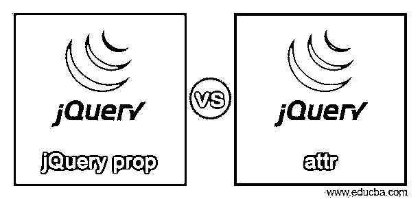
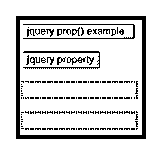
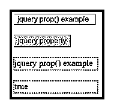
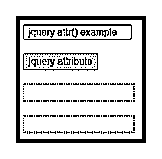
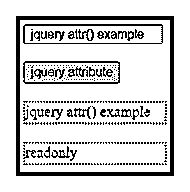

# jQuery 属性与属性

> 原文：<https://www.educba.com/jquery-prop-vs-attr/>




## jQuery 属性与属性的区别

*   jquery prop()是属性的缩写，jquery attr()是属性的缩写。
*   jquery prop()方法被设置并返回给定 HTML 元素的属性。
*   jquery attr()方法返回引用 DOM(文档对象模型)树的元素的属性值。
*   jquery attr()方法基于 HTML 页面和初始化的 DOM 树值。
*   jquery prop()方法基于显示文档对象模型值。
*   属性方法返回应用程序的当前输出，而属性方法返回属性的原始值。
*   Jquery prop()和 attr()方法有助于操纵 HTML 和 CSS 元素。
*   Jquery prop()和 attr()方法适用于 HTML 和 XML 文件。

### jQuery prop 与 attr 的正面比较(信息图表)

以下是 jQuery prop 和 attr 之间的主要区别


<small>网页开发、编程语言、软件测试&其他</small>

### 对照表

下表显示了这两种 jquery 方法的比较。

| **特性** | **Jquery prop()方法** | Jquery attr()方法 |
| **缩写** | jquery“prop”是该属性的缩写。 | jquery“attr”是属性的缩写。 |
| **定义** | jquery prop()方法根据 DOM 树返回元素的属性值。 | jquery attr()方法被设置并返回元素的属性值。 |
| **方法** | jquery 属性是操纵 HTML 和 CSS 的方法 | jquery 属性是操纵 HTML 和 CSS 的方法 |
| **语法** | ·         Return the property value.

```
$(" jquery selector ").prop(property )
```

设置属性值。

```
$(" jquery selector ").prop(property, value )
```

设置多个属性值。

```
$(" jquery selector ").prop({property: value, property: value} )
```

 | .   Return the attribute value.

```
$(" jquery selector ").attr(" attribute" )
```

.设置属性值。

```
$(" jquery selector ").attr (attribute, value )
```

.设置多个属性值。

```
$(" jquery selector ").attr ({attribute: value, attribute: value} )
```

 |
| **Jquery 文件** | The user can use from jquery 1.11.3 file to the latest version of the jquery file.

```
<script src = "https://ajax.googleapis.com/ajax/libs/jquery/3.5.1/jquery.min.js">
</script>
```

 | 用户可以使用从 jquery 1.11.3 文件到最新版本的 jquery 文件。

```
<script src = "https://ajax.googleapis.com/ajax/libs/jquery/3.5.1/jquery.min.js">
</script>
```

 |
| **功能** | ·         Get the current value of the property element.设置属性元素的当前值。 | .     Get the original value of the attribute element..设置属性元素的原始值。 |
| **描述** | Display HTML attribute in browser with style called as property.jquery 属性显示诸如 align、autofocus 等值。 | <input type = “text” value = “write…” />类型和值是 HTML 页面的属性。 |
| **参数** | Jquery 属性需要一个参数来放置属性及其值。 | JQuery 属性需要一个参数来放置属性及其值。 |
| **工作程序** | ·         Use a jquery file with a script tag.将 HTML 属性和特性放在标记内。在脚本标记中使用 jquery prop()方法。将属性和值放在属性方法中。 | .  Use a jquery file with a script tag.

.初始化标签内的 HTML 属性。

.在脚本标记中使用 jquery attr()方法。

.将属性和值放在属性方法中。

 |
| **优缺点** | ·         Change the value of a property using the DOM tree.使用 DOM 树返回属性值。属性返回 DOM 的当前值。属性返回布尔值、数字和字符串值。 | .    Change the value of attributes in the HTML tag..返回 HTML 标签中的属性值。.属性返回原始值。

.该属性返回设置值，如字符串、数字。

 |
| **例子** | 

```
<!DOCTYPE>
<html>
<head>
<script src="https://ajax.googleapis.com/ajax/libs/jquery/3.5.1/jquery.min.js"></script>
<style>
input{
width: 150px;
height: 20px;
}
div{
width: 150px;
height: 20px;
border: 2px dotted blue;
color:red;
}
</style>
</head>
<body>
<input id = "attru" type = "text " value =" jquery prop() example"  readonly ="readonly"><br>
<br>
<button> jquery attribute </button> <br> <br>
<div id="div1"> </div><br>
<div id="div2"> </div>
<script>
$(document).ready(function(){
$("button").click(function(){
$("#div1").html($("#attru").prop("value"));
$("#div2").html($("#attru").prop("readonly"));
});
});</script>
</body>
</html>
```

 | 

```
<!DOCTYPE>
<html>
<head>
<script src="https://ajax.googleapis.com/ajax/libs/jquery/3.5.1/jquery.min.js"></script>
<style>
input{
width: 150px;
height: 20px;
}
div{
width: 150px;
height: 20px;
border: 2px dotted blue;
color:red;
}
</style>
</head>
<body>
<input id = "attru" type = "text " value =" jquery attr() example"  readonly ="readonly"><br>
<br>
<button> jquery attribute </button> <br> <br>
<div id="div1"> </div><br>
<div id="div2"> </div>
<script>
$(document).ready(function(){
$("button").click(function(){
$("#div1").html($("#attru").attr("value")) + '</br>';
$("#div2").html($("#attru").attr("readonly"));
});
});
</script>
</body>
</html>
```

 |
| **输出** | **Before property method**


**在属性方法之后**


 | **Before attribute method**


**在属性方法之后**


 |
| **使用** | ·         Return the value of the Html page and property.设置要在浏览器中显示的 HTML 页的属性。显示功能是否使用布尔值。 | .     Initialize the original value inside of the HTML tag..修改 HTML 页面的原始功能 |

### 主要差异

*   jquery 属性方法返回页面的即时值。显示当前工作功能是否可用。
*   jquery 属性方法返回页面的原始值。它会显示并修改原始值。
*   jquery 属性方法与 DOM 树相关，因此 jquery 属性与 HTML 页面相关，很少与 DOM 树相关。
*   jquery 属性显示在 HTML 标记中，因此 jquery 属性显示在浏览器中。
*   jquery 属性在页面上使用 attr()方法。jquery 属性在页面上使用 prop()方法。
*   jquery attr()方法返回字符串、数字和给定值。jquery prop()方法返回字符串、数字和布尔值。
*   属性是标记中的类型、id 和值。属性是对齐的、自动聚焦的，并且在标签中。
*   jquery 属性方法比 jquery 属性方法更受欢迎，也更有用。
*   jquery 属性方法对于应用程序的设计者或用户来说很容易。
*   只有开发人员需要 jquery 属性，用户不需要。
*   在某些情况下，jquery prop()方法可以替换为 jquery attr()方法。
*   attr()方法不能用 jquery prop()方法替换方法。

### 结论

*   jquery prop()方法和 attr()方法对于 web 应用程序值很有用。
*   这两种方法适用于任何类型的 web 应用程序表单。
*   jquery prop()方法和 attr()方法有助于与用户进行交互。

### 推荐文章

这是 jQuery prop vs attr 的指南。这里我们用信息图和比较表来讨论 jQuery prop 和 attr 的区别。您也可以看看以下文章，了解更多信息–

1.  [Figma vs Sketch](https://www.educba.com/figma-vs-sketch/)
2.  [苗条 vs 反应](https://www.educba.com/svelte-vs-react/)
3.  [熊猫合并 vs 加入](https://www.educba.com/pandas-merge-vs-join/)
4.  [Tekla vs Revit](https://www.educba.com/tekla-vs-revit/)


