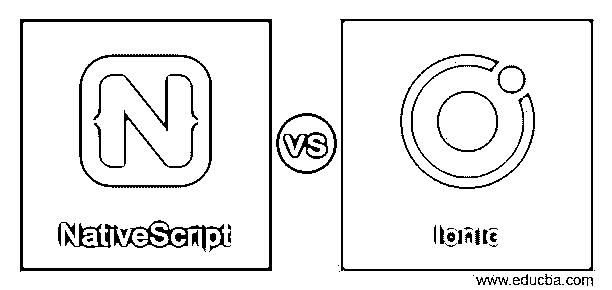
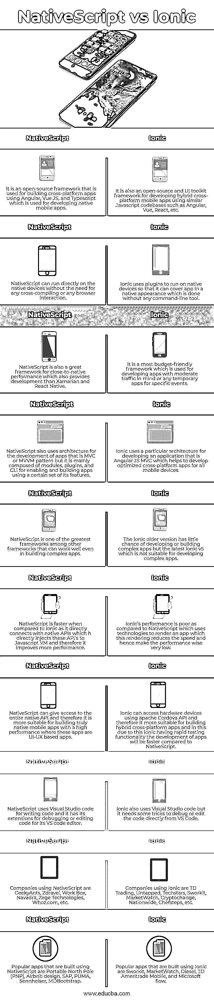

# 原生脚本与离子脚本

> 原文：<https://www.educba.com/nativescript-vs-ionic/>

## NativeScript 与 Ionic 的区别

NativeScript 可以定义为使用 Angular，Typescript，Javascript 开发原生移动应用程序的框架，它是一个开源的，可以直接与原生 API 通信，这意味着它可以为 Android 和 iOS 移动应用程序开发跨平台的应用程序，也可以使用各种其他应用程序开发编程语言从一种编程语言转换到另一种编程语言。Ionic 被定义为一个 UI 工具包，它是开源的，用于构建或创建混合跨平台的应用程序，其中该框架使用类似的 Javascript 代码库，如 Angular、React、Vue 等，主要以其 DOM 操作的高效性能而闻名。

### NativeScript 与 Ionic 的直接对比(信息图表)

以下是 NativeScript 与 Ionic 之间的 10 大差异:

<small>网页开发、编程语言、软件测试&其他</small>

### NativeScript 与 Ionic 的主要区别

下面列出了 NativeScript 与 Ionic 之间的一些主要差异:

#### 1.表演

NativeScript 动画或应用程序在 60 FPS 时表现良好，没有遇到任何困难，并且还提供了某些类型的长时间运行的进程，以保持快速性能的平衡速度，一些提高性能的做法是合并手动工具检测和应用程序内执行时间的跟踪。而 ionic 开发的应用程序也为移动和桌面应用程序提供了 60 FPS 的出色性能，因为它使用了一些插件和混合方法来加快开发过程中的性能，并且这个 Ionic 是一个非本机框架，提供触摸优化、预渲染、硬件加速过渡等。

#### 2.学习和理解框架

NativeScript 使开发人员或初学者易于学习，他们可以轻松地在 Angular JS、Typescript、Javascript 之间切换，因此，使开发人员或初学者在学习和理解方面更加可行和兼容，主要是他们必须学习核心模块和设计模式，但有时对于有资源和开发的初学者来说可能有点困难，因为他们可以发现它更容易和有用。鉴于 Ionic 对于初学者或开发者来说更容易学习和理解，因为它使用 HTML、CSS，这非常容易，并且它为 Angular 提供了动手操作，因此它使初学者更容易学习。初学者唯一应该学习的是 Cordova 插件和 CLI。

#### 3.一些有用的功能

原生脚本主要用于访问使用 Javascript 的原生 API 和组件。它提供了本机平台布局和高性能。它是一个用于在各种不同平台上开发应用程序的代码库，并提供无缝的用户体验。而 Ionic 具有诸如它提供快速开发测试周期的特征，这是因为它具有快速的功能性。这也为 Apache Cordova 提供了一个非常大的插件，并且有巨大的社区支持。这也有用于网络应用、Windows、Android 和 iOS 的单一代码库。这主要使用 Angular JS 来处理或创建定制的组件，并提供良好的性能。

### 原生脚本与离子比较表

| **原生脚本** | **离子型** |
| 它是一个开源框架，用于使用 Angular、Vue JS 和 Typescript 构建跨平台应用程序，Typescript 用于开发本地移动应用程序。 | 它也是一个开源的 UI 工具包框架，用于使用类似的 Javascript 代码库(如 Angular、Vue、React 等)开发混合的跨平台移动应用程序。 |
| NativeScript 可以直接在本机设备上运行，无需任何交叉编译或任何浏览器交互。 | Ionic 使用插件在本机设备上运行，这样它就可以用本机外观覆盖 app，而这是在没有任何命令行工具的情况下完成的。 |
| NativeScript 也是一个很好的接近原生性能的框架，它提供了比 Xamarian 和 React Native 更好的开发。 | 这是一个预算最友好的框架，用于开发中等流量的应用程序或任何特定事件的临时应用程序。 |
| NativeScript 也使用 MVC 或 MVVM 模式的架构来开发应用程序，但它主要由模块、插件和 CLI 组成，用于支持和构建使用其特定功能集的应用程序。 | Ionic 使用一种特殊的架构来开发 Angular JS MVC 应用程序，这有助于为所有移动设备开发优化的跨平台应用程序。 |
| NativeScript 是其他框架中最伟大的框架之一，即使在构建复杂的应用程序时也能很好地工作。 | Ionic 旧版本开发或构建复杂应用的可能性很小，但最新的 ionic v5 不适合开发复杂的应用。 |
| 与 ionic 相比，NativeScript 速度更快，因为它直接与本机 API 连接，后者直接将这些 API 注入 Javascript VM，因此它提高了更多性能。 | 与 NativeScript 相比，Ionic 的性能很差，native script 使用技术来渲染应用程序，这种渲染降低了速度，因此使性能非常低。 |
| NativeScript 可以提供对整个原生 API 的访问，因此它更适合于构建真正的高性能原生移动应用，其中这些应用是基于 UI-UX 的应用。 | Ionic 可以使用 apache Cordova API 访问硬件设备，因此它更适合构建混合跨平台应用程序，在这方面，由于 ionic 具有快速测试功能，应用程序的开发将比 NativeScript 更快。 |
| NativeScript 使用 Visual Studio 代码来编写代码，并为其 VS 代码编辑器提供了调试或编辑代码的扩展。 | Ionic 也使用 Visual Studio 代码，但它需要一些技巧来直接从 VS 代码中调试或编辑代码。 |
| 使用 NativeScript 的公司有 GeekyAnts、Zdravel、Work Box、Navadra、Zege Technologies、Whoz.com 等。 | 使用 Ionic 的公司有 TD Trading、Untapped、Techstars、Sworkit、MarketWatch、Cryptochange、Nationwide、Chefsteps 等。 |
| 使用 NativeScript 构建的流行应用有便携北极(PNP)、Airbnb design、SAP、PUMA、Sennheiser、MDBootstrap。 | 使用 Ionic 构建的流行应用程序有 Sworkit、MarketWatch、Diesel、TD Ameritrade Mobile 和 Microsoft flow。 |

### 结论

在本文中，我们得出结论，NativeScript 和 Ionic 都旨在创建移动应用程序，但使用不同的模型。根据性能，开发人员选择 NativeScript，因为它在所有本机框架中提供了高性能；根据更快的应用程序开发，开发人员选择 Ionic，因为它提供了比 NativeScript 更快的功能。NativeScript 和 Ionic 都使用 Angular JS，并且都是跨平台框架。因此，这有时可以帮助开发人员和组织，因此他们之间的选择应该根据开发人员的需要。

### 推荐文章

这是一本关于 NativeScript 和 Ionic 的指南。在这里，我们还讨论了 NativeScript 和 Ionic 键的差异，并提供了信息图表和比较表。您也可以看看以下文章，了解更多信息–

1.  [PhoneGap vs Ionic](https://www.educba.com/phonegap-vs-ionic/)
2.  [Docker 容器 vs 图片](https://www.educba.com/docker-containers-vs-images/)
3.  [Tekla vs Revit](https://www.educba.com/tekla-vs-revit/)
4.  [Cognos vs Tableau](https://www.educba.com/cognos-vs-tableau/)

