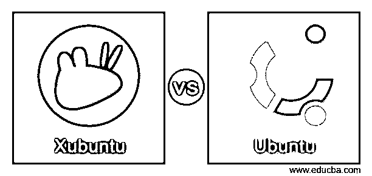
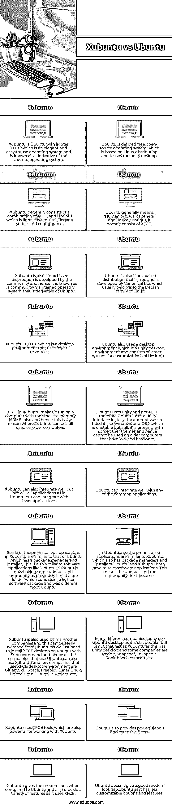

# 许邦图 vs 乌班图

> 原文：<https://www.educba.com/xubuntu-vs-ubuntu/>

## Xubuntu 和 ubuntu 的区别

下面这篇文章提供了 Xubuntu vs Ubuntu 的概要。Xubuntu 是一个桌面环境，代表 XFCE，它被定义为易于使用的操作系统，是 ubuntu 操作系统的一个社区维护的衍生物。一般来说，Xubuntu 被定义为 ubuntu，它更适用于内存和硬件能力较低的老机器。因此，Xubuntu 是 XFCE 和 ubuntu 的结合。Ubuntu 被定义为一个基于 Linux 发行版的免费开源操作系统，它包含了 Unix 操作系统的所有功能以及由 Canonical Ltd 赞助的 GUI 功能，Canonical Ltd 每 6 个月发布一个更新的版本以及许多 Ubuntu 软件包。

### Xubuntu 与 ubuntu 的正面比较(信息图)

以下是 Xubuntu 和 ubuntu 的 10 大区别:

<small>网页开发、编程语言、软件测试&其他</small>

### Xubuntu 和 ubuntu 的主要区别

让我们来讨论一下 Xubuntu 和 ubuntu 之间的一些主要区别:

*   **桌面环境:** Xubuntu 拥有 XFCE，这是一个桌面环境，该桌面环境在 Xubuntu 中使用，以便在使用它时使用最少的系统资源，因此它使它更轻便、稳定和可配置，还提供更多可定制的选项，有助于与低端硬件配合使用，并提供现代化的外观。虽然 Ubuntu 没有像 Xubuntu 那样的 XFCE 作为桌面环境，但它使用了 unity 桌面环境，该环境也可以提供最少的定制选项，并且没有像 Xubuntu 那样提供现代的外观，但它仍然提供了一些强大的工具和广泛的过滤器。
*   **使用低端硬件:** Xubuntu 可以很好地与使用低端硬件的旧系统配合工作，因为它使用 XFCE，这是因为它可以在内存小于 40 MB 的系统上运行，并且它可以更轻、更稳定地与使用低端硬件的旧计算机配合工作。然而，Ubuntu 无法与旧电脑上的低端硬件一起工作，因为它使用的是 unity 桌面环境，而不是 XFCE，后者使用的是 unity 界面，在计算解决方案和社交媒体集成方面更稳定，但在使用低端硬件的旧电脑上不稳定。
*   **从 Ubuntu 切换到 Xubuntu:** Xubuntu 有 XFCE，这是一个很好的桌面环境，也很适合工作。但是如果开发者已经有了 Xubuntu，切换回 ubuntu 是没有用的，因为它提供了更多的功能，而且使用 Ubuntu 的开发者很容易切换到 Xubuntu，因为他们只需要使用 sudo 命令在 Ubuntu 上安装 XFCE 桌面环境。因此，我们可以说 Ubuntu 和 Xubuntu 之间没有太大的区别，但开发者需要最好的桌面环境功能，也需要在旧 PC 上工作，然后他们可以切换到 Xubuntu。

### Xubuntu 与 ubuntu 对比表

我们来讨论一下 Xubuntu 与 ubuntu 的顶级对比:

| **Sr 号** | **Xubuntu** | **Ubuntu** |
| One | Xubuntu 是 ubuntu 与打火机 XFCE 这是一个优雅和易于使用的操作系统，被称为是一个衍生的 Ubuntu 操作系统。 | Ubuntu 是基于 Linux 发行版的免费开源操作系统，使用 unity 桌面。 |
| Two | Xubuntu 通常由 XFCE 和 ubuntu 组成，Ubuntu 是轻量级的，易于使用。优雅、稳定且可配置。 | Ubuntu 的一般意思是“对他人的仁慈”，与 Xubuntu 不同，它不包含 XFCE。 |
| Three | Xubuntu 也是由社区开发的基于 Linux 的发行版，因此它被认为是由社区维护的操作系统，是 ubuntu 的衍生物。 | Ubuntu 也是基于 Linux 的免费发行版，由 Canonical Ltd 开发，它通常属于 Linux 的 Debian 家族。 |
| Four | Xubuntu 是 XFCE，它是一个使用较少资源的桌面环境。 | Ubuntu 还使用了一个桌面环境，这是一个 unity 桌面环境，包含较少的桌面定制选项。 |
| Five | XFCE 在 Xubuntu 使它可以在最小内存(40MB)的计算机上运行，因此这就是 Xubuntu 仍然可以在旧计算机上使用的原因。 | Ubuntu 使用 unity 而不是 XFCE，因此 Ubuntu 使用 unity 界面，最初的尝试是像 Windows 和 OS X 一样构建它，这是不稳定的，但它仍然随着一些其他主题而增长，因此不能在拥有低端硬件的旧计算机上使用。 |
| Six | Xubuntu 也可以很好地集成，但不能像 ubuntu 那样集成所有的应用程序，只能集成较少的应用程序。 | Ubuntu 可以与任何常见的应用程序很好地集成。 |
| Seven | Xubuntu 中的一些预装应用程序类似于 ubuntu，Ubuntu 有一个包管理器和安装程序。这也类似于 Ubuntu 这样的软件应用。Xubuntu 现在有和以前一样的更新和社区，它有一个预加载器，由一个更轻的软件包组成，不同于 ubuntu。 | 在 Ubuntu 中，预装的应用程序与 Xubuntu 相似，也有软件包管理器和安装程序。Ubuntu 和 Xubuntu 都要保存软件应用。这意味着更新和社区是相同的。 |
| Eight | 许多其他公司也使用 Xubuntu，这可以很容易地从 ubuntu 切换，因为我们只需要用 Sudo 命令在 ubuntu 上安装 XFCE 桌面，因此所有使用 ubuntu 的公司也可以使用 Xubuntu，少数使用 XFCE 桌面环境的公司是 Gitlab，SkullSpace，Freebsd，Lunar Linux，United GmbH，Bugzilla Project 等。 | 今天许多不同的公司使用 Ubuntu 桌面，因为它仍然很受欢迎，但没有 Xubuntu 快，因为它有 unity desktop，一些公司是 Reddit，Snapchat，Tokopedia，Robinhood，Instacart 等。 |
| Nine | Xubuntu 使用 XFCE 工具，这些工具在处理 Xubuntu 时也非常强大。 | Ubuntu 还提供了强大的工具和丰富的过滤器。 |
| Ten | 与 ubuntu 相比，Xubuntu 提供了现代的外观，并且由于使用了 XFCE，它还提供了各种各样的功能。 | Ubuntu 并没有像 Xubuntu 那样给人一种现代的感觉，因为它的可定制选项和功能更少。 |

### 结论

在本文中，我们得出结论，Xubuntu 和 ubuntu 都是基于 Linux 的发行版，它们都比其他基于 Linux 的发行版好。在这篇文章中，我们可以清楚地说 ubuntu 的唯一缺点是它不能在旧电脑上运行，这是 Xubuntu 和 Ubuntu 的一个很大区别。因此，如果开发者想要使用低端硬件，开发者应该小心使用，因为 Xubuntu 有 XFCE 作为桌面环境，这在 ubuntu 中是不存在的。

### 推荐文章

这是一个 Xubuntu vs Ubuntu 的指南。这里我们分别用信息图和比较表来讨论 Xubuntu 和 ubuntu 的主要区别。您也可以看看以下文章，了解更多信息–

1.  [Linux Mint vs Ubuntu](https://www.educba.com/linux-mint-vs-ubuntu/)
2.  [卡莉 Linux vs Ubuntu](https://www.educba.com/kali-linux-vs-ubuntu/)
3.  [Ubuntu vs Centos](https://www.educba.com/ubuntu-vs-centos/)
4.  [Ubuntu vs Fedora](https://www.educba.com/ubuntu-vs-fedora/)

