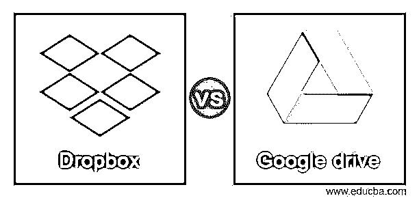
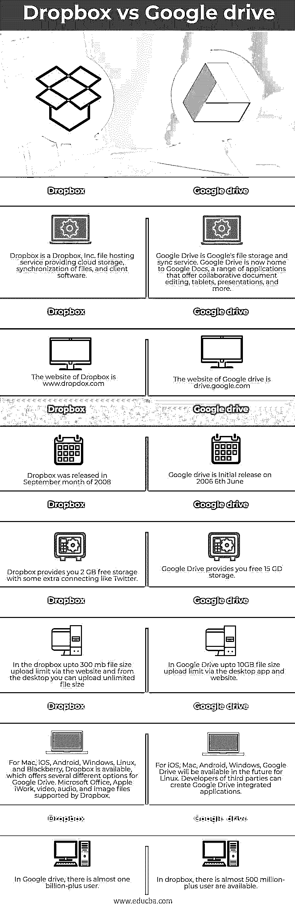

# Dropbox vs Google drive

> 原文：<https://www.educba.com/dropbox-vs-google-drive/>

## Dropbox 和 Google drive 的区别

Dropbox 和 Google Drive 在你的云中运行良好，而不是在你的设备上存储文件。每个应用程序都是移动的，所以你的桌面和手机都允许你输入文件。Google Drive 比 Dropbox 提供更多的免费存储空间，你可以支付额外的存储空间，Dropbox 的最大存储空间是 3TB，而 Google Drive 的最大存储空间是 30TB。Dropbox 跟踪和同步文件更改的速度比 Google Drive 更快。Dropbox 采用了块同步方法，只同步已做的更改。另一方面，整个文档由 Google 下载并重新加载，因此从另一个设备访问这些更改有时会延迟。在这个话题中，我们要讨论的是 Dropbox vs Google drive。

### 什么是 Google Drive？

Google Drive 是一个基于云的存储解决方案，用于在任何智能手机、平板电脑或电脑上在线保存和访问文件。使用 Google Drive 这样的云存储服务有很多优势，比如轻松的文件共享和远程文件备份。然而，与 DropBox 和苹果的 iCloud 服务等竞争对手相比，Google Drive 的受欢迎程度是基于有用的协作工具和与谷歌服务的谷歌套件的集成。当你有一个谷歌帐户时，你在谷歌驱动器上已经有 15 GB 的免费存储空间。那么如何利用这些空间呢？我们的指南涵盖了从如何使用 Google Drive 在任何设备上上传文件到与他人合作的所有工具的所有内容。

<small>网页开发、编程语言、软件测试&其他</small>

### Dropbox 是什么？

Dropbox 是几个流行的云存储服务之一，可以在线保存和共享你的云文件。这有什么意义？您可以从任何地方在线保存和存储您的文件—从您的家庭计算机、计算机或移动设备。这使得访问变得容易。您可以将文件存储在 Dropbox 的服务器上，并在所有设备上同步它们，或者自动维护它们。你可以付费升级到更大的存储空间和附加功能，但基本的 Dropbox 服务是免费的。

### Dropbox 和 Google drive 的直接对比(信息图)

以下是 Dropbox 和 Google drive 的主要区别

### Dropbox 和 google drive 的主要区别

当数据传输时，Google Drive 和 Dropbox 会对从云存储服务到设备的数据进行认证和加密，反之亦然。然而，Dropbox 使用高级加密标准(AES)进行 256 位加密，以保持文件存储时的安全。这个加密标准已经被美国国家安全局批准用于保护高度机密的信息。如果你的主要 Google Drive 或 Dropbox 用途是免费存储，那么 Google Drive 显然是赢家。你可以从 Google Drive 获得 15 GB 的免费存储空间，而 Dropbox 只能给你 2 GB。然而，对于你推荐给 Dropbox 的每个朋友，你可以获得额外的 500 MB 存储空间，从而获得高达 19 GB 的开放存储空间。
Google Drive 和 Dropbox 使用各种同步方式，影响同步速度。当两个文件都由 Google 自动保存时，下载并上传整个文档进行同步。当您试图从另一台设备访问本文档的最新版本时，这可能会导致延迟。

### 对照表

| **Dropbox** | **谷歌驱动** |
| Dropbox 是 Dropbox，Inc .的文件托管服务，提供云存储、文件同步和客户端软件。 | Google Drive 是谷歌的文件存储和同步服务。Google Drive 现在是 Google Docs 的所在地，这是一系列提供协作文档编辑、平板电脑、演示等功能的应用程序。 |
| Dropbox 的网站是 www.dropdox.com | 谷歌驱动的网站是 drive.google.com |
| Dropbox 于 2008 年 9 月发布 | Google drive 于 2006 年 6 月 6 日首次发布 |
| Dropbox 为你提供了 2 GB 的免费存储空间和一些额外的连接，比如 Twitter | Google Drive 为您提供免费的 15 GD 存储空间 |
| 在 dropbox 中，通过网站上传的文件大小限制为 300 mb，从桌面上传的文件大小没有限制 | 在 Google Drive 中，通过桌面应用程序和网站上传的文件大小上限为 10GB |
| 对于 Mac，iOS，Android，Windows，Linux 和黑莓，Dropbox 是可用的，它为 Google Drive 提供了几个不同的选项。Dropbox 支持的 Microsoft Office、Apple iWork、视频、音频和图像文件。 | 对于 iOS，Mac，Android，Windows，Google Drive 将在未来用于 Linux。第三方的开发者可以创建 Google Drive 集成应用。 |
| 在 Google drive 中，有将近 10 亿多用户 | 在 dropbox 中，有将近 5 亿多用户可用 |

### 结论

除了可用的存储空间，您的选择还取决于云存储的用途。Dropbox 在共享文件夹中共享文件的能力为你提供了独特的合作机会，而谷歌确保如果你愿意，Drive 内置于其其他文字处理和电子邮件云服务中。所以在这篇文章中，我们已经看到了 Dropbox 和 Google drive 的关键区别。我希望这篇文章对你有所帮助。

### 推荐文章

这是 Dropbox vs Google drive 的指南。这里我们用信息图和对比表来讨论 Dropbox 和 Google drive 的主要区别。您也可以看看以下文章，了解更多信息–

1.  [网页 vs 网站](https://www.educba.com/webpage-vs-website/)
2.  [Tekla vs Revit](https://www.educba.com/tekla-vs-revit/)
3.  [Alexa vs Siri](https://www.educba.com/alexa-vs-siri/)
4.  [电报对信号](https://www.educba.com/telegram-vs-signal/)

