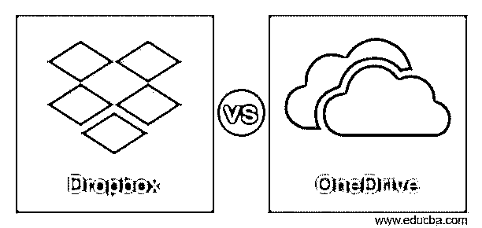
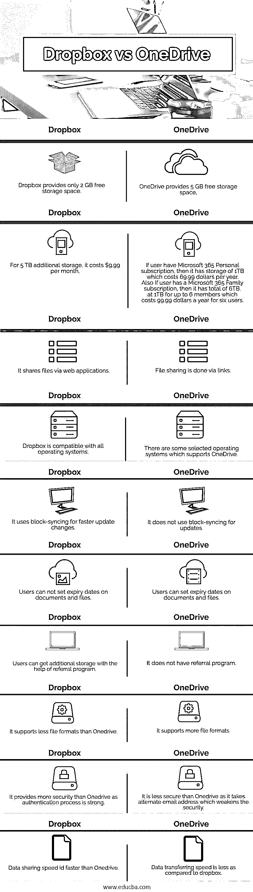

# Dropbox vs OneDrive

> 原文：<https://www.educba.com/dropbox-vs-onedrive/>

## Dropbox 和 OneDrive 的区别

下面这篇文章提供了 Dropbox vs OneDrive 的概要。微软于 2007 年 8 月 1 日为其客户推出了在线数据存储服务。它最初被称为 SkyDrive，然而，它现在已经更改为 OneDrive。它适用于所有形式的数据共享和数据存储。所有用户都从微软获得 15GB 的免费存储空间。如果用户想要编辑文件或文档，还可以使用在线 MS Office 工具，如 MS Word、PowerPoint、MS Excel 和 One Note。

OneDrive 有两种形式。一个是适用于 Windows 7 和 8 的简单 OneDrive，另一个是适用于 Windows 7、8 和 8 的 OneDrive 商用版。1 OneDrive 有 107 种语言版本，适用于 Windows、Mac OSX、Linux、iOS、Xbox 和 Windows Phone。除了登录网站，您还可以使用一个或多个应用程序从您的计算机或智能手机直接访问您的 OneDrive 帐户。

<small>网页开发、编程语言、软件测试&其他</small>

Dropbox 是一个文件托管工具。Dropbox 提供各种服务，如云存储、个人云、客户端应用程序和文件同步。德鲁·休斯顿和阿拉什·菲尔多西是麻省理工学院的两位同学，他们在 2007 年创立了 Dropbox。它只是带有 2 GB 的免费存储空间。

### Dropbox 和 OneDrive 的直接对比(信息图)

以下是 Dropbox 与 OneDrive 的 10 大区别:

### Dropbox 与 OneDrive 的主要区别

让我们讨论一下 Dropbox 和 OneDrive 之间的一些主要差异:

*   如果用户拥有微软 365 个人订阅，那么它拥有 1TB 的存储，每年花费 69.99 美元。
*   此外，如果用户订阅了 Microsoft 365 系列，则总容量为 6TB，最多 6 名成员的容量为 1TB，6 名用户每年的费用为 99.99 美元。在 Dropbox 中，对于 5 TB 的额外存储，每月费用为 9.99 美元。
*   OneDrive 提供 5 GB 的免费存储空间。而 Dropbox 只提供 2 GB 的免费存储空间。
*   如果用户拥有微软 365 个人订阅，那么它拥有 1TB 的存储，每年花费 69.99 美元。
*   此外，如果用户订阅了 Microsoft 365 系列，则总容量为 6TB，最多 6 名成员的容量为 1TB，6 名用户每年的费用为 99.99 美元。另一方面，在 dropbox 中，5 TB 的额外存储每月需要 9.99 美元。
*   Dropbox 支持更多的文件格式。而 OneDrive 支持的文件格式比 Onedrive 少。
*   Dropbox 通过网络应用程序共享文件。在 OneDrive 中，文件共享是通过链接完成的。
*   Dropbox 兼容所有平台。然而，有一些选定的操作系统支持 OneDrive。
*   Dropbox 使用块同步来加快更新更改。另一方面，OneDrive 不使用块同步进行更新。
*   Dropbox 允许用户不设置文档和文件的到期日期。在 OneDrive 中，用户可以设置文档和文件的到期日期。
*   用户可以借助 Dropbox 中的推荐程序获得额外的存储空间。相反，OneDrive 没有推荐计划。
*   Dropbox 比 Onedrive 提供了更高的安全性，因为身份验证过程非常强大。另一方面，OneDrive 不太安全，因为它使用备用电子邮件地址，这削弱了安全性。
*   数据共享速度 id 比 Onedrive 快。

### Dropbox 与 OneDrive 对比表

我们来讨论一下 Dropbox 和 OneDrive 的顶级对比:

| **Sr 号** | **Dropbox** | **OneDrive** |
| One | Dropbox 只提供 2 GB 的免费存储空间。 | OneDrive 提供 5 GB 的免费存储空间。 |
| Two | 对于 5 TB 的额外存储，每月费用为 9.99 美元。 | 如果用户有微软 365 个人订阅，那么它有 1TB 的存储空间，每年花费 69.99 美元。此外，如果用户订阅了 Microsoft 365 系列，则总容量为 6TB，最多 6 名成员可使用 1TB，6 名用户每年的费用为 99.99 美元。 |
| Three | 它通过网络应用程序共享文件。 | 文件共享是通过链接完成的。 |
| Four | Dropbox 兼容所有操作系统。 | 有一些选定的操作系统支持 OneDrive。 |
| Five | 它使用块同步来加快更新变化。 | 它不使用块同步更新。 |
| Six | 用户不能设置文档和文件的到期日期。 | 用户可以设置文档和文件的到期日期。 |
| Seven | 用户可以在推荐程序的帮助下获得更多的存储空间。 | 它没有转诊方案。 |
| Eight | 它支持的文件格式比 Onedrive 少。 | 它支持更多的文件格式。 |
| Nine | 它提供了比 Onedrive 更高的安全性，因为身份验证过程非常强大。 | 它不如 Onedrive 安全，因为它需要备用电子邮件地址，这削弱了安全性。 |
| Ten | 数据共享速度比 Onedrive 快。 | 与 dropbox 相比，数据传输速度较慢。 |

### 结论

在这篇文章中，我们已经看到了 Dropbox 和 OneDrive 之间的关键差异。但是，我们无法确定支持哪一种存储服务，因为两者以各自的方式同样有益和高效。

### 推荐文章

这是 Dropbox vs OneDrive 的指南。这里我们分别用信息图和对比表来讨论 Dropbox 和 OneDrive 的关键区别。您也可以看看以下文章，了解更多信息–

1.  [哈斯克尔 vs 鲁斯特](https://www.educba.com/haskell-vs-rust/)
2.  [Asana vs Slack](https://www.educba.com/asana-vs-slack/)
3.  [SharePoint vs OneDrive](https://www.educba.com/sharepoint-vs-onedrive/)
4.  [电报对信号](https://www.educba.com/telegram-vs-signal/)

