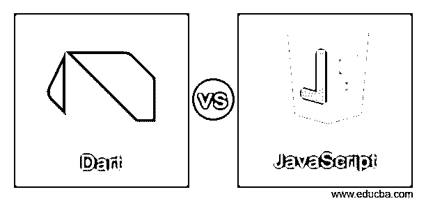

# Dart vs JavaScript

> 原文：<https://www.educba.com/dart-vs-javascript/>

## Dart 和 JavaScript 的区别

下面的文章提供了 Dart 与 JavaScript 的概要。JavaScript 和 Dart 都是跨平台移动应用开发的流行工具。与 JavaScript 相比，Dart 是一个新工具，但是它有 Google 的出色支持和各种令人惊奇的有用特性。

Dart 是 Google 开发的一种开源的客户端优化语言。它是类型安全的，用 AOT 和 JIT 编译。Dart 编译源代码，就像 Java、c 等其他编程语言一样。Dart 有自己的包管理器 Pub。它还拥有自己的虚拟机来运行名为 Dart VM 的本机应用程序。Dart 与 Java 具有相同的语法和编码风格，因此具有 OOPS 经验的开发人员和编码人员可以轻松使用 Dart。而 JavaScript 也是一种易于使用、稳定且高级的语言，有各种在线可用的库和框架。

<small>网页开发、编程语言、软件测试&其他</small>

JavaScript 是一种浏览器脚本语言，它也扩展到了许多服务器端和移动应用程序开发环境。JS 已经存在了将近 20 年，可以说它现在是一种稳定可靠的编程语言。在脸书推出 React 和 React 原生框架之后，JS 已经成为一个广泛使用和流行的工具。JavaScript 有包管理器，包括 NPM 和 Yarn。虽然 JavaScript 是首选语言，但它也有一些褒贬不一的评论。尽管如此，JavaScript 的优势不容置疑，因为它是安全的，几乎每个平台都支持它。

### Dart 与 JavaScript 的直接对比(信息图)

以下是 Dart 与 JavaScript 之间的 6 大区别:

### 关键的区别

让我们讨论一下 Dart 和 JavaScript 之间的一些主要区别:

*   有一个相对比 JS 小的网络。尽管有很好的库和文档，许多开发人员对使用 Dart 感到困惑。相反，JavaScript 对于应用程序玩家来说很容易学习 JavaScript，因为它是轻量级的，易于理解，并且是一种更快的编程语言。它通过提供大量的 JavaScript 库和包来提高开发人员的生产力。
*   Dart 仅用于开发跨平台移动应用程序的前端，而 JavaScript 提供对服务器端和后端开发的支持。
*   Dart 比 JavaScript 更加类型安全，因为它支持强原型和松原型。JavaScript 不是一种类型安全的语言，因为它支持动态和鸭式类型。只有在运行时才能检测到编程错误。JavaScript 是解释编程语言，可能感觉更快更轻便。比 java 等其他编译型编程语言要好。但是作为 JavaScript 的基准测试，Dart 比 JS 快得多。
*   Dart 代码可以使用 Sublime 或 VIM 等轻量级编辑器编写，但 Dart 插件和 ide 中有 IntelliJ IDEA 和 Android studio，用于开发 Dart 应用程序，特别是用于开发 Flutter 应用程序。另一方面，JavaScript 为 JavaScript 开发提供了一些令人惊叹的 ide 和编辑器。此外，它不需要成熟的 IDE，因为开发人员可以使用轻量级编辑器，如 Sublime Text、VIM、Atom 或 Emacs。有一些像 Visual Studio Code 和 WebStorm 这样的 ide 可以用于 JavaScript 应用程序开发。
*   Google 支持的 Dart 也被 Blossom、Whale、WorkTrails 等顶级机构使用。而 JavaScript 在包括易贝、Instagram、Slack、Reddit、Airbnb 在内的大公司中被广泛用于开发网络和跨平台智能手机应用。

### Dart 与 JavaScript 对照表

让我们讨论一下 Dart 和 JavaScript 之间的主要比较:

| **Sr 号** | **镖** | **JavaScript** |
| One | Dart 具有与 Java 相同的语法和编码风格，因此具有 OOPS 经验的开发人员和编码人员可以轻松使用 Dart。 | JavaScript 也是一种易于使用的、稳定的高级语言，有各种各样的库和框架，可以很容易地在线获得。 |
| Two | 有一个相对比 JS 小的网络。尽管有很好的库和文档，许多开发人员对使用 Dart 感到困惑。 | 对于应用程序玩家来说，学习 JavaScript 很容易，因为它是一种轻量级的、易于理解的、速度更快的编程语言。它通过提供大量的 Javascript 库和包来提高开发人员的生产力。 |
| Three | Dart 只用于开发跨平台移动应用的前端。 | JavaScript 支持服务器端和后端开发。 |
| Four | Dart 比 JavaScript 更加类型安全，因为它支持强原型和松原型。JavaScript 不是一种类型安全的语言，因为它支持动态和鸭式类型。 | Programming errors can be detected only at run time. |
| Five | Dart 代码可以用 Sublime 或 VIM 等轻量级编辑器编写，但 Dart 插件和 ide 中有 IntelliJ IDEA 和 Android studio，用于开发 Dart 应用程序，特别是用于开发 Flutter 应用程序。 | JavaScript 为 JavaScript 开发提供了一些令人惊叹的 ide 和编辑器。此外，它不需要一个成熟的 IDE，因为开发人员可以使用轻量级编辑器，如 Sublime Text、VIM、Atom 或 Emacs。有一些 ide，如 Visual Studio Code 和 WebStorm，它们适用于 JavaScript 应用程序开发。 |
| Six | Google 支持的 Dart 也被 Blossom、Whale、WorkTrails 等顶级组织使用。 | JavaScript 在包括 ebay、Instagram、Slack、Reddit、Airbnb 在内的大公司中被广泛用于开发 web 和跨平台智能手机应用。 |

### 结论

在本文中，我们看到了 Dart 和 JavaScript 之间的主要区别。然而，我们不能决定支持哪一种编程语言，因为它们都以自己的方式同样有益和高效。

### 推荐文章

这是 Dart vs JavaScript 的指南。这里我们分别用信息图和比较表来讨论 Dart 和 JavaScript 的主要区别。您也可以看看以下文章，了解更多信息–

1.  [JavaScript vs VBScript](https://www.educba.com/javascript-vs-vbscript/)
2.  [JavaScript vs C#](https://www.educba.com/javascript-vs-c-sharp/)
3.  [JavaScript Var vs Let](https://www.educba.com/javascript-var-vs-let/)
4.  [TypeScript vs JavaScript](https://www.educba.com/typescript-vs-javascript/)

