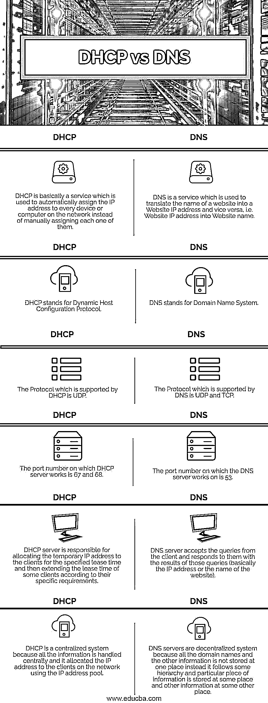

# DHCP 与 DNS

> 原文：<https://www.educba.com/dhcp-vs-dns/>

## DHCP 和 DNS 的区别

**DHCP** 代表动态主机配置协议，用于为互联网上的计算机和其他设备分配 IP 地址。它使旧设备与网络的连接变得更加容易，而无需为不断变化的客户(如学校、办公室等)手动分配 IP 地址。它为特定的租用时间分配临时 IP 地址，并根据特定要求更改客户端的租用时间。

**DNS** 代表域名系统，是一个分散式的命名系统，用于互联网上的计算机和其他设备，将互联网或任何其他专用网络上连接的设备的域名转换为数字 IP 地址，反之亦然。它消除了用户记住每个域的 IP 地址的需要。它有点像电话簿，提供每个域名的 IP 地址。

<small>网页开发、编程语言、软件测试&其他</small>

### DHCP 与 DNS 的面对面比较(信息图表)

以下是 DHCP 与 DNS 之间的 6 大区别:

### DHCP 和 DNS 的主要区别

下面详细介绍了 DHCP 和 DNS 技术之间的一些主要区别:

*   DHCP 和 DNS 都有不同的目的。DHCP 用于在特定的租用时间内将 IP 地址自动分配给网络上的客户端或计算机，并在需要时延长特定客户端的租用时间，而 DNS 服务是一种地址解析机制，用于将域名转换为 IP 地址，反之亦然。
*   除了将 IP 地址分配给计算机或互联网上的其他设备，DHCP 还向客户端提供其他信息，如计算机的子网掩码和主机的 IP 地址，而 DNS 用于为客户端定位 active directory 域服务器，并将 IP 地址转换为域名，反之亦然。
*   DHCP 服务提供的主要优点是减少了网络管理员手动分配临时 IP 地址给每个客户端的开销，并且提供了分配 IP 地址的可靠媒介，而 DNS 服务的优点是它消除了记住长 IP 地址的需要，因为域名被使用它转换成 IP 地址。
*   记住 DHCP 和 DNS 服务工作的端口非常重要。DHCP 在端口号 67 和 68 上工作，而 DNS 在端口号 53 上工作。
*   DHCP(动态主机配置协议)支持 UDP 协议，而 DNS(域名系统)支持 UDP 和 TCP 协议。
*   DNS 是一个集中的系统，它以分层的方式将 xyz.com 等网站的域名转换为 87.77.199.132 等数字 IP 地址，反之亦然。它由数千台服务器组成，这些服务器协同工作，一些信息存储在一台服务器上，另一些信息存储在其他服务器上。如果一台服务器无法解析该查询，它可以联系其他服务器进行同样的处理，而 DHCP 是一个集中式系统，因为与 IP 地址相关的所有信息都存储在中央 IP 地址池中，IP 地址从该地址池分发到客户端(可能是计算机、平板电脑、智能手机等)。)通过互联网上的服务器。
*   当互联网上有一个庞大的设备网络时，DHCP 尤其有用，这些设备中的大多数经常变化，就像公司的员工在某个项目中在同一个网络上工作一样，IP 地址经常变化，而 DNS 在域名用于 web 地址并且临时用户不需要记住互联网上连接的每个设备的 IP 地址的情况下很有用。

### DHCP 与 DNS 对照表

DHCP 和 DNS 为连接到网络的客户端提供不同的用途。下面给出的比较表显示了 DHCP 和 DNS 之间的直接比较，以帮助您更好地理解它:

| **序列号** | **DHCP** | **DNS** |
| 

1.  T2】

 | DHCP 基本上是一种服务，用于自动为网络上的每台设备或计算机分配 IP 地址，而不是手动分配。 | DNS 是一种用于将网站名称转换为网站 IP 地址的服务，反之亦然，即，将网站 IP 地址转换为网站名称。 |
| 

1.  T2】

 | DHCP 代表动态主机配置协议。 | DNS 代表域名系统。 |
| 

1.  T2】

 | DHCP 支持的协议是 UDP。 | DNS 支持的协议是 UDP 和 TCP。 |
| 

1.  T2】

 | DHCP 服务器工作的端口号是 67 和 68。 | DNS 服务器工作的端口号是 53。 |
| 

1.  T2】

 | DHCP 服务器负责在指定的租用时间内为客户端分配临时 IP 地址，然后根据客户端的特定要求延长其租用时间。 | DNS 服务器接受来自客户端的查询，并用这些查询的结果(基本上是 IP 地址或网站名称)来响应它们。 |
| 

1.  T2】

 | DHCP 是一个集中式系统，因为所有信息都集中处理，并使用 IP 地址池为网络上的客户端分配 IP 地址。 | DNS 服务器是分散的系统，因为所有的域名和其他信息不是存储在一个地方，而是遵循一定的层次结构，特定的信息存储在某个地方，其他信息存储在其他地方。 |

| 动态主机配置协议 | 域名服务器(Domain Name Server) |
| DHCP 基本上是一种服务，用于自动为网络上的每台设备或计算机分配 IP 地址，而不是手动分配。 | DNS 是一种用于将网站名称转换为网站 IP 地址的服务，反之亦然，即，将网站 IP 地址转换为网站名称。 |
| DHCP 代表动态主机配置协议。 | DNS 代表域名系统。 |
| DHCP 支持的协议是 UDP。 | DNS 支持的协议是 UDP 和 TCP。 |
| DHCP 服务器工作的端口号是 67 和 68。 | DNS 服务器工作的端口号是 53。 |
| DHCP 服务器负责在指定的租用时间内为客户端分配临时 IP 地址，然后根据客户端的特定要求延长其租用时间。 | DNS 服务器接受来自客户端的查询，并用这些查询的结果(基本上是 IP 地址或网站名称)来响应它们。 |
| DHCP 是一个集中式系统，因为所有信息都集中处理，并使用 IP 地址池为网络上的客户端分配 IP 地址。 | DNS 服务器是分散的系统，因为所有的域名和其他信息不是存储在一个地方，而是遵循一定的层次结构，特定的信息存储在某个地方，其他信息存储在其他地方。 |

### 结论

上面的描述清楚地解释了什么是 DHCP 和 DNS，以及它们之间的主要区别。DHCP 和 DNS 服务都为网络上的客户端执行单独的角色。DHCP 是将 IP 地址自动配置给连接在互联网上的客户端的省时且快速的过程，而不是手动将它们分配给每个客户端，而 DNS 便于用户将域名转换成 IP 地址，而无需记忆复杂的 IP 地址。

### 推荐文章

这是一个关于 DHCP 和 DNS 的指南。这里我们讨论 DHCP 和 DNS 的定义、主要区别、比较以及不同的用途。你也可以看看下面的文章。

1.  [SQL Server 权限](https://www.educba.com/sql-server-permission/)
2.  [服务器监控工具有哪些？](https://www.educba.com/server-monitoring-tools/)
3.  [微软团队 vs Slack](https://www.educba.com/microsoft-teams-vs-slack/)
4.  [SQL Server 数据类型](https://www.educba.com/sql-server-data-types/)

