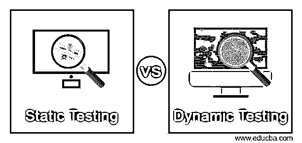
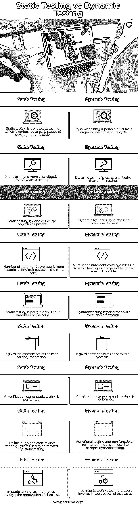

# 静态测试与动态测试

> 原文：<https://www.educba.com/static-testing-vs-dynamic-testing/>

## 静态测试与动态测试简介

静态测试和动态测试都是开发人员和测试人员用来测试软件功能和质量的重要测试方法。每种测试类型都有其优势和风险因素，基于产品或应用程序的测试，开发人员或测试人员在开发生命周期的每个阶段选择正确的技术来测试应用程序。

### 静态测试与动态测试的直接比较(信息图表)

下面是静态测试和动态测试之间的 9 大区别:

<small>网页开发、编程语言、软件测试&其他</small>

### 静态测试

静态测试是一种不执行代码的测试，它是手动或使用一组工具完成的。它用于检查文档要求、代码、设计文档，并对每个文档进行审查。它开始于开发生命周期的早期，因此也被称为验证测试。静态测试可以在工作文档上执行，例如需求规格、设计文档、测试计划、源代码、测试用例、测试脚本、网页内容。静态测试技术如下

*   **检查:**这是一种检查，其中创建一个检查表来检查文档。目的是找到缺陷。
*   演练:在这种技术中，领导者召开会议来解释产品。
*   技术评审:这项技术用于确定代码是否符合技术需求和标准。
*   非正式评审:在这种技术中，文档被非正式地评审，并给出非正式的评论

### 动态试验

当代码处于操作模式时，动态测试在运行时环境中完成。当使用输入值执行代码时，会检查代码的输出，并与预期结果进行比较。它是在验证阶段执行的，因此动态测试也被称为验证测试。功能测试和非功能测试是动态测试的类型。

动态测试技术的类型如下

*   单元测试:单元测试用于测试系统的单个部分
*   集成测试:用于测试不同模块之间的接口。
*   验收测试:它是从用户的角度来完成的。
*   系统测试:用于测试整个系统。

### 静态测试与动态测试对比表

| **静态测试** | **动态测试** |
| 静态测试是在开发生命周期的早期阶段执行的白盒测试。 | 动态测试在开发生命周期的后期执行。 |
| 静态测试比动态测试更划算。 | 动态测试不如静态测试划算。 |
| 静态测试在代码开发之前完成。 | 动态测试是在代码开发之后进行的。 |
| 许多语句覆盖更多的是静态测试，因为它覆盖了所有的代码区域。 | 在动态测试中，许多语句的覆盖范围较小，因为它只覆盖了有限的代码区域。 |
| 静态测试在不执行代码的情况下进行。 | 动态测试是随着代码的执行而进行的。 |
| 它给出了代码和文档的评估。 | 它给软件系统带来了瓶颈。 |
| 验证阶段，执行静态测试 | 在验证阶段，执行动态测试。 |
| 使用走查和代码审查技术来执行静态测试。 | 功能测试和非功能测试技术用于执行动态测试。 |
| 在静态测试中，测试过程包括准备一份清单。 | 在动态测试中，测试过程包括测试用例的执行。 |

### 静态测试和动态测试的主要区别

静态测试和动态测试的主要区别如下:

*   静态测试在开发周期的早期进行，而动态测试在开发生命周期的后期进行。
*   静态测试可以手动完成或者通过使用一组工具来完成，而动态测试是在运行时环境中执行的。
*   静态测试在验证阶段执行，而动态测试在验证阶段执行。
*   在代码开发之前进行静态测试，而在代码开发之后进行动态测试。
*   静态测试是在不执行代码的情况下执行的，而动态测试是通过执行代码来完成的。
*   静态测试用于找出应用程序中的错误、代码流和潜在的恶意代码，而
*   动态测试用于了解软件的功能行为、CPU 响应时间、监控系统内存、系统性能。

### 结论

静态测试和动态测试都用来检查软件或产品。各有利弊。一种用于验证，另一种用于验证。基于具体要求和测试需要。可以采用这些方法中的一种来测试产品或软件。这是他的文章，我们已经讨论了这些测试技术和它们的工作过程之间的区别。希望你喜欢这篇文章。

### 推荐文章

这是静态测试和动态测试的指南。这里我们用信息图和比较表来讨论静态测试和动态测试的主要区别。您也可以看看以下文章，了解更多信息–

1.  [组件测试 vs 单元测试](https://www.educba.com/component-testing-vs-unit-testing/)
2.  [负载测试与压力测试](https://www.educba.com/load-testing-vs-stress-testing/)
3.  [系统测试 vs 集成测试](https://www.educba.com/system-testing-vs-integration-testing/)
4.  [手工测试 vs 自动化测试](https://www.educba.com/manual-testing-vs-automation-testing/)

