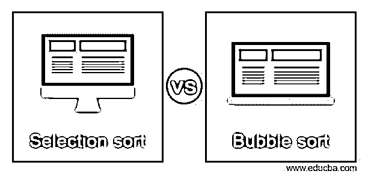
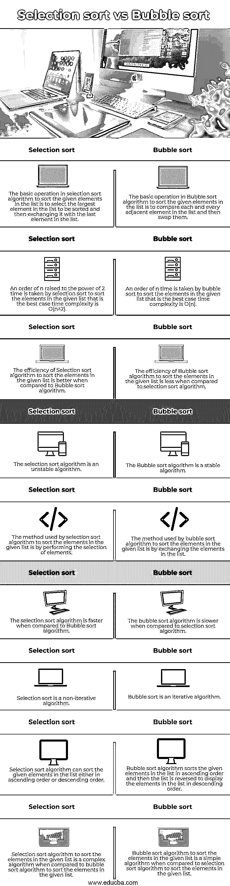

# 选择排序与冒泡排序

> 原文：<https://www.educba.com/selection-sort-vs-bubble-sort/>

## 选择排序与冒泡排序简介

用于排序的两种排序算法是选择排序和冒泡排序，并且冒泡排序用来执行排序的方法是交换要排序的列表中的元素，而选择排序用来执行排序的方法是选择要排序的列表中的元素，并且当涉及排序技术的稳定性时， 冒泡排序是一种稳定的算法，而选择排序是一种不稳定的算法，但是当与冒泡排序算法相比时，选择排序算法的效率更好，因为当与选择排序算法相比时，冒泡排序算法消耗更多的存储器。

让我们比较一下选择排序技术和用于对给定列表中的元素进行排序的冒泡排序技术。

<small>网页开发、编程语言、软件测试&其他</small>

### 选择排序和冒泡排序的比较(信息图)

以下是选择排序与冒泡排序的 9 大区别:

### 选择排序和冒泡排序的比较表

选择排序和冒泡排序的对照表如下所示:

| **选择排序** | **冒泡排序** |
| 选择排序算法中对列表中给定元素进行排序的基本操作是选择列表中要排序的最大元素，然后与列表中的最后一个元素交换。 | 冒泡排序算法中对列表中给定元素进行排序的基本操作是比较列表中的每个相邻元素，然后交换它们。 |
| 选择排序采用 n 的 2 次幂来对给定列表中时间复杂度为 O(n^2).的元素进行排序 | 冒泡排序采用 n 阶时间对给定列表中的元素进行排序，这是时间复杂度为 O(n)的最佳情况。 |
| 与冒泡排序算法相比，选择排序算法对给定列表中的元素进行排序的效率更高。 | 与选择排序算法相比，冒泡排序算法对给定列表中的元素进行排序的效率较低。 |
| 选择排序算法是一种不稳定的算法。 | 冒泡排序算法是一种稳定的算法。 |
| 选择排序算法对给定列表中的元素进行排序的方法是执行元素选择。 | 冒泡排序算法对给定列表中的元素进行排序的方法是交换列表中的元素。 |
| 与冒泡排序算法相比，选择排序算法更快。 | 与选择排序算法相比，冒泡排序算法较慢。 |
| 选择排序是一种非迭代算法。 | 冒泡排序是一种迭代算法。 |
| 选择排序算法可以对列表中的给定元素进行升序或降序排序。 | 冒泡排序算法以升序对列表中的给定元素进行排序，然后反转列表以降序显示列表中的元素。 |
| 与对给定列表中的元素进行排序的冒泡排序算法相比，对给定列表中的元素进行排序的选择排序算法是一种复杂的算法。 | 与对给定列表中的元素进行排序的选择排序算法相比，对给定列表中的元素进行排序的冒泡排序算法是一种简单的算法。 |

在对给定列表中的元素进行排序时，选择排序技术和冒泡排序技术有几个不同之处。选择排序和冒泡排序的主要区别如下:

选择排序中的基本操作是选择列表中要排序的最大元素，然后与列表中的最后一个元素交换，而冒泡排序中的基本操作是比较列表中的每个相邻元素，然后交换它们。

选择排序采用 n 的 2 次幂来排序给定列表中的元素，这是时间复杂度为 O(n^2 的最佳情况，而冒泡排序采用 n 的次数来排序给定列表中的元素，这是时间复杂度为 O(n)的最佳情况。

与冒泡排序算法相比，选择排序算法的效率较高，而冒泡排序算法的效率较低。

选择排序算法是一种不稳定的算法，而冒泡排序算法是一种稳定的算法。

选择排序算法用来对列表中的元素进行排序的方法是执行元素选择，而冒泡排序算法用来对列表中的元素进行排序的方法是交换列表中的元素。

选择排序算法比冒泡排序算法快，而冒泡排序算法比选择排序算法慢。

选择排序算法是非迭代算法，而冒泡排序算法是迭代算法。

选择排序算法可以以升序或降序对列表中的给定元素进行排序，而冒泡排序算法以升序对列表中的给定元素进行排序，然后反转列表以降序显示列表中的元素。

与对给定列表中的元素进行排序的冒泡排序算法相比，对给定列表中的元素进行排序的选择排序算法是复杂的算法，而与对给定列表中的元素进行排序的选择排序算法相比，对给定列表中的元素进行排序的冒泡排序算法是简单的算法。

### 结论

在本文中，我们通过比较选择排序方法和冒泡排序方法，了解了使用选择排序和冒泡排序进行排序的概念及其差异，并了解了主要差异，如排序方法、效率、稳定性、时间复杂度、速度等。在选择排序和冒泡排序之间。

### 推荐文章

这是一个关于选择排序和冒泡排序的指南。这里我们分别讨论信息图和比较表的主要区别。您也可以看看以下文章，了解更多信息–

1.  [核心 Java vs Java](https://www.educba.com/core-java-vs-java/)
2.  [窄带与宽带](https://www.educba.com/narrowband-vs-broadband/)
3.  [C++向量 vs 数组](https://www.educba.com/c-plus-plus-vector-vs-c-plus-plus-array/)
4.  [C++向量 vs 列表](https://www.educba.com/c-plus-plus-vector-vs-list/)

