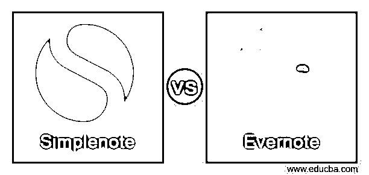
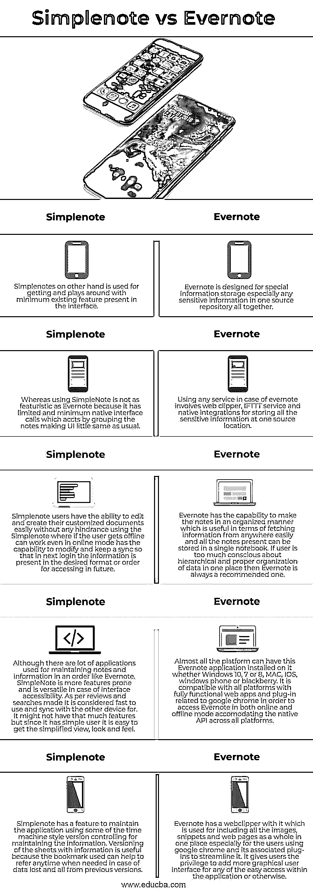

# Simplenote vs Evernote

> 原文：<https://www.educba.com/simplenote-vs-evernote/>

## Simplenote vs Evernote 的定义

Simplenote 和 Evernote 被认为是笔记应用程序，用户可以根据需要记住重要的问题或制定计划一整天的待办事项。Simplenote 和 Evernote 都可以安装在手机或电脑系统中，这意味着它可以兼容这两种系统。笔记可以是任何形式的，无论是文本形式还是多媒体形式，Simplenote 和 Evernote 都会按照要求来做。Simplenote 和 Evernote 都有各自的优缺点，取决于用户的偏好。

### Simplenote 和 Evernote 的正面比较(信息图)

以下是 Simplenote 和 Evernote 的 5 大区别:

<small>网页开发、编程语言、软件测试&其他</small>

### Simplenote 与 Evernote 对比表

| **简单注** | **Evernote** |
| 另一方面，Simplenotes 用于获取和使用界面中最少的现有功能。 | Evernote 是为特殊信息存储而设计的，尤其是所有敏感信息都存储在一个资源库中。 |
| 而使用 SimpleNote 并不像 Evernote 那样前卫，因为它只有有限的和最少的本地接口调用，这些调用通过将笔记分组来实现，使得 UI 与平常几乎没有什么不同。 | Using any service in the case of Evernote involves web clipper, IFTTT service, and native integrations for storing all the sensitive information at one source location. |
| Simplenote 用户能够使用 Simplenote 毫无障碍地轻松编辑和创建他们的定制文档，如果用户离线，即使在在线模式下也可以工作，能够修改并保持同步，以便在下次登录时，信息以期望的格式或顺序呈现，以便将来访问。 | Evernote 能够以有组织的方式记录笔记，这对于从任何地方轻松获取信息都很有用，并且所有笔记都可以存储在一个笔记本中。如果用户太在意数据在一个地方的层次和适当的组织，那么 Evernote 总是一个推荐的选择。 |
| 虽然有很多像 Evernote 这样用于维护笔记和信息有序的应用。SimpleNote 更倾向于特性，并且在接口可访问性方面是通用的。根据评论和搜索，它被认为是快速使用和同步与其他设备。它可能没有那么多的功能，但因为它有一个简单的用户，所以很容易得到简化的视图、外观和感觉。 | 几乎所有的平台都可以安装这个 Evernote 应用程序，无论是 Windows 10、7 或 8、MAC、IOS、windows phone 还是黑莓。它与所有具有与谷歌 chrome 相关的全功能网络应用和插件的平台兼容，以便在在线和离线模式下访问 Evernote，适应所有平台的原生 API。 |
| Simplenote 有一个特性，使用一些时间机器风格的版本控制来维护应用程序，以维护信息。对带有信息的表进行版本控制是很有用的，因为所使用的书签有助于在需要时随时查阅以前版本的数据。 | Evernote 有一个 web clipper，用于将所有的图像、片段和网页作为一个整体放在一个地方，特别是对于使用 google chrome 及其相关插件的用户来说。它赋予用户特权来添加更图形化的用户界面，以便于在应用程序内部或其他地方访问。 |

### Simplenote 与 Evernote 的主要区别

当谈到比较和找出 Evernote 和 Simplenote 之间的差异时，一个名为“Slant”的社区推荐使用 Evernote 而不是 Simplenote，尽管两者都有自己的优缺点。

Evernote 和 Simplenote 有一些关键的区别，如下所示:

*   Evernote 由许多与 web 相关的 UI 和界面组成，这些 UI 和界面用于使整个应用程序变得用户友好，不仅在访问的方便性方面，而且在整个应用程序的访问外观方面也是如此。
*   另一方面，Simplenote 在访问页面方面非常容易和快速，在线模式使用户有权在对齐的文本组页面之间快速切换，以制作信息。
*   Evernote 有一些很好的插件或附件，可以使网页图像在编辑和创建一些不错的蓝图选项方面更加灵活，以便以适当的格式组织数据。
*   Simplenote 具有一些特性，可以在所有人之间共享笔记，或者让其他人与其他特性和组进行深入协作。
*   所有的 Simplenote 应用程序都是开源的，易于下载。如果有人想为它做贡献，它已经准备好了，而 Evernote 是收费的，大约 1 美元，这使得它很少被使用，因为它是收费和许可的。
*   Evernote 在维护单一来源存储库的信息方面是同步的，它包括一个最好的 web clipper，可以使用简单简化的格式从桌面或移动设备中剪切任何图像或文本，这种格式非常灵活，并突出显示了大多数标签和注释，用于制定和撰写。
*   在 Simplenote 的最新版本中，包括 simplenote pro 在内的 simple note pro 能够使用 nvAlt 功能为桌面提供优秀的客户端，从而使其在正确管理笔记方面变得强大和用户友好。
*   Evernote 在 Simplenotes 方面有很多功能，比如它嵌入了一些有效的图片或快照，这些图片或快照是从白板和黑板上即时扫描下来的，用户可以根据需要随时随地继续做笔记。工作的继续和流动在任何时候都不会受到阻碍。
*   Evernote 能够提供快速切换，从而减少冲突并正确管理它们，还允许大量撤销和重做，这是 Sinplenote 的任何功能都不提供的。

### 结论

Simplenote 和 Evernote 这两个应用程序都是为了同样的目的，让笔记变得方便，并以适当的方式组织起来。它赋予用户权限和许多功能来定制笔记，并使用一些易于访问的实用程序，该实用程序是应用程序的一部分，使使用更加频繁和快速。

### 推荐文章

这是 Simplenote vs Evernote 的指南。这里我们分别讨论信息图和比较表的主要区别。您也可以看看以下文章，了解更多信息–

1.  [核心 Java vs Java](https://www.educba.com/core-java-vs-java/)
2.  [窄带与宽带](https://www.educba.com/narrowband-vs-broadband/)
3.  [C++向量 vs 数组](https://www.educba.com/c-plus-plus-vector-vs-c-plus-plus-array/)
4.  [C++向量 vs 列表](https://www.educba.com/c-plus-plus-vector-vs-list/)

