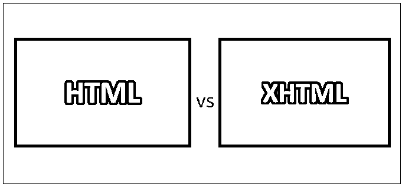

# HTML 与 XHTML

> 原文：<https://www.educba.com/html-vs-xhtml/>

## HTML 和 XHTML 的区别

HTML 可以扩展为源自 SGML 的超文本标记语言，XHTML 可以扩展为源自 XML 的可扩展标记语言。这两种编程语言都用于 web 应用程序或网站的开发。与核心特性相比，HTML 区分大小写，更便宜，并且使用简单的文本格式代码。而 XHTML 不区分大小写，比 HTML 贵，它使用 XHTML 和 XML 作为应用程序代码。

### 超文本标记语言

*   HTML 早些时候由 Tim Berners Lee 提出，由 W3C 和 WHATWG 开发，并于 1993 年发布。HTML 由 SGML 扩展而来。HTML 的文件扩展名是。html 和. htm。
*   HTML 的最后一个版本是 HTML5，这是 HTML 在 2014 年的一个主要版本。HTML 可以嵌入 CSS(层叠样式表)和 JavaScript。HTML 由元素组成，这些元素定义了 HTML 页面的结构。
*   HTML 页面可以使用 HTML 编辑器开发，如记事本(在 Windows 机器上)和文本编辑器(在 Mac Book 或 Mac 机器上)。
*   基本的 HTML 页面结构由 1。 *Doctype* 标签喜欢<！DOCTYPE html >，描述编写的 html 版本。2. *HTML 根元素*标签，如< html > < /html >，其中包含了为网页编写的所有代码。3.*头元素*标签类似于< h1 > < /h1 >，在此标题和标题中有描述。4. *Body 元素*标签和< body > < /body >一样，它保存着文档的内容。

### 可扩展的超文本标记语言

*   XHTML 是由万维网联盟开发的，于 2000 年发布。它是从 XML 和 HTML 扩展而来的。XHTML 的文件扩展名是。xhtml 和. xht。XHTML 的最新版本是 XHTML5，它被开发为配置了 HTML5 规范的 XML。
*   XHTML 开发的页面可以在现有的浏览器或新的浏览器中使用，并且可以在 XML 工具的帮助下轻松查看、编辑和验证。它与所有的浏览器兼容，并且可以很容易地嵌入基于 HTML 和 XML 文档对象模型的脚本和小程序。
*   它非常快速、准确、易于维护、可编辑、可转换和格式化。XHTML 总是为 web 页面提供一种一致的、定义良好的结构格式，便于 web 浏览器处理。
*   XHTML 语法几乎和 HTML 语法一样。XHTML 的结构也类似于 HTML，但是 XHTML 区分大小写，属性可以添加、更改，并且不能缩短。在 XHTML 中，它应该遵循正确的结构，标签应该正确嵌套。

### HTML 和 XHTML 的直接比较

以下是 HTML 和 XHTML 的八大对比:

<small>网页开发、编程语言、软件测试&其他</small>

### HTML 和 XHTML 的主要区别

HTML 和 XHTML 之间一些关键区别解释如下:

1.  在 HTML 中，我们可以使用空标签或开放标签来表示不需要结束标签，例如

    。在 XHTML 中，标签应该是关闭的或者自关闭的，如果打开了 g

    或者

2.  在 HTML 中，所有应该在浏览器中显示的文字都可以放在 HTML body 元素下。在 XHTML 中，内容可以放在块中。
3.  在 HTML 中，在定义属性时，没有必要提到引号。例如<option selected="selected">。在 XHTML 中，在定义属性时，必须提到引号。例如</option><option selected="”Selected”">。</option>
4.  在 HTML 中，属性值并不那么重要。例如<input type="”radiobutton”" selected="selected">。在 XHTML 中，属性值很重要。例如<input type="”radiobutton”" selected="”selected”">。
5.  在 HTML 中，没有严格的规则来书写元素的结构，例如

    **【Hello world】**

    。在 XHTML 中，元素的编写结构有严格的规则，例如

    **【Hello world】**

    。
6.  在 HTML 中，标签和属性可以用小写或大写来描述。在 XHTML 中，标签和属性只能用小写字母来描述。
7.  在 HTML 中，一个根元素不是强制性的。在 XHTML 中，文档应该有一个根元素。
8.  在 HTML 中，XML 声明是不必要的。在 XHTML 中，它基于 XML 的规则集。

### HTML 和 XHTML 对照表

下面是 HTML 和 XHTML 的对照表。

| **BASIS FOR****比较** | **HTML** | **XHTML** |
| **缩写** | 超文本标记语言。 | 可扩展超文本标记语言。 |
| **区分大小写** | HTML 不区分大小写。 | XHTML 区分大小写。 |
| **互联网媒体类型** | 对于 HTML，是 text/html。 | 对于 XHTML，是 application/xhtml+xml。 |
| **表情丰富** | HTML 的表达性较差。 | 与 HTML 相比，XHTML 更具表现力。 |
| **应用** | HTML 是 SGML 的一个应用。 | XHTML 是 XML 的一种应用。 |
| **格式** | HTML 有文档文件格式。 | XHTML 以标记语言作为类型格式。 |
| **解析器** | HTML 需要宽松的 HTML 特定解析器。 | 它需要用标准的 XML 解析器进行解析。 |
| **约束** | 在 HTML 中，不关心格式良好的约束。 | 在 XHTML 中，它关注的是格式良好的约束。 |

### 结论

HTML 和 XHTML 都是用于创建网页和应用程序的标记语言。HTML 和 XHTML 几乎相似，但 HTML 和 XHTML 之间的一些关键差异使它们彼此不同。XHTML 是 HTML 的扩展版本，只是在使用 XML 以及使元素无效的帮助下。

在 XHTML 中，Javascript 的处理与 HTML 略有不同。对函数进行了一些更改，使它们区分大小写。在这方面，CSS 以不同的方式被应用。

HTML 和 XHTML 都广泛用于开发基于 Android 的 web 应用程序。它提供了快速发展。它也有助于在服务器端脚本的帮助下嵌入其他语言。它使用户界面更加敏捷和灵活。

如果一个人懂 HTML，那么 XHTML 就很容易学。HTML 的最新版本 HTML5 在开发人员和 IT 组织中最受欢迎。HTML 易于学习和理解，因为它的语法非常简单。在当今时代，技术日新月异，但坚持或掌握任何语言的基础知识始终是成功的关键，并帮助我们以更好的方式学习新技术。

### 推荐文章

这是 HTML 和 XHTML 之间差异的有用指南。在这里，我们讨论了他们的 HTML 和 XHTML 的头对头比较，关键差异以及信息图表和比较表。您也可以阅读以下文章，了解更多信息——

1.  [HTML vs XML](https://www.educba.com/html-vs-xml/)
2.  [HTML vs CSS](https://www.educba.com/html-vs-css/)
3.  [HTML vs HTML5](https://www.educba.com/html-vs-html5/)
4.  [CSS3 vs CSS](https://www.educba.com/css-vs-css3/)

