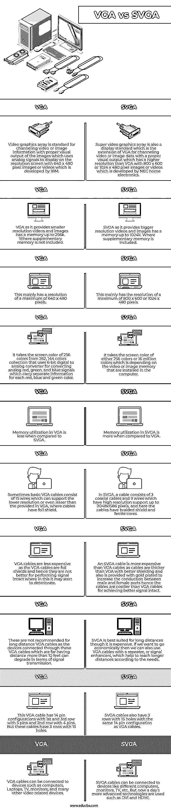

# VGA 与 SVGA

> 原文：<https://www.educba.com/vga-vs-svga/>

## VGA 与 SVGA 简介

VGA 缩写为 video graphics array，定义为使用模拟信号在分辨率为 640 x 480 的屏幕上显示信号的显示标准，每次显示 16 种颜色，VGA 监视器每次从 262，144 种颜色显示 256 种颜色。它还包含一个 6 位数模转换器，用于转换红色、蓝色和绿色信号。SVGA 缩写为 super video graphics array，是一种显示标准，用于显示支持 800 x 600 分辨率的信号，也称为 ultra VGA，是 VGA 的扩展。VGA 和 SVGA 都与显示器支持的分辨率概念有关。

### VGA 与 SVGA 的直接对比(信息图)

以下是 VGA 与 SVGA 之间的 10 大区别:

<small>网页开发、编程语言、软件测试&其他</small>

### VGA 与 SVGA 对比表

|  | **VGA** | **SVGA** |
|  | 视频图形阵列(Video graphics array)是一种标准，用于传输视频或图像信息，并提供适当的图像视觉输出，它使用模拟信号在分辨率为 640 x 480 像素的屏幕上显示图像或视频，这是由 IBM 开发的。 | 超级视频图形阵列也是一种显示标准，它是 VGA 的扩展，用于引导具有适当视觉输出的视频或图像数据，其分辨率高于由 NEC 家用电子公司开发的具有 800 x 600 或 1024 x 480 像素图像或视频的 VGA。 |
|  | VGA 提供较小分辨率的视频和图像，内存高达 256k。其中不包括辅助存储器。 | SVGA 提供更大分辨率的视频和图像，内存高达 1024k。其中包括辅助存储器。 |
|  | 这主要具有最大 640 x 480 像素的分辨率。 | 这主要具有最大 800 x 600 或 1024 x 480 像素的分辨率。 |
|  | 它从 262，144 色集合中获取 256 色的屏幕颜色，该集合使用 6 位数模转换器来转换模拟红、绿和蓝信号，这些信号携带每种红、蓝和绿颜色的单独信息。 | 它采用 256 色或 1600 万色的屏幕颜色，这取决于计算机中安装的视频或图像内存。 |
|  | 与 SVGA 相比，VGA 的内存利用率更低。 | 与 VGA 相比，SVGA 的内存利用率更高。 |
|  | 有时，基本 VGA 电缆由 15 根线组成，可以支持较低的分辨率，甚至低于 VGA 中提供的分辨率，在 VGA 中，电缆具有箔屏蔽。 | 在 SVGA 中，电缆由 3 根同轴电缆和 9 根导线组成，具有高达 2048×1586 像素的高分辨率支持，这里的电缆具有编织屏蔽和铁氧体磁芯。 |
|  | VGA 电缆不太贵，因为 VGA 电缆是箔屏蔽，因此它们不太适合完整地执行信号，在这种情况下信号可能会开始恶化。 | SVGA 电缆比 VGA 电缆更贵，因为电缆比 VGA 电缆更厚，具有更好的屏蔽，并且还镀有金，以增加公端口和母端口之间的导电性，因此电缆比 VGA 电缆更贵，以实现更好的信号完整性。 |
|  | 不建议将这些电缆用于长距离 VGA 电缆，因为通过这些距离超过 10 英尺的 VGA 电缆连接的设备会降低信号传输性能。 | SVGA 最适合长距离，尽管它很贵。如果我们想要经济实惠，那么我们也可以使用带中继器或信号增强器的 VGA 电缆，这有助于根据需要达到更长的距离。 |
|  | 该 VGA 线有 14 针配置，第 1 排和第 3 排有 5 针，第 2 排有 4 针。但是这些电缆有 3 排 15 个孔。 | SVGA 电缆也有 3 排 15 孔，具有与 VGA 电缆相同的 14 针配置。 |
|  | VGA 电缆可以连接到计算机、笔记本电脑、电视、显示器和许多其他视频相关设备。 | SVGA 电缆可以连接到不同的计算机、显示器、电视等设备。但是现在使用了更先进的技术，如 DVI 和 HDMI。 |

### VGA 与 SVGA 的主要区别

让我们讨论一下 VGA 与 SVGA 的主要区别。

**决议及其名称**

在 VGA 中，它代表视频图形阵列，可以支持显示器或计算机屏幕等的 640 x 480 像素分辨率。SVGA 的名称代表超级视频图形阵列，它指定了 VGA 的增强版本，在计算机、电视、显示器等中支持 800 x 600 或 1024 x 480 像素的分辨率。

**颜色支持**

在 VGA 中，它一次支持 256 种颜色，其中使用 DIA(数字到模拟)转换器为每种颜色转换 6 位颜色将有 262，144 种颜色，这些颜色由红色、蓝色和绿色组合而成。SVGA 一次可以支持 16 或 256 种颜色，产生 1600 万种颜色，而 SVGA 可以支持这意味着它支持 8 位颜色，可以从 256 种颜色组合中选择。

**电缆描述**

带箔屏蔽的 VGA 电缆更细，这些电缆具有 15 针配置，其中仅使用 14 针，这些电缆支持较短的信号传输距离，如果想要扩展，可以使用连接到 VGA 电缆的中继器或信号增强器，因此支持较低的分辨率。而 SVGA 电缆较粗，具有编织屏蔽层和与 VGA 相同的引脚配置，但它支持更长的距离，超过 10 英尺，因为它具有更高的分辨率。

**内存消耗**

在 VGA 中，由于信号支持较低的分辨率，因此它可能比 SVGA 消耗更少的内存，最多可达 256k。虽然 SVGA 电缆支持更高的分辨率，但它比 VGA 消耗更多的内存，最高可达 256k 至 1024k。

**成本**

与 SVGA 相比，VGA 更便宜，因为它们支持更短的距离和更小的分辨率。SVGA 电缆价格昂贵，因为它们需要更多的电线来支持更长的距离。这完全取决于要求，因为两条电缆是相同的。

### 结论

在本文中，我们得出结论，VGA 和 SVGA 是显示器标准电缆，具有不同的分辨率和不同的功能，但都使用模拟信号，并且都支持相同的计算机端口。选择电缆时，完全取决于需要显示的视频或图像的分辨率，因此使用 VGA 或 SVGA 电缆。

### 推荐文章

这是 VGA 与 SVGA 之间最大差异的指南。这里我们讨论信息图和比较表的主要区别。您也可以看看以下文章，了解更多信息–

1.  [SharePoint vs OneDrive](https://www.educba.com/sharepoint-vs-onedrive/)
2.  [微软团队 vs Slack](https://www.educba.com/microsoft-teams-vs-slack/)
3.  [内部与外部](https://www.educba.com/on-premise-vs-off-premise/)
4.  [Couchbase vs CouchDB](https://www.educba.com/couchbase-vs-couchdb/)

