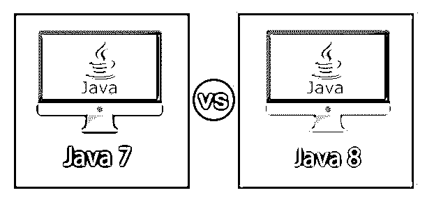
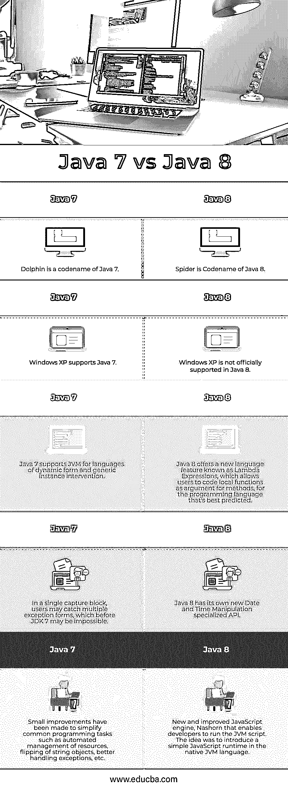

# Java 7 vs Java 8

> 原文：<https://www.educba.com/java-7-vs-java-8/>

## Java 7 和 Java 8 的区别

**什么是 Java 7:** 自从太阳微系统公司合并以来，Java 7 是在甲骨文的管理和所有权下，在 [Java 编程语言](https://www.educba.com/java-programming-language-features/)中的第一次主要更新。2010 年 1 月 27 日，甲骨文公司完成了最后的收购。美国科技巨头组织了一场庆祝 Java 标准版 7 到来的活动。Java SE 7 的推出展示了甲骨文对语音和技术的专注。开发 Java 编程语言的 Sun Microsystems 公司是科技巨头们的一大成就。今天，甲骨文公司的全资子公司 Sun Microsystems 运营着 Sun 服务器、MySQL、Solaris 存储和网络硬件部门。在收购后的 5 年里，Java 7 对 Oracle 来说是一个巨大的成功，也是对 Java 的一个重大改进，几乎将业务带到了一个全新的水平。这个新版本包括了许多创新，这些创新已经在编程领域迅速发展。Java 7 版本是可靠的，提供了许多主要的更新，包括主要的错误修复和对动态非 Java 语言的改进支持，以及对通用类开发干扰的支持。

**什么是 Java 8:** Java SE 8 (Spider)是一个突破性的软件框架发布，带来了 Java 编程的许多重大升级和增强，包括 Java Script 增强引擎、用于操纵日期和时间的新 API、JVM 增强和更快等等。Java SE 8 是编程语言的巨大飞跃，它也带来了技术巨头最期待的更新 lambda word。这是更新 Java 8 中专门包含的新语言特性，也是最重要的编程升级之一。这个附加组件最终导致了实用编程成为开发平台的先驱。甲骨文于 2014 年 3 月 18 日正式发布 Java 开发套件 8，这标志着全球计划的一个转折点。该公司改变了函数式编程的编程模型，以适应 Lambda 的新表达式。

<small>网页开发、编程语言、软件测试&其他</small>

### Java 7 与 Java 8 的面对面比较(信息图表)

以下是 Java 7 和 Java 8 之间的五大对比:

### Java 7 和 Java 8 的主要区别

让我们从以下几点来讨论 Java 7 和 Java 8 之间的一些关键区别:

*   自 2010 年收购 Sun Microsystems 以来，Java SE 7 一直是第一个也是唯一一个由 Oracle Corporation 拥有和管理的编程语言更新。Java 8 是下一个最大的 Java 7 升级，它在 Java 模型中有一些重要的特性和增强。
*   JVM 支持动态语言加上微小的语言改进是 Java 7.0 最显著的特性之一。Java 8 是一个重要的编程更新，它为函数式编程带来了 Lambda 表达式的重大升级。Java 8 提供了一个 JavaScript 运行时，允许开发人员在应用程序中嵌入 JavaScript 代码。
*   Java 8 还有一个新的和改进的日期/时间 API、JavaScript 增强的核心和新的流 API。有竞争力的电池，安全和随机发电，等等。Java 7 改进了类初始化的架构，改进了受控 beans，支持多种异常，等等。
*   Java 7 引入了字符串支持，这样用户可以更容易、更有效地重写代码。他帮助用户编写更好阅读的代码。Java 8 的 Lambda 表达式允许您将本地函数编码为方法的参数。
*   Oracle 从 2015 年 4 月起停止发布 Java SE 7 安全更新，但当前的 Java 归档安装仍然开放。2018 年 9 月以后，Java 8 的公开更新将停止。Java 8 提供了对 Java 类型的注释以及重复注释。

### Java 7 与 Java 8 的对比表

下表总结了 Java 7 与 Java 8 的比较 **:**

| **Java 7** | **Java 8** |
| Dolphin 是 Java 7 的一个代号。 | 蜘蛛是 Java 8 的代号。 |
| Windows XP 支持 Java 7。 | Java 8 不正式支持 Windows XP。 |
| Java 7 支持动态形式和通用实例干预语言的 JVM。 | Java 8 提供了一种新的语言特性，称为 Lambda 表达式，它允许用户编写本地函数作为方法的参数，这是对编程语言的最好预测。 |
| 在单个捕获块中，用户可以捕获多个异常表单，这在 JDK 7 之前是不可能的。 | Java 8 有自己新的日期和时间操作专用 API。 |
| 已经做了一些小的改进来简化常见的编程任务，例如资源的自动管理、字符串对象的翻转、更好地处理异常等。 | 新的和改进的 JavaScript 引擎 Nashorn 使开发人员能够运行 JVM 脚本。想法是在本地 JVM 语言中引入一个简单的 JavaScript 运行时。 |

### 结论

在本文中，我们已经了解了什么是 Java 7 和 Java 8，Java 7 和 Java 8 之间的主要区别以及一个比较表。

### 推荐文章

这是一个关于 Java 7 和 Java 8 之间主要区别的指南。在这里，我们用信息图和比较表来讨论 Java 7 和 Java 8 的主要区别。您也可以看看以下文章，了解更多信息–

1.  [顶级](https://www.educba.com/java-8-features/) [特色](https://www.educba.com/java-8-features/)[Java 8](https://www.educba.com/java-8-features/)
2.  [Java 中的方法类型](https://www.educba.com/methods-in-java/)
3.  [Java 中的虚函数是如何工作的？](https://www.educba.com/virtual-function-in-java/)
4.  [Java 中控制语句概述](https://www.educba.com/control-statement-in-java/)

