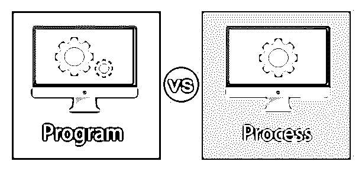
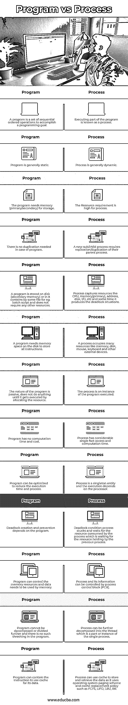

# 程序与过程

> 原文：<https://www.educba.com/program-vs-process/>

## 程序与过程的区别

在这篇文章中，我们将看到一个大纲的程序与过程。程序是一组指令，它们按照规定的顺序排列以执行特定的任务。该程序通常驻留在二级存储器(硬盘)中，相对较大。这个过程是一个被动的实体。正在执行的程序称为进程，每个进程都在主存储器(ram)中管理，并由微处理器控制和执行。每个进程都有一些属性，如进程状态、进程 id、程序计数器、堆栈指针寄存器、会计数据、内存限制等。所有这些过程信息都包含在过程控制块中。当进程在其状态中执行转换变化(上下文切换)时，操作系统在进程控制块中更新该信息。进程是活动的实体。

### 程序与流程之间的直接比较(信息图表)

以下是程序与流程之间的 13 大对比:

<small>网页开发、编程语言、软件测试&其他</small>

### 程序与流程的主要区别

让我们从以下几点来讨论程序与过程之间的一些关键区别:

**1。**程序和进程都是相互关联的术语，程序的生命周期比进程长，在批处理操作系统中被视为系统活动，称为顺序执行指令/作业，而在实时操作系统中被称为程序。

**2。**用户可以在操作系统中并行运行多个程序。这些术语指的是编程操作系统，其中操作系统管理其与程序相关的活动，如内存管理、高速缓存管理等。

**3。**一个程序被认为是一个被动的实体，在操作系统中，例如一个批处理文件或可执行文件包含一组有序的指令/命令来执行任何特定的任务，它之所以被称为被动，是因为它本身不执行任何动作，它需要一个接一个地执行指令来完成特定的任务。

**4。**操作系统为执行程序分配内存给它。程序的地址空间由指令、数据和指针的地址组成。例如，如果 P 是程序，操作系统将把内存分配给 P(在执行之前),并将探索 P 的地址空间，然后操作系统将调度 P 程序的执行并分配资源。

**5。**(文件输入/输出，外部访问信息)，CPU 并不总是执行程序 P 的指令；实际上，[操作系统](https://www.educba.com/types-of-computer-operating-system/)制定了 CPU 调度，在程序 P 的执行和其他程序的执行之间共享 CPU。(它们是并行执行的)。

**6。**进程被认为是一个正在执行的程序，它被认为是一个活动的实体，实现/实施指令写入程序的任务。一个程序可以引用多个进程。所有这些进程活动都由操作系统通过 PCB(进程控制块)来处理，其中包括程序计数器、进程 id、进程状态等切换信息(当进程在进程间切换时执行控制)。程序计数器存储即将到来的指令顺序，该指令将在程序完成时或稍后执行。

**7。**进程涉及到一些外部和内部的资源进行处理，比如寄存器、内存、I/O 资源等来实现和管理进程任务。在程序执行期间，它占用处理器或 me/O 操作，这使得程序和进程有所不同。

**8。**例如；在 java 程序中。当我们在文件中编写程序时，它只是一个脚本，一组不执行任何操作的命令和指令，但当我们执行这个程序时，它变成单个或多个进程，因此在本质上动态地处理它，进程之间的资源共享是通过处理器的上下文切换来完成的，单个处理器分布在多个进程中，并负责以分布式方式执行进程。

**9。**程序是一组可计数的有序和连续的指令/操作/命令，需要被执行以完成某些动作。另一方面，当前正在执行的程序实例是一个进程。

### 程序与过程对照表

下表总结了程序与流程 **:** 之间的比较

| **程序** | **流程** |
| 一个程序是完成一个编程目标的一组连续有序的操作。 | 执行程序的一部分被称为进程。 |
| 程序通常是静态的。 | 过程通常是动态的。 |
| 该程序需要内存(主/辅)进行存储。 | 该工艺对资源的要求很高。 |
| 这个程序不需要复制。 | 新的子/子流程需要复制其父流程。 |
| 一个程序存储在磁盘(二级存储器)上或包含在某个文件中，例如批处理脚本，不需要任何其他资源。 | 进程捕获 CPU、内存(主)、地址、磁盘、I/O 等资源，有时会产生死锁情况。 |
| 程序需要磁盘上的内存空间来存储所有指令。 | 一个进程占用许多资源，如内存、磁盘、鼠标、键盘和其他外部设备。 |
| 程序的本质是被动的，在通过分配资源执行之前不做任何事情。 | 进程是被执行程序的一个实例。 |
| 程序没有计算时间和成本。 | 进程有相当多的单个事实访问和计算时间。 |
| 程序可以优化，以减少执行时间和过程。 | 进程是一个独立的实体，它的执行依赖于处理器。 |
| 死锁的产生和预防取决于程序。 | 死锁条件进程停滞并等待正在等待前一个进程占用资源的进程消耗资源。 |
| 程序可以控制内存资源和内存需要使用的数据。 | 过程及其信息可由过程控制块(PCB)控制。 |
| 程序不能进一步分解或分割，程序中不存在这样的脱粒。 | 流程可以进一步分解为线程，线程是单个流程的一部分或实例。 |
| 程序可以包含对其数据使用缓存的指令。 | 进程可以使用缓存来存储和检索数据，因为它使用操作系统分页方案和缓存替换策略，如 FCFS、LIFO、LRU、RR。 |

### 结论

程序和进程是彼此相关的术语，但并不相似，程序只是一个包含有序操作的脚本或文件，并存储在磁盘上，它类似于进程的前一阶段。进程是通过执行进程而生成的事件，被执行以生成事件的程序被称为进程。

### 推荐文章

这是一个程序与过程之间最大差异的指南。在这里，我们用信息图和比较表来讨论程序与过程的主要区别。您也可以看看以下文章，了解更多信息–

1.  [编程与 Web 开发–顶级对比](https://www.educba.com/programming-vs-web-development/)
2.  [Python 中的套接字编程](https://www.educba.com/socket-programming-in-python/)
3.  [Web 编程语言介绍](https://www.educba.com/web-programming-languages/)
4.  [什么是 Rust 编程？|优势](https://www.educba.com/what-is-rust-programming/)

