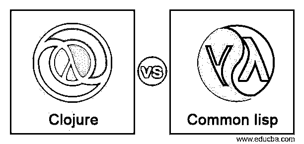
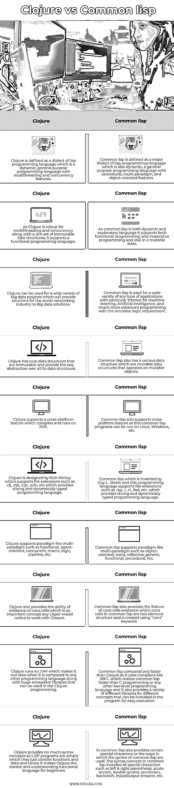

# Clojure vs Common lisp

> 原文：<https://www.educba.com/clojure-vs-common-lisp/>

**

** 

## Clojure 和 Common lisp 的区别

Clojure 是一种动态函数式编程语言，它是 lisp 编程语言的一种方言，具有多线程和并发性的高效和健壮功能的组合，并在 JVM 上运行，JVM 是一种 java 平台，还具有诸如提供对 java 框架的访问的功能，Java 框架是一组丰富的不可变数据结构，可以将代码作为数据共享。Common lisp 是一种探索性编程语言，也是 lisp 编程语言的一种方言，具有过程化、面向对象和函数式编程语言范式的特征组合，是一种多范式、动态和通用的语言，适合于增量式软件开发。在这个主题中，我们将学习 Clojure vs Common lisp。

### Clojure 与 Common lisp 的直接比较(信息图)

下面是 Clojure 和 Common lisp 之间的主要区别

<small>网页开发、编程语言、软件测试&其他</small>

### Clojure 和 Common lisp 的主要区别

以下是下面提到的主要区别

#### 数据结构支持

在 Clojure 中，它允许支持不可变的数据结构，这在 Clojure 中被高度遵循，因此据说大多数程序员在他们的代码中使用这种不可变的数据，这是默认遵循的特性。然而，在 common lisp 中最广泛地允许命令式编程，它支持在可变对象上操作的数据结构，但是 common lisp 支持函数式编程和命令式编程。

#### 编程语言的类型

Clojure 允许不可变的数据结构支持，因此它主要支持具有多范例的函数式编程语言，如宏、逻辑、流水线、面向函数和代理、多线程和并发支持。而 common lisp 主要允许或操作可变对象，但它支持函数式编程和命令式编程，具有多范例，如通用、过程、函数、面向对象、元和反射支持。

#### Cons 细胞

在 Clojure 中，cons 单元的存在使得开发人员或程序员从任何其他编程语言转向 Clojure。然而，公共 lisp 也提供了 cons 单元的存在，这是通常所有 lisp 编程语言的基本要素的二元结构，并且这些 cons 单元可以使用“cons”关键字来创建。

#### 并发

Clojure 最擅长编写并发程序，因为它提供了不可变的数据结构，还提供了软件事务内存、函数式编程等，因此开发人员可以专注于开发功能而不是并发概念。而在 common 中，lisp 还提供了并发编程的概念，这反过来可以设计和实现并发 LISP 解释器，用于同时评估 LISP 表单列表。

### 对照表

| **序列号** | **Clojure** | **常见的 Lisp** |
| One | Clojure 被定义为 lisp 编程语言的一种方言，lisp 编程语言是一种具有多线程和并发特征的动态通用编程语言。 | Common lisp 被定义为 lisp 编程语言的主要方言，它也是动态的，是一种具有过程化、多范例和面向对象特征的通用编程语言。 |
| Two | 由于 Clojure 对于多线程和并发性以及一组丰富的不可变数据结构是健壮的，所以它支持函数式编程语言。 | 由于 common lisp 既是动态的又是探索性的语言，它既支持函数式编程又支持命令式编程，并且还处于可变状态。 |
| Three | Clojure 可以用于各种大数据项目，这些项目将为社交网络行业提供大数据解决方案。 | Common lisp 广泛用于各种类型的应用程序，特别是机器学习、人工智能和具有递归逻辑要求的更高级的编程。 |
| Four | Clojure 拥有不可变的核心数据结构，并在所有数据结构上提供 seq 抽象。 | Common lisp 也有各种数据结构，它们是可变数据结构，对可变对象进行操作。 |
| Five | Clojure 支持在 JVM 上编译和运行的跨平台特性。 | Common lisp 还支持跨平台特性，因为这种 common lisp 程序可以在 Linux、Windows 等平台上运行。 |
| Six | Clojure 是由 Rich Hickey 设计的，它支持诸如。clj，。cljs，。cljc，。edn 等，它们提供了强大的动态类型编程语言。 | 由 Guy L. Steele 发明的 Common lisp，这种编程语言支持文件扩展名，如。lsp，。l，。cl，。fasl 等。它提供了强大的动态类型编程语言。 |
| Seven | Clojure 支持多范例，如功能、面向代理、并发、宏、逻辑、管道等。 | Common lisp 支持多范例，如面向对象、元、反射、通用、函数、过程等。 |
| Eight | Clojure 还提供了 cons 单元存在的能力，这是任何 Lisper 在使用闭包时都会注意到的一个重要概念。 | Common lisp 还提供了 cons 单元存在的特性，common lisp 中的 cons 单元是二元结构，是使用“cons”关键字创建的。 |
| Nine | Clojure 运行在 JVM 上，这使得它与任何其他编程语言相比都运行缓慢，同时还有可以在 Clojure 编程中使用的巨大的生态系统库。 | Common lisp 比 Clojure 相对更快，因为它使用像 SBCL 这样的编译器，这使得 common lisp 比 C 编程或任何其他低级编程语言都快，并且它还为不同的概念提供了各种不同的库，这些库可以包含在程序中以便于执行。 |
| Ten | Clojure 没有提供太多的语法概念，因为 LISP 程序很简单，它们只包含函数和数据，因此它使 Clojure 成为初学者最容易理解的函数式语言 | 在 common lisp 中还提供了某些特殊字符或使用 common lisp 语法的方式。common lisp 中的语法概念包括所有特殊字符，如左右括号、重音符、双引号、分号、反斜杠、输入/输出流等。 |

### 结论

在本文中，我们得出结论，Clojure 是一种主要的函数式编程语言，它能够支持不可变的数据结构，而 common lisp 支持带有可变数据结构的命令式和函数式编程语言。因此，我们可以说这两者之间没有太大的区别，因为两者都是 lisp 编程语言的方言。开发人员或程序员应根据需要或要求在这些解决方案中进行选择，以开发各种大数据解决方案。

### 推荐文章

这是 Clojure vs Common lisp 的指南。这里我们用信息图和比较表讨论 Clojure 和 Common lisp 的主要区别。您也可以看看以下文章，了解更多信息–

1.  [VGA 与 SVGA 的对比](https://www.educba.com/vga-vs-svga/)
2.  [Alexa vs Siri](https://www.educba.com/alexa-vs-siri/)
3.  [Shopify vs Squarespace](https://www.educba.com/shopify-vs-squarespace/)
4.  [表格尺寸与尺寸](https://www.educba.com/tableau-dimension-vs-measure/)

