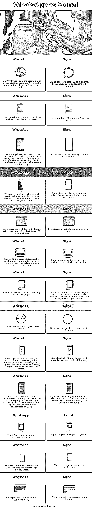

# WhatsApp vs Signal

> 原文：<https://www.educba.com/whatsapp-vs-signal/>

## WhatsApp 和 Signal 的区别

下面这篇文章为 WhatsApp vs Signal 提供了一个大纲。如果你正在寻找一个加密的消息应用程序，并且对使用哪个应用程序感到困惑，比如 Signal 或 WhatsApp，这篇文章将帮助你找到哪个更好。WhatsApp 更新了隐私政策，其他脸书所有的公司可以访问 WhatsApp 用户的数据。这些新的 WhatsApp 隐私政策引发了许多关于安全和数据隐私的问题。世界首富埃隆·马斯克(Elon Musk)认可的全新信号提供了安全功能，被认为是 WhatsApp 的最佳替代品之一。

### WhatsApp 和 Signal 的直接对比(信息图)

以下是 WhatsApp 与 Signal 的 13 大区别:

<small>网页开发、编程语言、软件测试&其他</small>

### WhatsApp 与 Signal 的主要区别

让我们讨论一下 WhatsApp 和 Signal 之间的一些主要差异:

*   WhatsApp 提供各种聊天功能，如发送媒体、位置、联系人等。Signal 也有同样的聊天功能。
*   WhatsApp 收集用户数据，包括设备 ID、电话号码、联系人、位置、电子邮件、广告数据、购买历史、支付信息和其他用户内容。另一方面，Signal 收集电话号码，不收集用户的其他个人数据。因此，它比 WhatsApp 更安全。
*   WhatsApp 和 Signal 都允许语音通话和视频通话选项。为了在 WhatsApp 中取消发送信息，它有一个“删除所有人”选项。最近还推出了“消失的消息”功能。Signal 还具有“消失消息”功能，用户可以设置时间，从 5 秒到 7 天不等。
*   在 WhatsApp 上，用户可以创建多达 256 个参与者的群组。除了语音通话之外，它还增加了群组视频通话功能，而一个群组可以有多达 100 名参与者。群组视频通话最多可容纳 5 名成员。
*   WhatsApp 允许用户分享高达 16 MB 的视频和高达 100MB 的其他文件。在 Signal 上，用户可以共享高达 100MB 的文件和媒体。
*   WhatsApp 有一个网页版，允许你使用手机应用程序登录你的账户。之后，你仍然可以在 WhatsApp 网站上获得该应用的所有功能。它还有一个桌面应用程序。另一方面；Signal 没有网页版，只有桌面应用。
*   在 WhatsApp 上，聊天、通话和媒体都提供了端到端的加密。然而，现在脸书拥有的公司可以读取用户的数据。但是，没有像 Signal 这样的其他高级安全功能。它为消息、通话和聊天的元数据提供加密。为了进一步保护用户隐私，Signal 有一个“密封发送者”选项以及中继呼叫功能，其中呼叫通过信号服务器进行重新路由。
*   用户可以在 WhatsApp 上 24 小时更新状态，用户可以上传图片或 30 秒的视频。相反，在 Signal 上，到目前为止没有提供状态特性。
*   WhatsApp 有一个支付功能，叫做 WhatsApp Pay。而 Signal 没有任何支付功能。

### WhatsApp vs 信号对比表

我们来讨论一下 WhatsApp 和 Signal 的顶级对比:

| **Sr 号** | **WhatsApp** | **信号** |
| **1** | 在 WhatsApp 上，用户可以创建多达 256 个参与者的群组。除了语音通话之外，它还增加了群组视频通话功能 | 小组最多可有 100 名参与者。群组视频通话最多可容纳 5 名成员。 |
| **2** | 用户可以共享高达 16 MB 的视频和高达 100MB 的其他文件。 | 用户可以共享高达 100MB 的文件和媒体。 |
| **3** | WhatsApp 有一个网页版，允许你使用手机应用程序登录你的账户。之后，你仍然可以在 WhatsApp 网站上获得该应用的所有功能。它还有一个桌面应用程序。 | 它没有网页版，但有一个桌面应用。 |
| **4** | WhatsApp 提供在线和离线备份，为了备份聊天和媒体，用户可以选择他们的谷歌账户。 | Signal 不允许公司驱动或云服务。它只提供本地备份。 |
| **5** | 用户可以 24 小时更新状态。用户可以上传图片或 30 秒的视频。 | 目前还没有提供状态特性。 |
| **6** | 为聊天、通话和媒体提供端到端加密。然而现在，facebook 旗下的公司可以读取用户数据。 | 它为消息、通话和聊天的元数据提供加密。 |
| **7** | 没有像 Signal 这样的其他高级安全功能。 | 为了进一步保护用户隐私，Signal 有一个“密封发送者”选项，以及中继呼叫功能，其中呼叫通过信号服务器重新路由。 |
| **8** | 用户可以在 51 分钟内删除邮件。 | 用户不能在 3 小时内删除消息。 |
| **9** | WhatsApp 收集用户数据，包括设备 ID、电话号码、联系人、位置、电子邮件、广告数据、购买历史、支付信息和其他用户内容。 | Signal collects Phone numbers and not other personal data of the user. |
| **10** | WhatsApp 不提供密码功能，但用户可以使用第三方软件设置密码。但它提供了指纹锁功能和双因素认证(2FA)。 | Signal 支持指纹和 PIN 锁，分块截图，2FA，用户可以在发送前自动模糊人脸。 |
| **11** | WhatsApp 不支持隐名键盘。 | 信号支持匿名键盘。 |
| **12** | 有 WhatsApp 商业应用，那里已经有很多企业了。 | 对商家来说没有什么特别之处。 |
| **13** | 它有一个名为 WhatsApp Pay 的支付功能。 | Signal 没有任何支付功能。 |

### 结论

在这篇文章中，我们看到了 WhatsApp 和 Signal 基于所有功能的详细对比。您可以根据自己的需求和隐私偏好选择其中任何一个。

### 推荐文章

这是 WhatsApp vs. Signal 的指南。在这里，我们分别用信息图和比较表讨论了 WhatsApp 和 Signal 的主要区别。您也可以阅读以下文章，了解更多信息——

1.  [仙丹 vs 二郎](https://www.educba.com/elixir-vs-erlang/)
2.  [VGA 与 SVGA 的对比](https://www.educba.com/vga-vs-svga/)
3.  [Zendesk vs Salesforce](https://www.educba.com/zendesk-vs-salesforce/)
4.  [SharePoint vs OneDrive](https://www.educba.com/sharepoint-vs-onedrive/)

