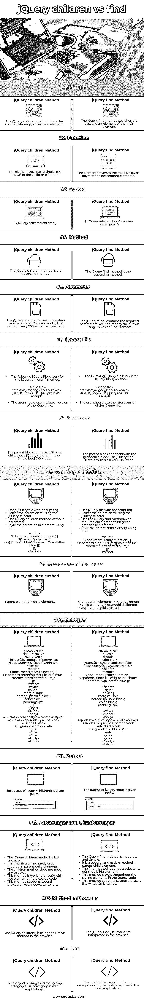
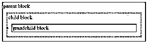
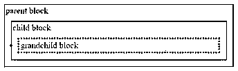

# jQuery 子代与 find

> 原文：<https://www.educba.com/jquery-children-vs-find/>


## jQuery 子代与 find 的区别

下面的文章提供了 jQuery children vs find 的概要。jQuery children 方法正在搜索父元素的子元素。jQuery children 函数只匹配超级元素的子元素。jQuery find 方法正在搜索父元素的子元素和孙元素。jQuery find 函数用于匹配超级元素的后代。jQuery children 方法返回单个子元素，jQuery find 方法返回多个子元素。jQuery 子函数向下移动到直接子元素。jQuery find 函数向下移动到 children 元素的末尾。

### jQuery 子代与 find 的直接比较(信息图)

以下是 jQuery children 与 find 之间的 14 大区别:

<small>网页开发、编程语言、软件测试&其他</small>




### jQuery 子代与 find 的主要区别

让我们讨论一下 jQuery children 和 find 之间的一些主要区别:

*   jQuery children 方法从父元素返回子元素。jQuery find 方法从父元素返回派生元素。
*   jQuery 子方法在两个元素之间遍历。jQuery find 方法是从父元素到子元素、孙元素和曾孙元素的遍历。
*   jQuery 子方法比 find 方法工作得更快。jQuery find 方法工作正常。
*   jQuery 子方法是一个单级操作。jQuery find 方法是一种多级操作。
*   jQuery find 方法比 jQuery children 方法更适合过滤。
*   对于搜索，jQuery children 方法比 jQuery find 方法工作得更好。
*   jQuery children 函数在浏览器中使用了 native 方法。jQuery find 函数使用了浏览器中解释的 JavaScript。
*   jQuery 子方法不需要参数或选择器。jQuery find 方法需要使用参数或选择器。
*   jQuery children 方法直接转到子节点。jQuery find 方法访问整个文档对象模型 DOM。
*   jQuery 子方法的语法是:

```
children()
```

*   jQuery find 方法的语法是:

```
find(" selector ")
```

### jQuery 子代与查找比较表

让我们讨论一下 jQuery children 与 find 之间的主要比较:

| **特性** | **jQuery 子方法** | **jQuery 查找方法** |
| **定义** | jQuery children 方法查找主元素的子元素。 | jQuery find 方法搜索主元素的后代元素。 |
| **功能** | 该元素向下遍历一个级别，直到子元素。 | 该元素向下遍历多个级别，直到后代元素。 |
| **语法** | $(jQuery 选择器)。儿童() | $(jQuery 选择器)。find("必需参数") |
| **方法** | jQuery 子方法是遍历方法。 | jQuery find 方法是一种遍历方法。 |
| **参数** | jQuery“children”不包含任何参数。您可以根据需要使用 CSS 修改输出。 | jQuery“find”包含必需的参数。您可以根据需要使用 CSS 修改输出。 |
| **jQuery 文件** | 

*   The following jQuery file works for the jQuery children () method.

<脚本 src = " https://Ajax . Google APIs . com/Ajax/libs/JQuery/3 . 5 . 1/JQuery . min . js ">
</脚本>

*   Users should use the latest version of JQuery file.

 | 

*   The following jQuery file works for JQuery find () method.

<脚本 src = " https://Ajax . Google APIs . com/Ajax/libs/JQuery/3 . 5 . 1/JQuery . min . js ">
</脚本>

*   Users should use the latest version of JQuery file.

 |
| **操作** | 父块与子块相连接。jQuery children()遍历单级 DOM 树。 | 父块与孙块连接。jQuery find()遍历多层 DOM 树。 |
| **工作程序** | 

*   Use jQuery files with script tags.
*   Select the parent class using jQuery selector.
*   Use the jQuery sub-method without parameters.
*   Style parent-child elements with CSS.

<脚本>
$(文档)。ready( function() { $("。家长”)。儿童()
。css( {"color": "blue "，" border" : "3px 虚线蓝" })；
})；
</剧本> | 

*   Use jQuery files with script tags.
*   Select the parent class using jQuery selector.
*   Use the jQuery find method with the required children/grandchildren/great-grandchildren elements.
*   Style parent-child elements with CSS.

<脚本>
$(文档)。ready( function() { $("。家长”)。找(“李”)。css({"color": "blue "，" border" : "3px 虚线蓝" })；
})；
</脚本> |
| **元素的相关性** | 父元素->子元素 | 祖辈元素->父元素->子元素->孙元素->曾孙元素 |
| **例子** | T29】！DOCTYPE>
<html><head>
<script src = " https://Ajax . Google APIs . com/Ajax/libs/JQuery/3 . 5 . 1/JQuery . min . js ">
</script>
<script>
$(文档)。ready( function(){
$(”。家长”)。孩子()。css( {"color": "blue "，" border" : "3px 虚线蓝" })；
})；
</剧本>
<风格>
。child * {
边距:10px
边框:1px 纯黑；
颜色:黑色；
填充:2px
}
</style>
</head>
<body>
<div class = " child " style = " width:450 px；>
<div class = " parent ">父块
< ul >子块
<李>孙块</李>
</ul>
</div>
</div>
</body>
</html | T30】！DOCTYPE>
<html>
<head>
<script src = " https://Ajax . Google APIs . com/Ajax/libs/JQuery/3 . 5 . 1/JQuery . min . js ">
</script>
<script>
$(文档)。ready( function(){
$(”。家长”)。找(“李”)。css({"color": "blue "，" border" : "3px 虚线蓝" })；
})；
</剧本>
<风格>
。child * {
边距:10px
边框:1px 纯黑；
颜色:黑色；
填充:2px
}
</style>
</head>
<body>
<div class = " child " style = " width:450 px；>
<div class = " parent ">父块
<ul
<子块>孙块</Li>
</ul>
</div>
</div>
</body>
</HTT |
| **输出** | The output of jQuery children() is given below.




 | The output of jQuery find() is given below.


 |
| **优缺点** | 

*   JQuery sub-method is quick and simple.
*   It is a special and rarely used method in parent-child elements.

*   This method directly handles two elements in the source code.
*   This method supports multiple browsers, such as windows, Linux, etc.

 | 

*   The jQuery lookup method is moderate and simple.
*   It is a popular and usable method in parent-child elements.
*   The find method requires a selector to get the sibling element.
*   This method traverses the sibling elements in the source code.
*   This method supports multiple browsers, such as windows, Linux, etc.

 |
| 浏览器中的**方法** | jQuery children()正在浏览器中使用本机方法。 | jQuery find()是浏览器中解释的 JavaScript。 |
| **使用** | 该方法用于在 web 应用程序中从类别到子类别进行筛选。 | 该方法用于过滤 web 应用程序中的类别及其子类别。 |

### 结论

jQuery find 方法和 jQuery 子方法用于在 web 应用程序中进行搜索和过滤。jQuery find 方法和 jQuery children 方法是获取根元素的叶元素。这种遍历方法使得开发人员可以轻松编码，并为用户提供所需的元素。这两种方法减少了 web 应用程序中冗长的编码过程。

### 推荐文章

这是 jQuery children vs find 的指南。这里我们讨论 jQuery children 与 find 的主要区别，包括信息图和比较表。您也可以看看以下文章，了解更多信息–

1.  [Bootstrap vs jQuery UI](https://www.educba.com/bootstrap-vs-jquery-ui/)
2.  [vista . js vs jquery](https://www.educba.com/vue-js-vs-jquery/)
3.  [Angular vs JQuery](https://www.educba.com/angular-vs-jquery/)
4.  [Bootstrap vs Jquery](https://www.educba.com/bootstrap-vs-jquery/)


