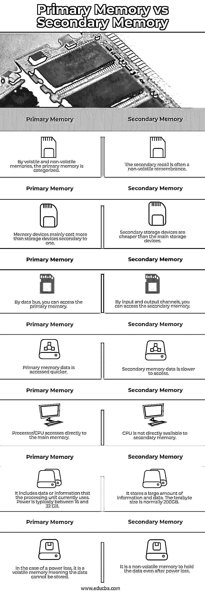

# 主存储器与辅助存储器

> 原文：<https://www.educba.com/primary-memory-vs-secondary-memory/>

## 主存储器和辅助存储器的区别

下面的文章提供了主存储器和辅助存储器的概要。记忆类似于我们的大脑，因为它使用数据和指令来存储它们。计算机内存是用于处理数据和存储必要的处理指令的存储空间。存储器被分成几个更小的部分，称为单元。每个小区/位置都有唯一的地址和大小。基本上，有两种记忆，第一种是主记忆，第二种是次记忆。

#### 什么是初级记忆？

核心计算机设备内存是主内存。当前命令被复制到主存储器，因此 CPU 可以直接从主存储器访问数据。因为有内部存储器，主存储器访问数据更快，并且处理器使用数据总线来访问主存储器数据。主存储器本质上通常是易失性的，这意味着数据在保存之前不会存储在主存储器中。基本存储是半导体，成本高于二级存储。主计算机内存空间始终低于辅助内存。

<small>网页开发、编程语言、软件测试&其他</small>

主存储器分为两种，第一种是 RAM，第二种是 ROM。

*   **RAM:**RAM 的内存读写。当前需要的数据存储在 RAM 中，可以很容易地从 CPU 中访问。当电源关闭时，RAM 易失并丢失数据。静态或动态 RAM 是可能的。
*   ROM:ROM 是一个只读存储器；它的实质是不能改变的。它配有启动设备的指令。即使断电，它仍保持其内容，即 ROM 的非易失性存储器。EPROM，PROM 和 EEPROM 是 ROM 的形式。

#### 二级记忆是什么？

辅助存储器是一种机器辅助存储器。要永久保存在辅助存储器中的数据被保留。CPU 不能直接从二级存储器访问数据。最初，数据必须复制到主存储器，并且只能通过 CPU 处理。对辅助存储器数据的访问也较慢。您可以访问输入通道上的辅助存储器。辅助存储器是非易失性的，这确保了即使电源关闭，辅助存储器材料也存在。辅助存储器是磁或光存储器，比主存储器便宜。

### 主内存与辅助内存的直接比较(信息图表)

以下是主内存与辅助内存之间的 7 大区别:

### 主存储器与辅助存储器的主要区别

让我们讨论一下主存储器和辅助存储器之间的一些主要区别:

*   主存储器和辅助存储器的主要区别在于主存储器可以通过内核直接访问，而 CPU 不能直接访问辅助存储器。
*   主数据存储器也称为主计算机存储器。然而，二级记忆被称为辅助记忆。
*   要处理的数据当前在主存储器中，但是必须无限期保留的数据存储在辅助存储器中。
*   主存储器是半导体存储器，而次存储器是磁存储器和光存储器。主存储器的数据存取速率高于辅助存储器。
*   辅助存储器比主存储器便宜。
*   通过使用数据总线，我们可以访问主存储器，通过输入输出通道可以访问辅助存储器。

### 主存储器与辅助存储器对照表

让我们讨论一下主内存与辅助内存之间的主要比较:

| **Sr 号** | **主存储器** | **二级存储器** |
| One | 通过易失性和非易失性存储器，主存储器被分类。 | 二次回忆通常是一种非易失性记忆。 |
| Two | 存储设备的成本主要高于存储设备，仅次于存储设备。 | 辅助存储设备比主存储设备便宜。 |
| Three | 通过数据总线，你可以访问主存储器。 | 通过输入和输出通道，您可以访问辅助存储器。 |
| Four | 主存储器数据被更快地访问。 | 二级存储器数据存取较慢。 |
| Five | 处理器/CPU 直接访问主存储器。 | 辅助内存不能直接使用 CPU。 |
| Six | 它包括处理单元当前使用的数据或信息。功率通常在 16 到 32 GB 之间。 | 它存储了大量的信息和数据。兆兆字节的大小通常为 200GB。 |
| Seven | 在断电的情况下，它是一个易失性存储器，意味着数据不能被存储。 | 它是一种非易失性存储器，即使在断电后也能保存数据。 |

### 结论

主存储成本很高，只能在小容量设备上使用。辅助存储更容易访问，并且批量存在于设备中。即使没有副内存，但有了主内存，计算机也能工作。所以在这篇文章中，我们看到了一级内存和二级内存的详细对比。

### 推荐文章

这是一个关于主存储器和辅助存储器的指南。这里我们分别讨论信息图和比较表的主要区别。您也可以看看以下文章，了解更多信息–

1.  [硬盘与内存](https://www.educba.com/hard-drive-vs-ram/)
2.  [Fluentd vs Logstash](https://www.educba.com/fluentd-vs-logstash/)
3.  [电报对信号](https://www.educba.com/telegram-vs-signal/)
4.  [RAM vs ROM](https://www.educba.com/ram-vs-rom/)

