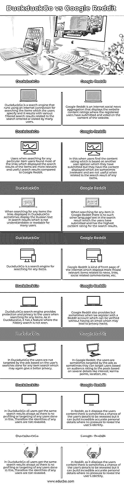

# DuckduckGo vs 谷歌 Reddit

> 原文：<https://www.educba.com/duckduckgo-vs-google-reddit/>

## DuckduckGo 和 Google Reddit 的区别

DuckduckGo 被定义为用于搜索用户输入的具有互联网连接的任何项目的任何细节的搜索引擎，该搜索引擎通过其隐私政策强调保护用户进行的搜索，并且还基于许多用户访问的网站过滤搜索。谷歌 Reddit 被定义为一个新闻聚合网站，它使用互联网连接，是一个社交新闻平台，它根据用户对注册用户已经提交的内容的讨论和投票来显示评级。

### DuckduckGo 和 Google Reddit 的正面比较(信息图)

以下是 DuckduckGo 和 Google Reddit 的 5 大区别:

<small>网页开发、编程语言、软件测试&其他</small>

### DuckduckGo 和 Google Reddit 的主要区别

以下是 duckduckgo 与 google reddit 的主要区别:

#### 1.相关搜索差异

DuckduckGo 是一个互联网搜索引擎，当显示与任何项目相关的搜索结果时，它显示基于搜索项目提供更多相关细节的链接。与 Google Reddit 相比，这个 DuckduckGo 不记得它的搜索历史，这也可以显示出隐私优势。尽管 Google Reddit 也被认为是用于搜索特定搜索项的互联网首页，但是它基于用户提交的与指定的搜索项相关的内容来显示内容评级，与 DuckduckGo 相比，它大多数时候提供的搜索项的相关细节较少。

#### 2.隐私差异

在 DuckduckGo 中，用于搜索任何项目结果的互联网搜索引擎提供链接，该链接在搜索项目结果时向用户提供隐私，而没有对任何用户细节的任何黑客攻击，否则与项目搜索相关的隐私将被黑客攻击。而在 Google Reddit 中，随着许多用户提交他们对内容的看法或评级，该 Reddit 中任何用户详细信息或项目搜索相关详细信息的隐私都有可能被窃取。

#### 3.知名度和广告定位

在 DuckduckGo 搜索引擎中，它显示对所有用户都相同的搜索结果，并且它不具有针对用户的广告或简档的任何特征，因为这些特征本身使得 DuckduckGo 在维护其用户隐私方面受欢迎，并且它也不记得其任何用户的搜索项目帖子的搜索历史，这也将导致维护用户的隐私。鉴于 Google Reddit 提供任何用户帖子和评论的评级，有时可能会泄露用户的身份，但任何用户都没有压力通过发布或评论其评级或发布任何搜索到的项目详细信息来泄露其身份。因此，Reddit 可以根据分配给注册用户的每个帖子的因果积分，让用户发布更受欢迎和高质量的帖子。

### DuckduckGo vs 谷歌 Reddit 对比表

DuckduckGo 与 Google Reddit 之间的比较如下:

| **序列号** | **DuckduckGo** | **谷歌 Reddit** |
| **1** | DuckduckGo 是使用互联网连接运行的搜索引擎，用于搜索用户指定的项目，并且它产生与许多用户输入或访问的搜索相关的各种过滤的搜索结果。 | Google Reddit 是一个互联网社交新闻聚合，显示注册用户提交和投票的网站内容评级。 |
| **2** | 用户在搜索任何特定项目时，用户发现显示项目搜索结果的大多数链接与 Google Reddit 相比是更相关和有用的搜索结果。 | 在这种情况下，当用户发现基于他们已经提交的另一个用户的意见的内容评级，但是他们显示的内容有时是不相关的，并且当与任何项目的搜索结果相关时是无用的。 |
| **3** | 当搜索任何项目时，DuckduckGo 中显示的链接有时会在搜索结果中显示俄语文本，这对许多用户来说是不可理解或不可读的。 | 当在 Google Reddit 中搜索任何项目时，在用户提交的搜索结果中没有这样的其他语言文本，并且在搜索结果中具有最高的内容评级。 |
| **4** | DuckduckGo 是一个搜索任何项目的搜索引擎。 | Google Reddit 是互联网的一种首页，显示更多与新闻、链接、社会相关评论等相关的混合条目。 |
| **5** | DuckduckGo 搜索引擎在搜索任何项目时为用户提供保护和隐私。和 DuckduckGo 一样，它有一个看不到历史搜索的特性。 | 谷歌 Reddit 也提供，但有时当我们注册一个 Reddit 帐户，可以验证没有电子邮件，这可能会导致隐私黑客。 |
| **6** | 在 DuckduckGo 中，基于用户对任何项目搜索所做的搜索，用户不是广告的目标，这可以再次提供更好的隐私。 | 在 Google Reddit 中，用户有时会被广告锁定，因为有时他们可以根据兴趣、因果关系点、位置等几个细节，根据帖子的受众评级来锁定用户。 |
| **7** | 在 DuckduckGo 中，所有用户总是获得相同的搜索结果，因为在这种情况下没有对任何用户进行分析或定位。因此，不会泄露任何用户的身份。 | 在 Reddit 中，由于它显示用户的内容，有时用户的详细信息有可能被泄露，但它可以建立令人难以置信的准确的个人详细信息，而不会有泄露用户身份的压力。 |
| **8** | 它的流行是基于 DuckduckGo 提供给用户的隐私特性。 | 它的受欢迎程度是基于分配给用户帖子和评论的因果报应点数，这将表明用户帖子的受欢迎程度，也是质量。 |

### 结论

在本文中，我们的结论是，DuckduckGo 被认为是一个使用互联网连接搜索给定项目的搜索引擎，它会为搜索的特定项目提供各种不同的链接，而 Reddit 是一个显示几乎所有链接的首页，如新闻、社会评论等。这完全取决于用户基于什么来搜索特定项目的内容。

### 推荐文章

这是 DuckduckGo vs Google Reddit 的指南。在这里，我们还讨论了 duckduckgo 与 google reddit 的主要区别，包括信息图表和比较表。您也可以看看以下文章，了解更多信息–

1.  [计算机科学家 vs 数据科学家](https://www.educba.com/computer-scientist-vs-data-scientist/)
2.  [AUTOCAD vs CATIA](https://www.educba.com/autocad-vs-catia/)
3.  [AutoCAD vs Microstation](https://www.educba.com/autocad-vs-microstation/)
4.  [Autocad vs Inventor](https://www.educba.com/autocad-vs-inventor/)

