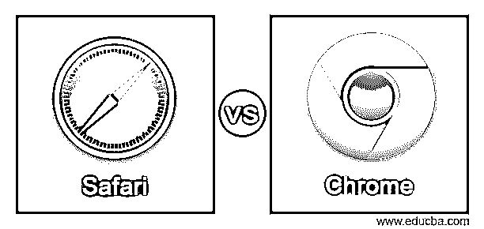
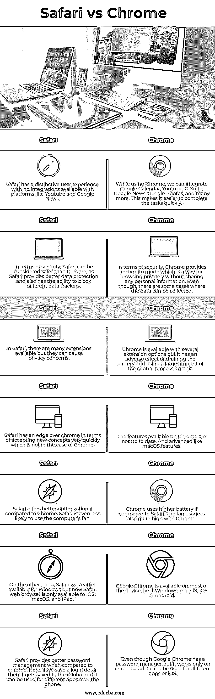

# Safari vs Chrome

> 原文：<https://www.educba.com/safari-vs-chrome/>

## Safari vs Chrome 简介

2003 年，苹果首次在 Mac OS X Panther 上发布了名为 Safari 的图形浏览器。它基于 Webkit 引擎。自 2007 年推出第一款 iPhone 以来，Safari 的移动版本就一直与苹果的 iOS 设备相连。从一开始，Safari 就是所有苹果设备的默认浏览器。对于 windows，2007 年至 2012 年有 Safari 可用。另一方面，Chrome 是谷歌打造的跨平台网络浏览器。谷歌 Chrome 于 2008 年首次与微软 Windows 一起推出，并由 Mozilla Firefox 和苹果的免费软件组件构建而成。谷歌 Chrome 随后被移植到 Android、macOS、Linux 和 iOS 上。在 Android 中，它是默认的网络浏览器。Chrome 操作系统将 Chrome web 浏览器作为其主要组件，用于 web 应用程序。

### Safari 和 Chrome 的直接对比(信息图)

以下是 Safari 和 Chrome 的 7 大区别:

<small>网页开发、编程语言、软件测试&其他</small>

### Safari 与 Chrome 的对比表

| **狩猎之旅** | **铬合金** |
| Safari 拥有独特的用户体验，无法与 Youtube 和谷歌新闻等平台集成。 | 在使用 Chrome 的同时，我们可以集成谷歌日历、Youtube、G-Suite、谷歌新闻、谷歌照片等等。这使得快速完成任务变得更加容易。 |
| 在安全性方面，Safari 可以被认为比 Chrome 更安全，因为 Safari 提供了更好的数据保护，也有能力阻止不同的数据追踪器。 | 在安全性方面，Chrome 提供了匿名模式，这是一种不共享任何个人信息的私人浏览方式。尽管如此，在某些情况下还是可以收集数据的。 |
| 在 Safari 中，有许多可用的扩展，但它们可能会引起隐私问题。 | Chrome 有几个扩展选项，但它有消耗电池和使用大量中央处理器的不利影响。 |
| Safari 在接受新概念方面比 chrome 更快，但 Chrome 则不然。 | Chrome 上可用的功能不是最新的。以及类似 macOS 的高级功能。 |
| 与 Chrome 相比，Safari 提供了更好的优化。Safari 更不可能用电脑的风扇。 | 与 Safari 相比，Chrome 使用更高的电池。Chrome 的风扇使用率也很高。 |
| 另一方面，Safari 早期可用于 Windows，但现在 Safari web 浏览器仅可用于 iOS、macOS 和 iPad。 | 谷歌 Chrome 可以在大多数设备上使用，无论是 Windows、macOS、iOS 还是 Android。 |
| 与 chrome 相比，Safari 提供了更好的密码管理。在这里，如果我们保存一个登录详细信息，它就会保存到 iCloud 中，可以通过电话用于不同的应用程序。 | 尽管谷歌 chrome 有一个密码管理器，但它只能在 Chrome 上使用，不能用于不同的应用程序或 iOS。 |

### Safari 与 Chrome 的主要区别

谷歌 Chrome 和 Safari 是两种不同的网络浏览器，可供互联网消费者使用。就谷歌 Chrome 而言，它是由谷歌支持、维护和开发的，而另一方面，Safari 是由苹果支持、维护和开发的。Chrome 目前使用 V8 Javascript 引擎执行 Javascript，另一方面，Safari 使用 LLVM JIT 引擎进行即时 Javascript 编译。如果我们比较这两种浏览器，即谷歌 Chrome 和 Safari，我们可以观察到 Safari 有更好的基准。在故障方面，我们可以说谷歌 chrome 的故障率低于苹果的 Safari。

正如我们之前所讨论的，谷歌浏览器是由谷歌公司开发和维护的。谷歌浏览器于 2008 年 9 月 2 日首次推出。Google Chrome 可以支持多种媒体代码，包括 H.264、Theora、Vorbis、MP3 和 WebM。这些媒体代码有自动更新。谷歌 chrome 中的 chrome 标签可以通过登录同步到 Android 和 iOS。Chrome 可用于不同的操作系统，包括 iOS、Windows、Android 和 Linux。在不同的操作系统上，用户体验可能会有所不同。

正如我们在本文前面所讨论的，Safari 是由 apple 支持、维护和开发的。Safari 用于即时 javascript 编译的引擎是 LLVM JIT。Safari 的主要缺点是，一旦任何窗口崩溃，Safari 中的所有浏览器窗口都会崩溃。Safari 以前受 windows 支持，但现在 Safari 与 windows 操作系统不兼容。它只支持 macOS 和 iOS。Safari 具有将阅读列表保存在 iCloud 上的功能，以便可以与不同的 iOS 设备同步。

Safari 由苹果开发、维护、支持，另一方面，谷歌 Chrome 由谷歌开发、维护、支持。

Safari 使用 LLVM JIT 引擎进行即时 javascript 编译，另一方面，Google chrome 使用 V8 javascript 引擎执行 javascript。

作为一款网络浏览器，Safari 比 chrome 有更好的基准。

Chrome 支持多种操作系统，包括 Linux、windows、Android 和 Windows，但 Safari 只支持苹果公司构建的操作系统，包括 iOS 和 macOS。

Safari 不支持 Linux，而 Google Chrome 支持 Linux。

如果与谷歌 Chrome 相比，Safari 的失败率更高。

下载文件时，下载会增长到下拉菜单中的工具栏，而在谷歌浏览器中，下载会直接进入浏览器窗口的底部。

默认情况下，Safari 允许第三方资源创建的扩展，但 Google Chrome 不允许第三方扩展。

这些关键差异将有助于互联网用户根据他们的需求选择他们的网络浏览器。

### 结论

在上面关于 Safari vs Chrome 的文章基础上，我们了解了两种网络浏览器，主要是 Google Chrome 和 Safari。我们了解了这两种浏览器之间的各种差异，以及它们各自的优缺点。这篇文章将帮助人们选择一个完美的网络浏览器。

### 推荐文章

这是 Safari vs Chrome 的指南。这里我们分别讨论信息图和比较表的主要区别。您也可以看看以下文章，了解更多信息–

1.  [防火墙 vs 代理服务器](https://www.educba.com/firewall-vs-proxy-server/)
2.  [生育 vs 插画](https://www.educba.com/procreate-vs-illustrator/)
3.  [Dropbox vs OneDrive](https://www.educba.com/dropbox-vs-onedrive/)
4.  [Dart vs JavaScript](https://www.educba.com/dart-vs-javascript/)

