# iOS 与 Android——了解差异(有用)

> 原文：<https://www.educba.com/ios-vs-android-comparison-smartphone-app-wars/>

## 应用程序的 iOS 与 Android 比较…**排他性**还是**无限自由**？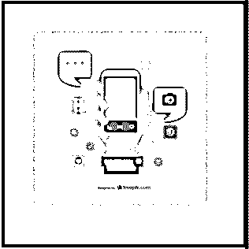

**iOS vs Android 对比**–**智能手机应用大战**–Android vs 苹果，Google vs iOS……竞争者以不同的形象出现，但智能手机[应用](https://www.educba.com/bundle/mobile-app-courses/ "Apps")战争中的玩家主要是这两个。如果你碰巧喜欢其中一个，那就没有必要再争论了。但是，这场战争还远远没有结束。愿最优秀的 app 胜出！

这些应用程序具有基于 Linux 的操作系统的优势，并且是部分开源的。这对于那些喜欢基于 PC 的应用程序平台的人来说是完美的。iOS 和 Android 的另一个比较点是界面和基本功能。除了像素完美的故事，ios 与 android 的设计元素也开始发挥作用。而对于 iOS 来说，Android 智能手机应用是最常用的，iOS 应用以其排他性而闻名…它们只能在苹果设备上使用。

### 连接

Android 和 iOS 应用都使用 **touch** 界面。这包括点击、滑动加捏和缩放。

<small>网页开发、编程语言、软件测试&其他</small>

这两个应用都包含操作系统，可以引导到主屏幕(很像你的电脑)

**区别**:

在 iOS 和 Android 中:iOS 应用只有行，而 Android 允许 widgets。对于 iOS 和 Android 用户来说，这意味着用户可以在 Android 应用上访问自动更新的信息，包括电子邮件和天气。

将用户放入**Dock**–iOS 应用允许用户访问一个 Dock，在那里他们可以锁定最常用的应用。

状态栏显示新收到的电子邮件、信息和提醒。

### 用户化

Android 应用可以根据设备和运营商进行定制，尽管一些预装应用可能已经存在于 Android 设备中。

[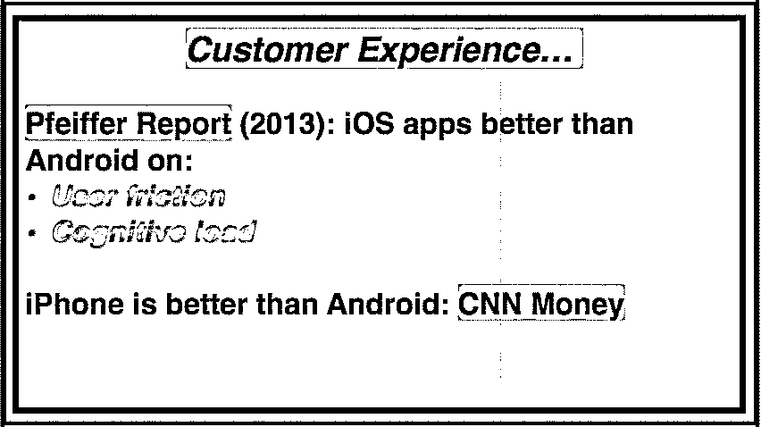

](https://cdn.educba.com/academy/wp-content/uploads/2015/11/IMAGE-22.jpg) 

### 应用可用性

*   Google Play 提供 android 应用，其中大部分运行在平板电脑上，而其他应用，如 Kindle Fire，则使用不同的应用商店。
*   但是，即使只有 iOS 版的应用程序也适用于 Android，包括 Pinterest 和 Instagram。
*   谷歌有一个更开放的应用商店，有 BitTorrent、Player 和 Adobe Flash 等独家应用。
*   Android 操作系统还允许用户访问基于谷歌的应用程序，如谷歌文档。

[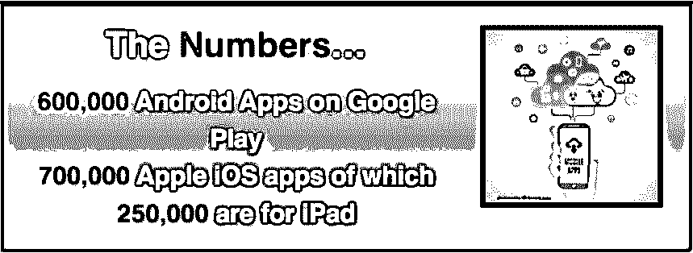

](https://cdn.educba.com/academy/wp-content/uploads/2015/11/IMAGE-32.jpg) 

开发者更喜欢 iOS。提供独家应用程序，如 Tweetbot 和 Blade。

**底线:**

*   大多数流行的应用程序都可以在两种操作系统上使用。
*   iOS 和 Android 平板电脑的应用程序更多地是专为 iPad 设计的，而 Android 平板电脑的应用程序是纵向扩展的
*   苹果应用=独家平台
*   Android 应用=多个平台

### 应用程序的稳定性

一般来说，Android 应用程序比 iOS 更稳定

[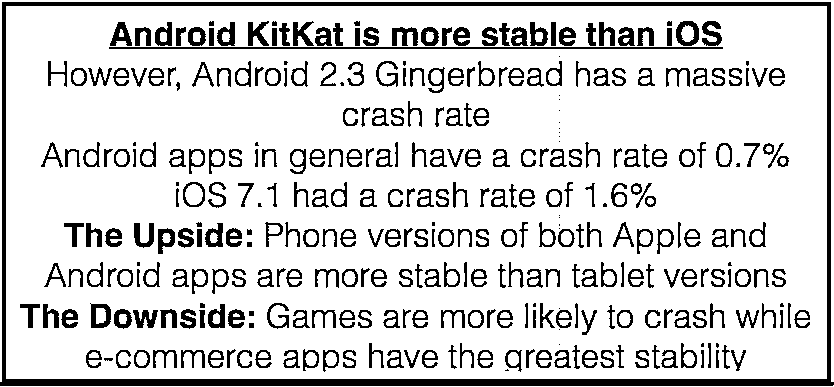

](https://cdn.educba.com/academy/wp-content/uploads/2015/11/IMAGE-42.jpg) 

### iOS 与 Android 软件升级

谷歌经常更新 Android 应用程序，但在制造商决定之前，他们不会在手机上接收更新。

新版本的 Android 发布已经过去了几个月。

在 iOS 与 Android 的比较中，用户的优势在于所有 iOS 设备都可以升级。

### 更多种类的设备

各种各样的 Android 设备可以以不同的尺寸、硬件容量和价格范围购买。iOS 只适用于苹果设备——iPhone、iPad 和 iPod Touch——这增加了应用程序的硬件成本

**推荐课程**

*   iOS 游戏认证课程
*   [免费安卓在线课程](https://www.educba.com/free-web-page-designing-software/)

### 通话功能

Android 允许用户通过应用程序发送多条短信，但 iPhone 应用程序允许用户通过短信或免打扰模式的回电提醒来回复来电。

### 信息

Android 使用户能够登录 GTalk 进行即时通讯…

[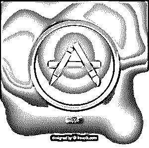

](https://cdn.educba.com/academy/wp-content/uploads/2015/11/IMAGE-52.jpg) 

*资料来源:freepik.com*

谷歌和 MSN 的 GTalk 和 Skype 上分别提供 IM…iOS 只为苹果用户提供原生聊天的选项。

### 录像

*   Google Hangouts 可以提供视频聊天，用户可以通过 3G/Wi-Fi 进行聊天。
*   iOS 使用 FaceTime，提供 3G 和 Wi-Fi 两种选择
*   用户只能与其他苹果设备交流，因为 iOS 应用程序与 Android 应用程序不同。

### 虚拟助手

虽然 iOS 的系列有许多功能，但 Android 应用程序提供 Google Now。从语音搜索和听写到口头提醒，两套应用程序和操作系统都提供了广泛的选择。

两全其美:Bing 和 [Google Maps 等应用可用于 Android](https://www.educba.com/career-in-google-maps/) 或 iOS，iOS 版地图在以下方面超越了 Android:

*   特征
*   易用性
*   设计

谷歌浏览器= Safari

不过，谷歌 Chrome 也可以被 iOS 应用使用。

### 多样性中的统一-整合

Android 应用与脸书等社交网站整合，iOS 应用也是如此。

用户可以更新状态、上传图片以及同步联系人。

另一方面:iOS 提供了更深层次的整合，因为 Twitter 和 FB 等社交网站是其核心的一部分。

### [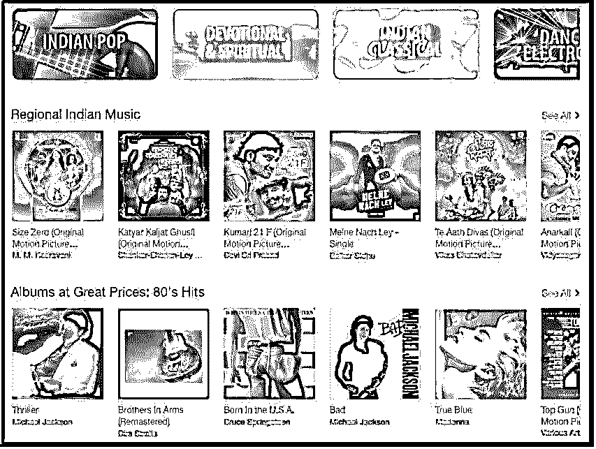

](https://cdn.educba.com/academy/wp-content/uploads/2015/11/IMAGE-62.jpg) 

### iOS 与 Android 移动支付

谷歌钱包允许应用程序用户在某些情况下使用 NFC 技术进行移动支付，只需轻轻一点即可进行无线支付

相比之下，iOS 应用程序有一个名为 Apple Pay 的移动支付系统，因为它具有指纹识别功能，所以更容易使用。像 Passbook 这样的 iOS 应用提供了多种功能

### iOS 与 Android 安全性对比

Android 应用程序不太容易出现错误，尽管它们倾向于要求更多的权限。

Android 应用程序与系统的其他资源相隔离

但问题是，随着 Android 应用程序更有可能被使用，恶意软件作者和黑客比 iOS 应用程序更经常地将它们作为目标。

如果 iOS 设备安装了苹果商店以外的应用程序，它就容易受到恶意软件、黑客和攻击的攻击。

### **iOS Vs Android** 隐私

在 ios 与 android 的隐私因素上，iOS 比 Android 更胜一筹。例如，Pandora 应用程序通过请求谷歌身份、联系人、照片、日历、文件、媒体和通话信息的权限，打开了一整盒的麻烦。iOS 上的 Pandora app 没有这样的要求。

[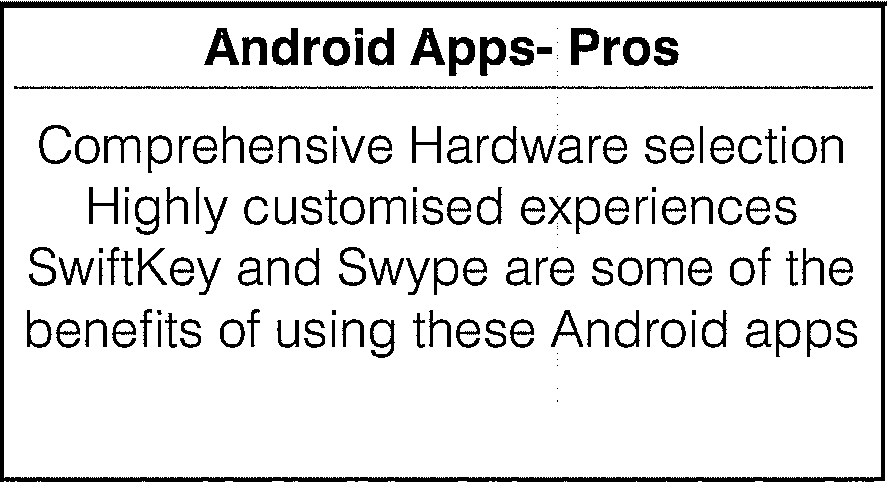

](https://cdn.educba.com/academy/wp-content/uploads/2015/11/IMAGE-71.jpg) 

### 开发应用程序

为 iOS 构建和发布应用比 Android 更难。这是因为 Android 应用程序是使用 C、C++和 Java 编写的，而操作系统使用开放平台，源代码可以免费下载。想要在 Google Play 商店上发布应用的开发者只需支付少量的一次性注册费。Android SDK 可用于多种设备。

相比之下，iOS SDK 只适用于 Mac，在苹果的应用商店发布的权利需要支付巨额费用。

### 美学

Android 应用程序按钮是单色的，有图标

iOS 按钮有没有边框的单色文本，它们往往非常简单

iOS 中的导航栏是一个后退按钮，而 Android 应用程序的导航栏上有许多操作按钮

[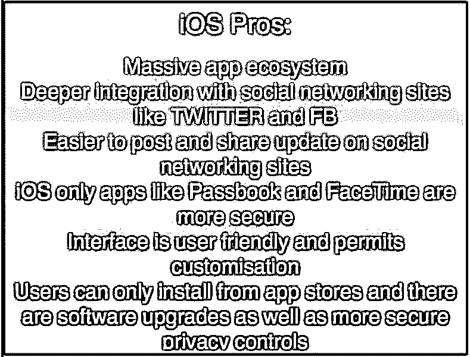

](https://cdn.educba.com/academy/wp-content/uploads/2015/11/IMAGE-82.jpg) 

Android 有一个意图系统，允许应用程序很好地互操作。

### **App** **'** **理解**:安全系数

随着人们转向数字生活，移动安全已成为一个主要问题。难怪现在的应用程序甚至会询问它们是否有被安装的许可！从表情到自拍，早期的担忧现在已经被安全保障所取代。Android 建立在一个开放的理念之上，手机制造商、无线运营商和个人可以配置他们的 iOS，而应用程序可以定制。流行应用的间谍软件版本也在徘徊。

这也意味着 iOS 应用程序和 Android 应用程序一样容易受到攻击，这与普遍的误解相反。这是因为 Android 设备制造商可以像苹果用户一样定制操作系统，其中一些功能增加了黑客和恶意软件的脆弱性。Android 和 iOS 用户已经下载了数十亿个应用程序，但应该始终考虑安全因素，牢记个人需求。

### 为什么苹果的应用程序能让你远离烦恼

苹果的成功来自其严格的质量控制。苹果公司严格控制硬件和操作系统的质量。它还在允许应用程序进入商店之前对其进行审查。这就是为什么 iOS 应用程序集成良好，质量上乘。

iPhone 的高端用户对新应用感兴趣，他们对如何在每个环节分发和销售应用的控制较少。苹果的利润来自硬件和应用程序，它们为品牌和开发者提供了与客户沟通的机会。

### 历史课

苹果是两个著名竞争对手中第一个进入智能手机应用领域的。苹果应用商店被管理和推出，但没有一个对手能赶上。直到 Android 投入使用，Google Play 彻底改变了应用程序世界。

根据 AppFigures 的数据，Google Play 应用下载量比苹果应用商店高出 60%。

Android 应用程序的数量和规模也在增加

### 数量与质量

就这些标准而言，苹果胜出是因为它提供了高质量的独家应用。

### 苹果应用商店的简要历史时间表

2008 年 7 月:应用商店开业。应用总数=500

2008 年 9 月:3 千个应用程序的应用商店下载量达到 1 亿次

2009 年 4 月:苹果应用下载量达到 10 亿次。该商店在 77 个国家开设，有多达 35，000 个应用程序可用

2009-7 月:苹果应用商店点击量 15 亿 [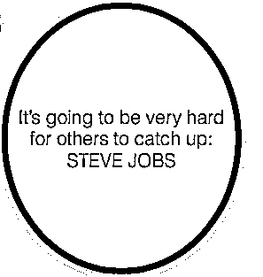

](https://cdn.educba.com/academy/wp-content/uploads/2015/11/IMAGE-91.jpg) 

2009 年 9 月:达到 20 亿马克

2010 年 9 月:25 万个应用程序的 65 亿次下载

2011 年 1 月:350，000 个应用程序的 100 亿次上传，包括 60，000 个原生 iPad 应用程序。

2012 年 3 月:55 万个应用程序的下载量达到 250 亿次

2013 年-1 月:苹果 app 下载量达到 400 亿；5 亿个活跃的应用商店账户，包含 775，000 个应用，为开发者创造了 70 亿美元的收入

2013 年 5 月:应用商店应用数量突破 500 亿大关

2014 年 6 月:每周 120 万个应用程序的 750 亿次下载/3 亿次访问

2015 年 1 月——应用程序收入 250 亿美元，目前 App store 中有 140 万个应用程序

### **安卓:巨大的障碍**

*   碎片化，因为开发人员必须解决一组无限的设备参数。
*   测试了 20 款不同分辨率和处理器的手机，导致开发速度变慢
*   重新思考设计元素是艰难的。即使是简单的一个像素的笔画，在高分辨率下看起来很惊人，但最终也无法令人眼花缭乱。
*   Android 应用程序很难开发，移动开发必须快速前进才能跟上潮流。
*   Android 领域不太健壮的工具和文档也是一个关键问题。
*   开发者可以在 iOS 应用的设计元素上更有创造力，特别是因为有许多 API 和库可以用于这个目的。

### **为什么苹果规则 [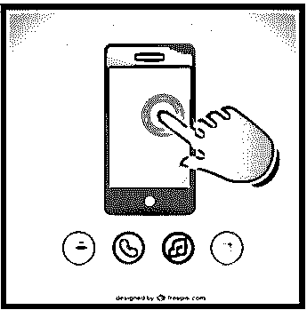

](https://cdn.educba.com/academy/wp-content/uploads/2015/11/IMAGE-102.jpg)** 

*   应用运行在本机代码中，而不是虚拟机中。
*   内存没有定期清除，导致速度变慢
*   硬件驱动程序适合这个目的
*   最新的 iOS 设备上的 64 位 CPU 与操作系统相结合，使其速度比 Android 设备快一倍
*   用户界面在硬件中呈现
*   触摸屏延迟更快，应用程序不会与他人争夺资源。

### **安卓在哪里构成挑战**

*   Android 应用程序价格低廉，易于制作，具有卓越的保证和隐私
*   此类应用程序增强了多媒体容量，并且易于使用
*   不同的文本预测器和键盘选择使 Android 应用程序在可用性方面更胜一筹
*   Android 也在系统级功能上得分
*   Tasker 是 Android 应用程序上的一个自动化程序，它可以让你将智能手机变成一个超级智能手机，并让你访问其他应用程序(尤其是 iOS)无法实现的设置
*   iPhone 用户可以定制自己的主屏幕，但这无法打败为 Android 手机量身定制的规格

[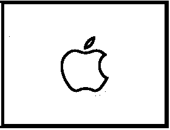

](https://cdn.educba.com/academy/wp-content/uploads/2015/11/IMAGE-112.jpg) 

*   第三方启动器增加了乐趣
*   Android 应用上的小工具是另一个巨大的好处。从天气窗口小部件到音乐窗口小部件，您可以拥有令人惊叹的产品，让生活更简单、更愉快。
*   如果苹果提供 Apple Watch，谷歌将有一系列创新，这将彻底改变应用程序世界。
*   开源平台意味着定制 rom 和更多；Android 应用程序提供了 iPhone 应用程序或 iOS 应用程序所缺乏的灵活性。
*   Android 也在真正的应用集成上得分。就 Android 应用程序而言，谷歌语音简直棒极了(尽管它也适用于 iOS。在 Google Play 上，Google Voice 等应用程序直接与操作系统集成，你可以直接通过 Google Voice 打电话或输入数值，而不是通过拨号器。其他服务，如短信和语音邮件也是可用的。

### **结论**

无论如何，每个应用生态系统都有自己的优点和缺点。选择适合自己需求和个人喜好的 app。这样，你将确保你的武器库中有最流行的应用程序。充分利用 iOS Vs [Android 开发](https://www.educba.com/android-app-development-for-beginners/ "Beginner's Guide to Android App Development")智能手机应用大战，只选择最快速和最安全的应用。毕竟，无论是 Android 还是 iOS，你都应该选择适合你的应用程序。

### 推荐文章

这里有一些相关的文章，可以帮助你获得更多关于 Android 手机应用的细节，所以只要浏览下面的链接就可以了。

1.  [办公套件应用](https://www.educba.com/office-suite-applications/)
2.  [安卓用户界面](https://www.educba.com/android-user-interface/)
3.  [安卓电子邮件应用](https://www.educba.com/email-apps-for-android/)
4.  [安卓最佳浏览器](https://www.educba.com/best-browser-for-android/)

