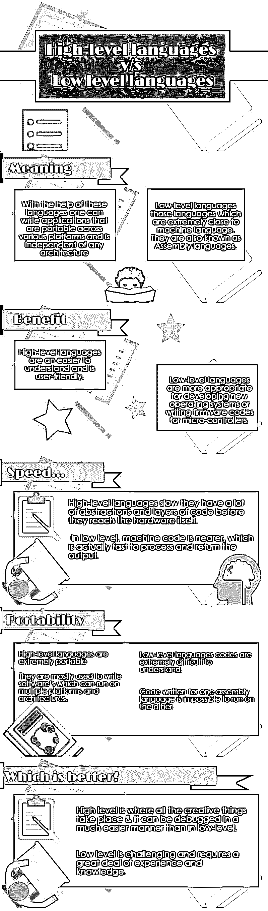
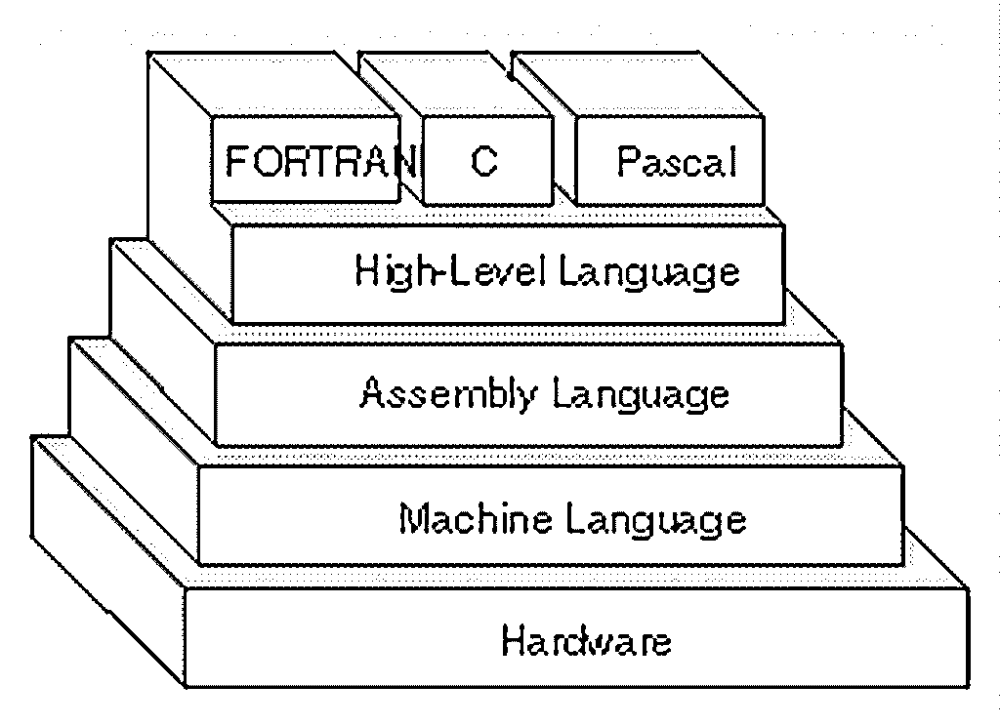
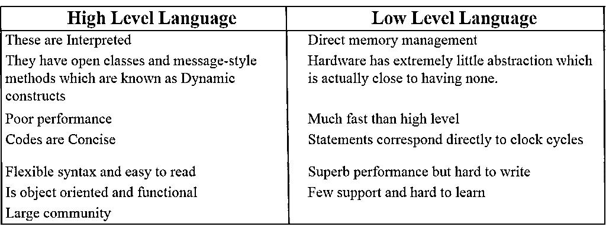
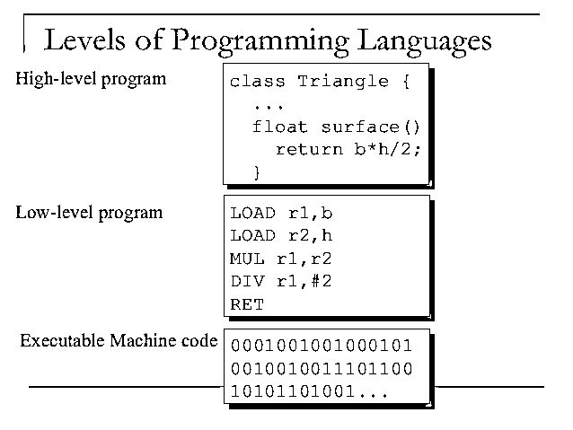

# 高级语言对低级语言

> 原文：<https://www.educba.com/high-level-languages-vs-low-level-languages/>

## 高级语言和低级语言的区别

我们写这篇博客是考虑到阅读这篇文章的人绝对是初学者。当没有人指导他们的时候，有背景的人，这意味着不完全是技术背景的人，实际上会发现很难开始学习编程。因此，我们写了这篇博客作为对他们的礼遇。那么，说到语言，到底什么是高级语言和低级语言呢？为什么要这么叫它们？它们之间的差异有多大？

不用说，魏已经在这篇博客中谈到了所有这些问题。

<small>网页开发、编程语言、软件测试&其他</small>

### >高级语言和低级语言之间的直接比较(信息图)

以下是对主要差异的详细解释。

 

### 什么是高级语言？

你必须是一个东西；什么是高级语言？但是告诉我你，他们更容易理解和用户友好。在这些语言的帮助下，人们可以编写跨各种平台(如 Linux 或 Windows)的可移植应用程序，并且独立于任何架构(如非英特尔 ARM 或臭名昭著的英特尔)。高级语言示例，用 python 编写一个程序，默认情况下它可以在任何 Linux 系统中运行，然后使用 py2exe 将其编译成 exe，然后在 windows 上运行。

类似的例子有 Python、C、Fortran 或 Pascal。这种语言被认为是高级语言，因为它们更接近人类语言，而远离机器语言。当我说人类语言时，我不是指我们在日常生活中谈论的东西。这意味着我们可以通过了解一些编程的[基础来理解代码。所写的代码几乎是人类可读的，是可以阅读和发音的东西。](https://www.educba.com/concepts-of-programming-languages/ "Programming Concepts for Beginners")

下面是一些用 Fortran 和 c 语言在屏幕上打印出简单程序的机器语言的例子。

**在 Fortran 中:**

`*program NewProgramF90
write(*,*) "This is a printed program"
end program NewProgramF90*`

现在，您可以使用以下代码编译它:

`gfortran newprogram.f90 -o newprogram -f90-gcc`

然后简单地运行它。

**一个类似 C 语言的程序:**

`#include<stdio.h>
main()
{
printf("This is a printed program");
}`

对于纯初学者来说，这是最简单的了。

但是，既然我们在谈论计算机，这对于计算机来说是很难理解的。因此，为了让计算机理解这一点并运行用高级语言创建的程序，必须将其编译成机器语言。

 

*图片来源:github.com*

这就是低级语言介于两者之间的地方。与以前只有少数几种高级语言不同，今天有 n 种高级语言，如 C、 [Cobol](https://www.educba.com/what-is-cobol/) 、FORTRAN、Pascal、Java、Perl、Python、PHP、Ruby、C++、BASIC 和 [Visual Basic](https://www.educba.com/software-development/courses/vb-net-course/ "Online VB.NET - Programming with Visual Basics .NET Training") 。

### 什么是低级语言？

低级语言那些非常接近机器语言的语言。它们也被称为汇编语言。汇编后最接近机器语言的语言是 C 和 C++。有些人甚至称 C 和 C++为低级语言。机器代码被称为低级代码，因为与高级编程语言不同，它不需要编译器之类的任何东西。它直接在处理器上运行，并且它们是非常特定于架构的。

低级语言更适合开发新的[操作系统](https://www.educba.com/applications-software-developer/ "Mobile Operating Systems to Build Applications")或者为微控制器编写固件代码。他们只需要一点点努力就可以做任何事情(具体来说，实际上是大量的努力)，但显然，你不会想在其中编写一些主要的应用程序。C(其实叫 Cee)也是类似的情况。c 语言实际上是一门非常庞大的语言。它允许您直接注册，并提供即时访问各种内存位置。

但同时，它也有许多允许硬件加载抽象的构造。坦率地说，C 和 C++双重代表了多种语言，因为大多数语言都从它们那里获得了库。实际上，C 和 C++都是低级的，正如我们之前告诉你的，因为在企业级编写应用程序是相当困难的。但理论上，两者其实都是高级语言。

### 特征

不同的特征如下:

 

现在，事情是这样的，每隔一段时间，我都会在各种采访和其他地方被问到我最喜欢哪个——低级还是高级编程。在我看来，世上没有最好的。答案是两者都有各自的特长，你不能用一个代替另一个。因此，我实际上喜欢他们两个。

低级编程具有挑战性，需要大量的经验和知识。高级语言的特点是所有创造性的事情发生的地方，也就是人们在日常生活中使用的应用程序，它可以比低级语言更容易地被调试。在这里，你可以接触到非常新的技术，因为由于社区的支持，很多语言都在不断升级。

如果你向任何高级语言编码人员询问他们喜欢什么，你得到的答案将远远不是你想要的。他们不会告诉你哪个更好。

他们可能会说，他们更热衷于某个特定的高级语言，而不是所有的语言。我不知道会发生这种事。最著名的例子是 Python 和 Ruby，如果你给他们看一些用汇编写的程序，那么你可能会说再见。

 

*图片来源:mathworks.com*

许多高级语言最棒的地方在于它们属于混合类型。比如 python 是极度面向对象的，但同时也支持闭包和一级函数。尽管它没有 Scala 强大，但它确实有能力像纯语言一样表现更多或更少的东西。

与低级语言相比，高级语言通常很慢。这是因为高级语言在到达硬件本身之前有许多抽象和代码层，而由于机器代码更近，处理和返回输出实际上更快。Python 中的一段代码最有可能被翻译成数千行机器语言。

当然，在不需要原始性能的地方，高级语言是同等重要的，因为你不能在低级开发出像在高级中那样稳定和大型的应用程序。这是值得记住的一件事。

### 用了什么 C 编程？低级/高级混淆

尽管 C 语言有许多与 Pascal 语言相似的特征，但有时它仍被认为是一种低级语言。它支持位操作、指针操作和对内存的直接访问。c 语言实际上是一种高级语言，具有低级语言的包容性。这就是程序员依赖 C 语言无与伦比的品质的主要原因。

虽然 C 被视为一种低级语言，但却非常具有可移植性，这似乎有点奇怪。狂热地说，C 实际上是被扩展到尽可能极限地使用硬件。

另一方面，汇编语言很难移植。但是，在低级的情况下，尤其是在运行于 JVM(即虚拟机)上的 Java 的情况下，试图实现可移植性是一件大事。运行在 VM 中的 c 或汇编将永远不能完全访问硬件。

更准确地说，如果一种语言被专门构造成直接在硬件上运行，那么它就成了低级语言。低级语言有很少的语法，不像高级语言有很多代码。

允许完全访问硬件的低级语言实际上不是编写项目的好选择。

### 什么时候用低级？

机器码看起来像这样，运行速度极快，因为它非常接近硬件。

`8B542408 83FA0077 06B80000 0000C383
FA027706 B8010000 00C353BB 01000000
B9010000 008D0419 83FA0376 078BD98B
C84AEBF1 5BC3`

以上是为 32 位架构编写的函数，即 x86 机器码，用于计算斐波那契数。

毫无疑问，编写机器码是非常令人恼火的，因为它需要时不时地检查运行的每一条指令的数字代码。谁会有时间做这个？这就是低级编程诞生的原因。

但是如果你向高级程序员询问低级编程，你会得到这样的答案:

 

*图片来源:pixabay.com*

### 结论

低级语言有一个额外的优势，即失去对 CPU 的控制，但是它们的代码极难被其他程序员理解和调试。其他体系结构家族都有自己的汇编语言集，这意味着为一种体系结构编写的代码不可能在另一种体系结构上运行。简而言之，这意味着代码是不可移植的。

高级语言的优点是它们非常容易移植；另一方面，它们通常用于编写可以在多种平台和架构上运行的软件。他们谁也不能取代谁，因为两者是一个硬币的两面。

### 推荐文章

这是如何使用 ANOVA 检验解释结果的指南。这里我们已经讨论了基本概念、一般用途、假设和运行它时要考虑的事情。您也可以浏览我们的其他相关文章，了解更多信息——

1.  [Haskell 编程语言](https://www.educba.com/what-is-haskell-programming-language/)
2.  [文本挖掘 vs 自然语言处理](https://www.educba.com/important-text-mining-vs-natural-language-processing/)
3.  [R 编程语言](https://www.educba.com/r-programming-language/)
4.  [手机 App 编程语言](https://www.educba.com/mobile-app-programming-language/)

