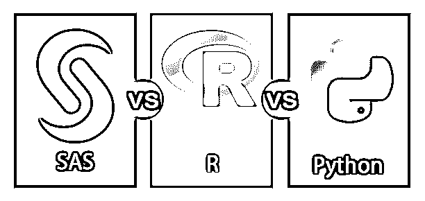
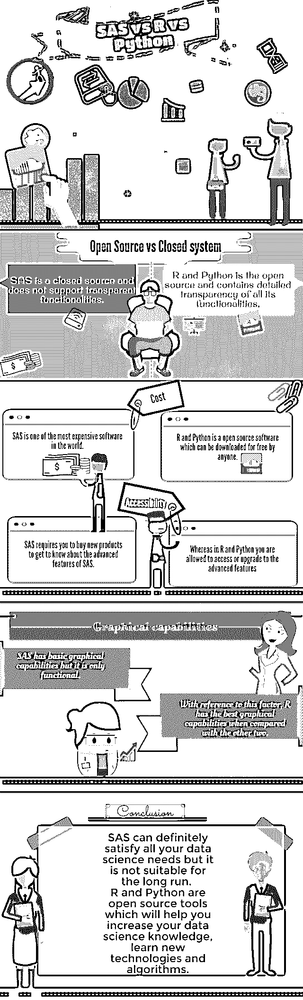

# SAS vs R vs Python

> 原文：<https://www.educba.com/sas-vs-r-vs-python/>

## SAS 与 R 和 Python 的区别

如果你打算选择分析职业，那么你脑海中出现的主要问题是，“哪种工具最适合这份工作？”

这是一场多年的战争，总是很难决定哪种编程语言最适合数据分析。传统上，这个问题是针对 SAS vs R 提出的，但是现在 python 加入了这个讨论。那么 sas vs r vs python 哪个更好呢？

<small>网页开发、编程语言、软件测试&其他</small>

几年前，使用这些工具很难追踪职业发展轨迹。但幸运的是，这被证明是塞翁失马焉知非福。但是现在，分析专家在决定他们应该应用什么技术之前，他们正在寻找执行这项任务的最佳工具。

[SAS](https://www.educba.com/course/advanced-sas-for-business-analytics/) vs R vs Python 竞争激烈。但是诚实的回答是每个工具都有其独特的方式。在这种情况下，没有普遍的赢家。每种工具都有自己的优点和缺点。

分析专家需要了解每种工具的优缺点，以决定哪种工具最适合他们的专业。

### SAS 与 R 和 Python 之间的直接比较(信息图)

以下是 SAS 与 R 和 Python 之间的主要区别。

现在让我们来看看这些工具是关于什么的，它是用来做什么的。

### 描述

以下是对这 3 种工具的简短描述:

#### 斯堪的纳维亚航空公司

它是软件解决方案的集成系统，是数据分析领域的领导者。这个软件有很多功能，如良好的图形用户界面和其他提供可怕的技术支持。它帮助您完成以下任务。

*   数据输入、检索和管理
*   报告写作和图形设计
*   [统计](https://www.educba.com/top-10-free-statistical-analysis-software/)和数学分析
*   业务预测和决策支持
*   运筹学和[项目管理](https://www.educba.com/agile-project-management-for-dummies/)
*   应用开发

巴克莱、雀巢、汇丰、沃尔沃和 BNB 巴黎银行等知名公司都使用这种方法。

#### 英语字母表中第十八个字母

r 是一种用于统计计算和图形的编程语言，由 Ross Ihaka 和 Robert Gentleman 于 1995 年创建。它提供了广泛的统计和图形技术。这是一个高度可扩展的开源路由。它是一种简单而有效的编程语言。它不仅仅是一个统计系统。它执行以下工作。

*   轻松操作包装
*   操纵字符串
*   处理规则和不规则时间序列
*   可视化数据
*   机器学习

美国银行、必应、福特、优步和 Foursquare 等顶级公司都使用 r。

#### 大蟒

[Python](https://www.educba.com/bundle/python-crash-course-bundle/ "Python Crash Course Bundle") 是一种面向对象的编程语言，语法清晰，可读性强。它是由吉多·范·罗森在 1991 年创建的。它很容易学习，会帮助你更快更有效地工作。它因为简单而在短时间内变得更受欢迎。

Python 被像 ABN-AMRO、Quora、谷歌和 Reddit 这样的著名公司所使用。

### 比较的原因

工业正在蓬勃发展。随着该领域的发展，每种语言都有很多技术进步。

如果您是数据分析领域的新手，那么您可能会因为自己的兴趣而学习新的领域，或者在大多数情况下，受您的组织所使用的工具的驱动。你可能会因为工具和软件程序的升级而面临挑战和挫折。

现在语言的比较是一个值得考虑的问题。几年前所做的任何比较都不适用于当前的情况。比较也有助于在三者中选择最好的。

本文将这些语言与以下因素进行了比较。你可能不会根据下面的比较来购买一个工具，但它一定会帮助你选择一个适合你职业的工具。

#### 1.开源与封闭系统

它是一个封闭的源代码，不支持透明的功能。而 R 和 Python 是 SAS 的开源对应物，包含其所有功能和算法的详细透明性。

它更耗时，因为它需要一个很长的过程来了解功能。这也是适得其反的。

#### 2.费用

这是世界上最昂贵的软件之一。获得 SAS 许可需要投资数百万美元。因此，它只能被大规模的公司使用。

只有少数公司使用 SAS。如果你是 SAS 专业人员，那么你需要选择一个他们使用 SAS 的工作场所。如果你加入了一家不使用 SAS 的公司，你的职业生涯将被重新导向一条新的道路。

r 是开源软件，任何人都可以免费下载。另一方面，Python 也是免费的开源软件，任何人都可以下载。

#### 3.学问

它很容易学习，尤其是对于已经了解 SQL 的人。此外，它有一个稳定的图形用户界面。SAS 教程可以在各种网站上找到，并且有全面的文档。

在数据分析领域，Python 非常容易学习。Python 没有广泛使用的 GUI 界面，但是 Python 笔记本已经变得流行起来。它们为您提供了文档和教程的功能。

r 是一种低级编程语言，因此即使对于较短的过程也需要较长的代码。如果你对 r 中的编码有更深入的了解，那会很有帮助。

#### 4.易接近

它要求您购买新产品来了解 SAS 的高级功能。它没有为您提供下载任何功能并立即使用的选项。它也有严格的许可限制。

而在 R 和 Python 中，您可以访问或升级到高级特性，如并行处理、多核包等。，帮你做重复性操作。

#### 5.数据处理能力

这三种语言在数据处理方面同样出色，而且它们也有并行计算的选项。三者在这个因素上没有太大区别。这两种语言可能会有一些创新来提高它们的标准。

#### 6.图形功能

参考这个因素，与其他两个相比，R 具有最好的图形能力。

它有基本的图形功能，但只是功能性的。情节定制比较难，需要深入了解 SAS 图包。

Python 可以使用本地库(matplotlib)或允许调用 R 函数的派生库。

r 在三者中图形能力非常出色。他们有先进的图形功能包。

#### 7.工具的进步

这三种语言都有基本的和最需要的功能，但是如果您的工作需要的话，最新的技术和功能非常重要。

r 和 Python 本质上是开源的，因此它们比其他两种语言更快地升级到最新的技术和特性。新技术的发展非常迅速。

另一方面，SAS 需要时间来更新到最新的特性和功能，因为它在受控的环境中工作。

SAS 在受控环境中工作有一个主要优势。它们经过了很好的测试，因此出错的可能性非常小。

但是 Python 和 R 在开源环境下工作，可以很快更新到最新的技术，但是它们更容易出错。

#### 8.工作场景

r 和 Python 在最近一段时间有更多的职位空缺，预计未来也会增加。

寻求成本效益的公司使用 r 和 Python。他们是初创公司的最佳选择。

它被大型组织和公司广泛使用。

最近的一项研究证明，用于数据分析的 Python 工作也将以与 r 相同的方式增加。

#### 9.支持可视化

[可视化是数据科学的基础部分](https://www.educba.com/data-visualization-types/)。SAS 的主要可视化平台称为 SAS 可视化分析。这个用起来太贵了。

r 和 Python 有很多免费的可视化工具。它不需要你像在 SAS 一样签合同并支付每一项活动的费用。

#### 10.客户支持和社区

就客户支持和服务而言，SAS 比其他两种语言更好。它有专门的客户支持和服务以及一个社区。如果您有任何技术问题，可以直接联系支持中心。

r 有一个很大的在线社区，但没有客户支持中心。你会得到他们的帮助，但不是立刻。

Python 也没有客户支持中心。它向其客户提供帮助，但不提供 SAS 级别的帮助。

#### 11.行业趋势

[就业市场](https://www.educba.com/job-market-statistics/)的趋势是快速向开源技术发展。r、Hadoop、Python 都是这方面的主要例子。它也是此类技术之一，但它是唯一的付费产品。人们更喜欢 R 和 Python 而不是 SAS，因为与免费产品相比，它没有提供任何额外的好处。由于某些原因，目前只有少数公司选择情景应用程序。

r 和 Python 是免费的，可以轻松下载。

#### 12.灵活

r 和 Python 得到了全球成千上万贡献者的支持。如果语言有任何发展或升级，那么客户可以放心使用。

SAS 产品只能由 SAS Institute Incorporated 使用，并且只有 SAS 开发人员可以开发任何新功能。这需要很多时间。在您使用新的[算法](https://www.educba.com/learning-algorithms/)更新 SAS 特性之前，您可以使用任何其他工具完成您的项目。

#### 13.教程和指南

它没有向客户提供任何循序渐进的指导。如果你开始了一个新的话题，或者想在 SAS 中学习一些新的东西，你一定要找一个 SAS 顾问，他也是 SAS 研究所的。

另一方面，r 和 Python 为您提供了详细的示例。它还在网上提供了一个教程。Python 包含名为 iPython 的可复制笔记本。r 练习和 iPython 笔记本在 github 等网站上随处可见。

这里有一个表格视图，可以根据一些标准轻松比较所有三个工具

| **标准** | **> SAS** | **R** | **Python** |
| 费用 | 有报酬的 | 自由的 | 自由的 |
| 学问 | 困难的 | 容易的 | 容易的 |
| 数据操作 | 高的 | 高的 | 高的 |
| 分析建模 | 高的 | 高的 | 中等 |
| 图形能力 | 低的 | 高的 | 中等 |
| 文本处理 | 低的 | 中等 | 高的 |
| 大数据 | 中等 | 低的 | 中等 |
| 常见用法 | 高的 | 高的 | 中等 |
| 工作场景 | 高的 | 中等 | 低的 |
| 客户支持 | 高的 | 低的 | 中等 |
| 工具的进步 | 高的 | 低的 | 中等 |

### 结论

绝对可以满足你所有的数据科学需求，但是不适合长期。公司现在正快速转向易于访问和使用的开源编程语言。

这是一个限制性和封闭的工具，目前不太受欢迎。

r 和 Python 是开源工具，将帮助您增加数据科学知识，学习新技术和算法。如今，了解 R 和 Python 自然会让你有资格从事数据科学工作。

底线是三者之间没有明显的赢家。这三种工具各有优缺点。他们的优势使他们能够在市场中长期生存。

最终，必须由数据科学家来决定使用哪种语言。作为一名数据科学家，应该由您来决定哪种语言最适合您的需要。你可以问自己几个问题，然后做出决定。

*   你想解决什么类型的问题？
*   你准备花多少钱去学一门语言？
*   你所在领域常用的工具有哪些？
*   市场上还有哪些类似的工具，它与常用工具有什么关系？

这些问题的答案可以帮助你选择最好的工具，在你的职业生涯中继续前进。

学习并成为这门语言的大师。

### 推荐文章

这是一个 SAS vs R vs Python 的指南。这里我们已经分别讨论了头对头比较、描述、比较原因。您也可以看看以下文章，了解更多信息–

1.  [SAS 的优势](https://www.educba.com/advantages-of-sas/)
2.  [Python mkdir](https://www.educba.com/python-mkdir/)
3.  [萨斯嵌套](https://www.educba.com/sass-nesting/)
4.  [Python 索引错误](https://www.educba.com/python-indexerror/)

