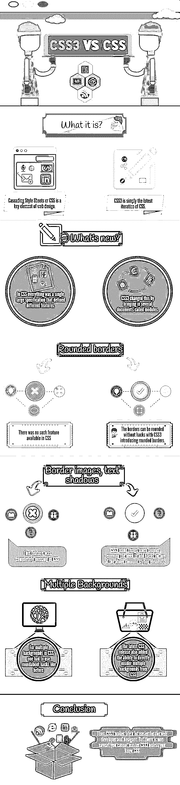

# CSS3 和 CSS——它们有什么不同？(资料图)

> 原文：<https://www.educba.com/css3-vs-css/>

## CSS3 与 CSS 的区别

级联样式表或 CSS 是网页设计的关键元素。作为一名网页开发人员或设计师，你需要了解 CSS，尤其是 CSS3 与 CSS 的区别。

如果你读过关于网页开发或网页设计的书，你可能听说过或遇到过 CSS3 这个术语。如果你曾经想过 CSS3 和 CSS 之间有什么不同，这里你所有的疑问都将得到解答:它们是一样的。

没错: [CSS3 vs CSS](https://www.educba.com/course/css-training-tutorials/ "CSS Tutorials and CSS3 for Web Development") 就像 [HTML](https://www.educba.com/course/online-html-5-training/ "Online HTML 5 Training") 和 [HTML5](https://www.educba.com/course/html-5-from-scratch-beginner-advanced/ "Comprehensive HTML 5 Training") 一样互不相同。CSS3 只是 CSS 的最新版本。现在谈论编码 CSS 的人实际上只是指 CSS3。

<small>网页开发、编程语言、软件测试&其他</small>

HTML5 和 CSS3 都已经成为流行词汇，其含义已经超越了它们的实际技术。它们象征着在 web 开发中坚持某些核心标准，而不是使用专有软件。在很大程度上，围绕这些流行语的炒作已经平息。大多数公司，甚至那些发誓要把所有东西都放在内部的公司，都会同意遵守这些核心标准会让每个人的生活变得更轻松。

现在，距离 CSS3 发布并被所有人接受已经有一段时间了。它给这个行业带来了很多伟大的东西，标志着整个 web 开发向前迈进了一大步。之前的版本 CSS2 是在 1998 年发布的。那差不多是 20 年前的事了。它在推出后收到的唯一一次修订是在 2011 年，称为 CSS3 2.1。即使有了这次修订，大多数专家也已经开始告诉我们 CSS3 是不可避免的。

你可能不知道的是，CSS3 是在它的上一个版本提交一年后才开始开发的。这意味着 W3C 自 1999 年以来一直致力于改进版本。用了超过 12 年的时间才发布了 CSS3 的第一个稳定版本。

CSS3 和 CSS 之间有巨大的差异(我们很快就会谈到)。但事实是，在 CSS3 发布时，网络浏览器已经准备好接受它的附加功能了。因此，他们很快适应了新版本。现在每个主流的网络浏览器都支持 CSS3，甚至是 ie 浏览器！

当然，W3C 仍在继续开发 CSS3 和 HTML5，所以不太可能有最终版本。公平地说，考虑到互联网发展的速度，最终版本目前也不是必须的。随着 web 需求和行业本身的快速增长和变化，编码必须以同样的速度前进，如果不是更快的话。

### CSS3 与 CSS 信息图

### 定义了 CSS3 与 CSS 的差异

现在你对 CSS3 的背景有了一点了解，让我们仔细看看它有什么变化。也许 CSS3 和它所取代的前一版本之间最大的区别是模块分离。在 CSS2 中，一切都是定义不同特性的单一大型规范。然而，CSS3 通过引入几个称为模块的文档改变了这一点。每个模块都有自己的新功能，不会影响以前稳定的 CSS 版本的兼容性。

### 媒体查询

有很多可用的模块，但是只有四个被 W3C 正式推荐发布。这四大模块如下:

1.  颜色，2011 年出版
2.  选择器级别 3，2011 年发布
3.  发布的名称空间 201
4.  2012 年发布的媒体查询

其中，最重要的模块是媒体查询。事实上，这个模块可以说是 CSS3 对 CSS 最重要的补充。媒体查询做了一些相当简单的事情:它允许将某些条件应用于不同的样式表。这使得网站可以灵活地适应不同的屏幕尺寸。换句话说，网站可以调整它们的尺寸和元素来适应不同的设备。今天，响应式网页设计可能是最流行的词汇。鉴于现在互联网的大部分使用是在移动设备上，响应式设计是绝对必要的，而媒体查询有助于实现这一点。该模块还使开发人员能够在不改变或删除内容的情况下根据各种分辨率定制网站。

媒体查询也很容易理解和添加。一旦你用了几次，你就可以很好的理解剩下的部分了。以下是一些示例代码行:

**@媒体屏幕和(最大宽度:600 像素){**

**背景:# FFF；**

**}**

这看起来很简单，不是吗？通过这几行代码，您可以为最大宽度为 600 像素的屏幕启用样式。这意味着所有最大宽度为 600 像素的屏幕将显示白色背景。最大宽度只是 CSS3 上可以应用于样式表的几个条件之一。另一个是最大器件宽度。这是屏幕分辨率，而不是观看区域。同样，可以用最小值代替最大值；用' min '代替' max '就行了。您也可以将两者结合起来，如下所示:

**@媒体屏幕和(最小宽度:600 像素)和(最大宽度:900 像素){**

**背景:# FFF；**

**}**

这里，样式只适用于观看宽度为 600-900 像素的屏幕。CSS3 为流行的移动设备，如苹果 iPad 和 iPhone，提供了一些预定义的样式表。以下是其中的一些:

**<链接 href = " iphone 4 . CSS " rel = " style sheet " media = " only screen and(-WebKit-min-device-pixel-ratio:2)" type = " text/CSS "/>**

**<链接 href = " portrait . CSS " rel = " style sheet " media = " all and(orientation:portrait)"/>**

**<链接 href = " landscape . CSS " rel = " style sheet " media = " all and(orientation:landscape)"/>**

现在应该很清楚媒体的询问有多重要了。这个模块对于那些想用最少的代码创建响应式网页设计的开发者来说非常方便。

### 圆形边框

CSS3 也有一些真正重要的网页设计考虑因素。例如，边框可以是圆形的，没有锯齿，CSS3 引入了圆形边框。这对于之前一直在纠结于 CSS 边框的 web 开发人员和设计人员来说是一个巨大的优势。不足为奇的是，其中一些功能在旧版本的 Internet Explorer 中仍然无法使用。您需要添加到样式表中特定类的唯一附加代码是，例如:

**-moz-border-radius:5px；**

**-WebKit-border-radius:5px；**

**border:2px solid # 897048；**

因此，CSS3 让 web 开发人员和设计人员的生活变得更加轻松。该版本还附带了渐变，这在以前的版本中是不可获得的。

**推荐课程**

*   [Java Web 服务在线培训](https://www.educba.com/course/soap-and-rest-in-java/)
*   [职业游戏开发 C++培训](https://www.educba.com/course/game-development-in-c-plus-plus-and-directx-courses/)
*   [道德黑客计划](https://www.educba.com/course/certified-ethical-hacking-course/)
*   [Vegas Pro 13 训练套装](https://www.educba.com/course/vegas-pro-13-training/)

### 边框图像、文本阴影

CSS3 中添加的其他元素在以前的版本中没有，包括边框图像和文本框/文本阴影。CSS3 使事情变得简单得多，不再需要为任何上述常见的样式元素添加代码。例如，下面是为文本阴影添加的单独一行代码:

**text-shadow:2px 2px 2px # ddccb 5；**

### 列

CSS3 还简化了如何向内容添加列。您现在需要做的就是添加四行代码:

1.  列计数
2.  列宽
3.  列间隙
4.  列规则

### 多重背景

最新的 CSS 版本还增加了从 CSS 中直接插入多个背景的能力，而不是像以前那样使用迂回的攻击。这些代码非常容易记忆和编写，对于创建现代网页设计元素也非常重要。这里有一个例子:

**。多重背景{**

**高度:100px**

**宽度:200px**

**填充:20px**

**背景:url(top.gif)右上角不重复，**

**url(bottom.gif)左上角重复-y，**

**url(middle.gif)底部重复-z；**

**}**

### 供应商前缀

在 CSS3 刚刚发布的时候，厂商前缀经常被使用。他们帮助浏览器解释 CSS 代码。如果您的 web 浏览器不能读取代码，它们会一直沿用至今。以下是主要浏览器的供应商前缀:

*   **-moz-** :火狐
*   **-webkit-** :苹果 Safari、谷歌 Chrome 等 webkit 浏览器
*   **-o-** :歌剧
*   **-ms-** :网络浏览器

Opera 的前缀也变得多余，因为该公司将其移动和桌面浏览器从 Presto 渲染引擎切换到 Webkit 平台。尽管供应商前缀在某种程度上还在继续使用，但在这一点上它已经基本消失了。

### 添加了伪类

随着 CSS3 的加入，我们还获得了许多额外的伪类，包括基于文档位置和与其他不同元素的关系来定位元素的结构类。以下是其中的一些:

*   :root 以文档的根元素为目标
*   :not(s)目标元素与(s)中指定的选择器不匹配
*   :first-child 以容器中的第一个子级为目标，而不考虑项的类型
*   :第一类型目标是父元素中第一个指定类型的元素
*   :n-child(n)使用(n)中的数值，根据子元素在父元素中的位置来定位子元素。例如，您可以使用它为博客评论添加交替的背景颜色
*   :empty 目标元素没有文本或子元素，如空元素
*   :only-child 以文档树中的元素为目标，该元素是父元素中唯一的子元素

### 新的 CSS3 选择器

CSS3 通过新的选择器、新的组合和伪元素提供了许多编写 CSS 规则的方法:下面是三个新的属性选择器:

*   对于精确匹配，element[foo^="bar"]
*   为了将元素与以“bar”开头的名为 foo 的属性进行匹配，element[foo $ =“bar”]
*   为了将元素与以“bar”结尾的名为 foo 的属性进行匹配，element[foo * =“bar”]

CSS3 附带了几个新的伪类，其中一些已经在上面讨论过了。这里还有一些:

*   :n-last-child(n)匹配最后一个元素的精确子元素
*   :n-of-type(n)匹配文档树中名称相同的同级元素
*   :n-last-of-type(n)从底部匹配同名的同级元素
*   :last-of-type 目标是父元素中最后指定的元素类型
*   :only-of-type 以它是唯一类型的元素为目标
*   :参考 URI 的目标元素
*   :enabled 匹配启用时的元素
*   :disabled 匹配禁用的元素
*   :当通过复选框或单选按钮选中元素时，checked 将该元素作为目标

### 一个新的组合子

CSS3 还带有一个全新的组合子:elementA ~ elementB

当 elementA 后面的某个地方跟有 elementB，但不是紧接其后时，这个新的组合子匹配。

### 新框样式属性

CSS3 的特色是和以前版本一样的盒子模型，但是增加了一些新的样式属性来帮助你设计盒子的边框和背景。CSS3 中的新背景属性包括:

*   **背景剪辑**

此属性用于定义如何剪辑背景图像。默认的剪辑尺寸是边框，但您可以将其更改为内容框或填充框。

*   **背景-起源**

这个特殊的属性用于确定背景是否应该放在边框、内容框或填充框中。

*   **背景尺寸**

该属性使开发人员能够指示背景图像的大小，并拉伸较小的图像以适合页面。

CSS3 还改变了一些现有的背景样式属性。下面是一些变化:

*   **背景——重复**

这个属性现在有了两个新值:round 和 space。圆形重新缩放图像，将图像平铺在一个框中多次。均匀间隔将平铺图像间隔在框内，不进行剪裁。

*   **背景-附件**

属性 no 包含一个“local”值，以便在元素有滚动条的情况下，背景与元素内容一起滚动。

### 新边框属性

CSS3 可以将边框设计成双线、实线、虚线甚至图像。边框图像是一个有趣的附加功能:它们让你创建一个四个边框的图像，然后告诉 CSS 将图像应用到边框上。以下是 CSS3 附带的一些新的边框属性:

*   **边框半径、边框右下半径、边框右上半径、边框左上半径、边框左下半径**让您创建圆形边框
*   **border-image-source** 允许您指定图像源文件，而不是使用预定义的边框样式
*   **边界图像切片**表示从边界图像的边缘向内偏移
*   **边框图像宽度**定义边框图像的宽度值
*   **边框-图像-开始**指定图像超出边框的量
*   **边框图像拉伸**定义边框图像中间和边缘部分的平铺或缩放

### 结论

随着您编写的代码越来越多，您将会学到更多关于 CSS3 的知识。但是有一个警告:除非你了解 CSS，否则你无法掌握 CSS3。学习 CSS3 包括建立你对 CSS 的理解和经验。如果你不知道 CSS，你必须从头开始和 CSS3 一起学习。好的方面是，如果你不熟悉 CSS，将 CSS3 和 CSS 学习结合起来会更容易，更容易，更快。

### 推荐文章

这里有一些文章可以帮助你更详细地了解 CSS3 和 CSS，所以只要浏览一下链接就可以了。

1.  [CSS vs HTML](https://www.educba.com/html-vs-css/)
2.  [了解 CSS Flexbox 初学者必备知识令人兴奋](https://www.educba.com/flexbox-properties/)
3.  [HTML5 vs JavaScript 最值得学习的东西](https://www.educba.com/html5-vs-javascript/)
4.  [CSS vs CSS3:差异](https://www.educba.com/css-vs-css3/)
5.  [CSS 边框样式示例](https://www.educba.com/css-border-style/)

