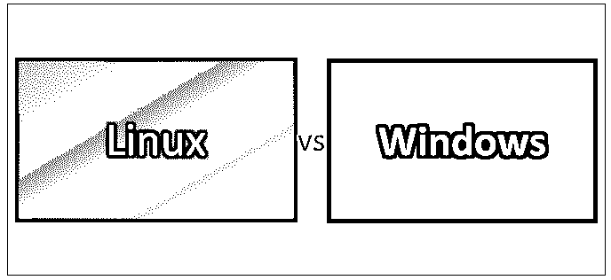
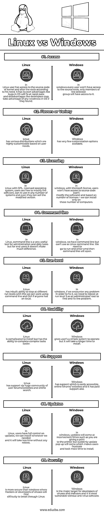

# Linux vs Windows

> 原文：<https://www.educba.com/linux-vs-windows/>

## Linux 与 Windows 的区别

[Windows 是微软为个人桌面/设备或电脑(PC)开发的](https://www.educba.com/what-is-windows/)系列操作系统，即计算机操作系统(OS)。每个操作系统都有一个图形用户界面(GUI ),桌面允许用户查看所有文件、视频等。它运行在 x86 硬件上，如 AMD 和 Intel 处理器。因此，几乎所有生产个人电脑或笔记本电脑的公司都配备了 windows 操作系统。Linux 是一个基于 T2 UNIX T3 的开源操作系统，创建于 1991 年。它是位于计算机上所有其他软件之下的软件。由于它是一个开源操作系统，用户可以修改现有代码并从中开发发行版。Linux 主要用作服务器——因为互联网上的大多数网页都是由 Linux 服务器生成的

### 什么是 Windows 操作系统？

Windows OS 的第一个版本发布于 1985 年，一个简单的 [GUI](https://www.educba.com/what-is-gui/) ，是现有磁盘操作系统(MS-DOS)的扩展，也是一个重要的版本。在我看来，1995 年的消费者版本集成了 windows 和 DOS 以及内置的互联网支持。大多数个人电脑目前只运行 Windows 操作系统。最新的 Windows 操作系统版本是目前统治市场的 Windows 10。

<small>网页开发、编程语言、软件测试&其他</small>

### 什么是 Linux 操作系统？

[Linux 是一个](https://www.educba.com/what-is-linux/)基于 UNIX 的开源操作系统，创建于 1991 年。 [Linux 操作系统](https://www.educba.com/linux-apps/)也附带了一个图形用户界面(GUI)和一些必要的日常软件。它还可以与运行在桌面计算机、移动设备、游戏控制台、数字存储设备、电子书阅读器、照相机和录像机上的 Linux 一起使用。

### Linux 和 Windows 的正面比较(信息图)

以下是 Linux 和 Windows 的 9 大对比:

### Linux 和 Windows 之间的关键区别

以下是 Linux 和 Windows 之间的差异:

*   Linux 是一个开源操作系统，而 Windows 操作系统是商业化的。
*   Linux 可以访问源代码，并根据用户需要修改代码，而 Windows 不能访问源代码。
*   即使有了现代的桌面环境和操作系统功能，Linux 的运行速度也将快于 windows 的最新版本，而 windows 在较旧的硬件上运行速度较慢。
*   Linux 发行版不收集用户数据，而 Windows 包含所有用户的详细信息，这导致了隐私问题。
*   Linux 比 windows 更可靠，如在 Linux；我们可以通过 x kill 命令杀死挂起的应用程序，但是在 windows 中，我们需要多次尝试才能杀死它。
*   Linux 比 windows 支持更多种类的自由软件，但是 windows 有大量的视频游戏软件。
*   Linux 软件的成本几乎是免费的，因为所有的程序、实用程序和复杂的应用程序如 open office 都是免费的。尽管如此，windows 也有许多免费程序和实用工具，但大多数程序都是商业性的。
*   Linux 非常安全，因为它很容易识别错误并修复，而 Windows 拥有庞大的用户群，成为病毒和恶意软件开发者的目标。
*   在谷歌、脸书、推特等公司，出于安全目的，企业组织使用 Linux 作为服务器和操作系统。，而游戏玩家和商业用户大多使用 windows。
*   在目前的情况下，Linux 和 windows 在硬件和驱动程序支持上具有相同的优先级。

### Linux 和 Windows 对照表

下面是 Linux 和 Windows 的详细对比。

| **比较依据** | **Linux** | **窗户** |
| **访问** | 在 Linux 中，用户可以访问内核的源代码，并根据自己的需要修改代码。它有优点，比如操作系统中的错误会很快修复，也有缺点，比如开发者可能会利用操作系统中的任何弱点，如果他们发现的话。 | 在 windows 中，不是每个用户都能接触到源代码；只有选定组的成员才能访问它。 |
| **口味或品种** | Linux 有各种发行版，可以根据用户需求进行高度定制。 | Windows 几乎没有可用的自定义选项。 |
| **发牌** | 在使用 GPL 许可的操作系统的 Linux 中，用户可以修改软件，在任意数量的系统中重用它，甚至可以出售修改后的版本。 | 在 windows 中，有了微软的许可，用户将无法访问源代码(不能修改软件)，根据许可的数量，我们只能在那些计算机上安装它。 |
| **命令行** | 在 Linux 中，命令行对于管理和日常任务来说是一个方便的工具，但是对于最终用户来说，没有太大的区别。 | 我们在 windows 中有命令行，但不能使用 Linux 命令行。我们需要运行并输入 cmd 命令行将会打开。 |
| **运行级别** | Linux 有内在的能力在不同的运行级别停止；有了这个，如果有人有问题，我们可以使用命令行和 GUI 工作。 | 在 windows 中，如果我们遇到任何问题来修复它，我们需要以管理员/ root 的身份在运行级别 3 重新启动来找到并修复问题。 |
| **可用性** | Linux 安装起来很复杂，但是可以更容易地完成复杂的任务。 | Windows 为用户提供了一个简单的操作系统，但安装时间会更长。 |
| **支持** | Linux 通过一个庞大的用户论坛/网站和在线搜索社区得到支持。 | Windows 提供易于访问的在线论坛/网站支持，并且也提供付费支持。 |
| **更新** | 在 Linux 中，用户对更新有完全的控制权；我们可以在任何需要的时候安装它们，并且不需要重启就可以花更少的时间。 | 在 windows 中，更新会在不方便的时候出现，例如给打印机打印，但突然会出现更新弹出窗口，这让用户感到沮丧，并需要更多的时间来安装。 |
| **安全** | Linux 比 windows 更安全，黑客或病毒的开发者会发现很难突破 Linux。 | Windows 是病毒和恶意软件开发者的主要目标，如果没有[防病毒软件，它最容易受到攻击。](https://www.educba.com/firewall-vs-antivirus/) |

### 结论

最后是 Linux 与 Windows 的对比概述。在阅读了 Linux 和 Windows 文章之间的差异之后，我希望您会有兴趣了解更多关于这些操作系统内部的信息。

希望将[操作系统](https://www.educba.com/applications-software-developer/)从 windows 转换为 Linux 或者相反的用户将对 Linux 和 Windows 操作系统的优缺点有很好的了解，并根据他们的需求做出决定，从而拥有更多优势。以上就是 Linux 和 Windows 操作系统的区别，而且在我看来，我感觉 Linux 比 Windows 操作系统更有优势。

### 推荐文章

这是 Linux 和 Windows 之间的区别的指南。在这里，我们讨论了 Linux 与 Windows 的直接比较、主要差异、信息图和比较表。您也可以阅读以下文章，了解更多信息——

1.  [Java 与 JavaScript](https://www.educba.com/java-vs-javascript/)
2.  [JavaScript vs. Ruby](https://www.educba.com/javascript-vs-ruby/)
3.  [Linux 与 BSD](https://www.educba.com/linux-vs-bsd/)
4.  [Linux vs. Android](https://www.educba.com/linux-vs-android/)

