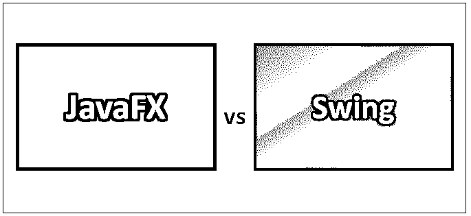
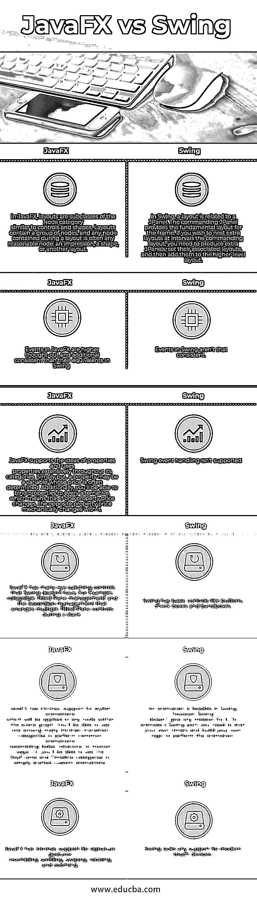

# JavaFX 与 Swing

> 原文：<https://www.educba.com/javafx-vs-swing/>

## JavaFX 与 Swing 的区别

如果你是一个经验丰富、成熟的 Java 应用科学家，毫无疑问你已经用 Swing 开发过用户界面。Oracle 并没有完全放弃 Swing——它没有被弃用，Swing 应用程序仍然可以工作。然而，没有人再做任何工作来加强 Swing，Oracle 已经明确表示 JavaFX 是未来的发展方向。关于 Swing 的长期问题以及它对 JavaFX 的影响似乎无处不在。然而——如果你看一下 [JavaFX Script](https://www.educba.com/careers-in-javascript/) 的内幕——所有的小部件似乎都或多或少地直接包装了 Swing 部件。JavaFX Script 似乎使用 Swing 部件作为“服务提供者”。

### JavaFX 是什么？

JavaFX 可能是 Java 的 [GUI 工具包(GUI 是图形用户界面的简称)。JavaFX 使得用 Java 编写](https://www.educba.com/software-development/courses/java-course/)[桌面应用](https://www.educba.com/microsoft-office-application/)和游戏变得更加容易。JavaFX 已经取代了 Swing，因为它推荐了 GUI toolkit for Java。此外，JavaFX 在风格上比 Swing 更加一致，并且有更多的选项。它也很时髦，允许你设计 GUI 牺牲布局文件(XML ),并用 CSS 美化它们，类似于我们习惯的网络应用程序。此外，JavaFX 还将 second + 3D 图形、图表、音频、视频和嵌入式网络应用集成到一个连贯的 GUI 工具包中……它是轻量级和硬件加速的。它支持多种操作系统以及 Windows、UNIX 系统和 Mac OS。

<small>网页开发、编程语言、软件测试&其他</small>

**JavaFX 选项**

*   JavaFX 自带了一套超大的 GUI 部件，比如按钮、文本字段、表格、树、菜单、图表等等。一旦构建了桌面应用程序，这将节省您大量的时间。
*   JavaFX 部件通常使用 CSS 进行样式化，您将能够使用 FXML 来编写 GUI，而不是用 Java 代码来编写。这使得快速放置 GUI 或修改外观或组合变得更加容易，而不必在 Java 代码中运行。
*   [JavaFX 包含一组](https://www.educba.com/javafx-charts/)随时可用的图表部件；因此，当你想要一个基本的图表时，你不应该从头开始编码。
*   JavaFX 还支持 3D 图形，如果您正在开发游戏或类似的媒体应用程序，这通常会很有帮助。
*   JavaFX 甚至包含受流行的 WebKit 浏览器支持的 WebView 因此，您将能够在 JavaFX 中引入网站或网络应用[。](https://www.educba.com/javafx-button/)

### 什么是 Swing？

Swing API [可以是一组](https://www.educba.com/what-is-swing/)可扩展的 GUI 部件，以简化开发者的生活，从而形成主要基于 JAVA 的前端/GUI 应用。它开启了 AWT API 的 prime，并作为 AWT API 的替代品，因为它几乎是所有管理都可以与 AWT 控件相媲美的。swing 部分遵循模型-视图-控制器设计来满足后续标准。

*   单个 API 足以支持多种外观。
*   API 是模型驱动的，以便最好的 API 不需要拥有信息。
*   API 是使用 Java Bean 模型，以便 Builder 工具和 IDE 将更高的服务提供给开发者使用。

**挥杆特点**

*   轻量级——Swing 部分独立于本地操作系统的 API，因为 Swing API 控件是纯 JAVA 代码，而不是底层的[软件系统调用](https://www.educba.com/system-software-tools/)。
*   控件 [Swing 提供了高级控件，如 Tree](https://www.educba.com/what-is-swing/) 、颜色选择器、表格控件、TabbedPane、滑块。
*   高度可定制——Swing 控件通常以非常简单的方式定制，因为视觉外观与内容无关。
*   可插拔的外观——主要基于 SWING 的 GUI 应用程序的外观经常在运行时被修改，由可访问的值支持。

### JavaFX 与 Swing 的直接比较

下面是 JavaFX 和 Swing 之间的前 6 名比较:

### JavaFX 和 Swing 对照表

下面是要点列表，描述 JavaFX 和 Swing 的对比。

| **序列号** | **JavaFX** | **摇摆** |
| **1** | 在 JavaFX 中，布局是节点类别的子类，类似于控件和形状。[布局包含一组](https://www.educba.com/javafx-layouts/)节点，布局过程中包含的任何节点通常是任何合理的节点:印象、形状或另一个布局。 | 在 Swing 中，布局[与 JPanel](https://www.educba.com/jpanel-in-java/) 相关联。命令 JPanel 提供了框架的基本布局。如果希望在命令布局的间隔处嵌套额外的布局，则需要生成额外的 JPanels，设置它们的关联布局，然后将它们添加到更高级别的布局中。 |
| **2** | 与 Swing 中的事件相比，JavaFX 中的事件更加深思熟虑且更加一致。 | Swing 中的事件并不一致 |
| **3** | JavaFX 支持属性的概念，并在其类别中广泛使用属性。简单地说，一个财产可能是一个变量，其价格往往是确定的。此外，您将能够将属性绑定到每个备选方案，这意味着如果一个属性价格发生变化，相对的属性价格也会随之机械地变化。 | 不支持 Swing 事件处理 |
| **4** | [JavaFX 有很多【Swing 没有的抢眼控件；例如，可折叠的标题窗格管理和在堆栈期间排列多个标题窗格控件的折叠管理。](https://www.educba.com/javafx-slider/) | Swing 有一些基本的控件，比如按钮、复选框和盒子。 |
| **5** | [JavaFX 对时尚动画有内在的支持](https://www.educba.com/javafx-filechooser/)，这将应用于场景图中的任何节点。您将能够使用许多内在过渡类别中的一个来执行类似渐变、旋转或运动方式的常见动画。或者，您可以使用关键帧和时间轴类别来简单地开始自定义动画。 | 一个动画在 Swing 中是可行的；然而，Swing 并没有为它赋予任何使命。要制作 Swing 部件的动画，您需要启动自己的计时器并构建自己的逻辑来执行动画。 |
| **6** | JavaFX 对类似滚动、滑动、旋转和缩放的签名手势有内在的支持。 | Swing 缺乏对现代触摸设备的任何支持。 |

### 结论

JavaFX 旨在生成具有微妙 GUI 选项的应用程序，如动画、web 视图、音频和视频回放以及级联样式表(CSS)支持的设计。

十年来，应用程序开发人员发现 Swing 是构建图形用户界面(GUI)和为 Java 应用程序增加交互性的非常有效的工具包。然而，许多当今最热门的 GUI 选项不能简单地通过实现 Swing 来实现。所以我们可以说 JavaFX 是现代世界对 GUI 的偏好。

### 推荐文章

这是 JavaFX 和 Swing 之间差异的有用指南。在这里，我们讨论了 JavaFX 与 Swing 的直接比较、关键差异以及信息图和比较表。您也可以阅读以下文章，了解更多信息——

1.  [Java vs Node JS](https://www.educba.com/java-vs-node-js/)
2.  [Java vs Python](https://www.educba.com/java-vs-python/)
3.  [Java Vector vs ArrayList](https://www.educba.com/java-vector-vs-arraylist/)
4.  [Java Swing vs Java FX](https://www.educba.com/java-swing-vs-java-fx/)

