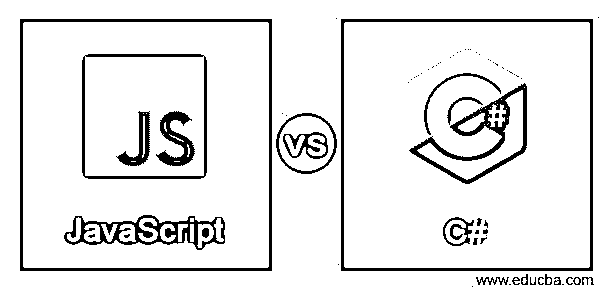
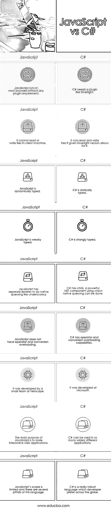

# JavaScript 与 C#

> 原文：<https://www.educba.com/javascript-vs-c-sharp/>

## JavaScript 和 C#的区别

在这篇 JavaScript vs C#的文章中，我们将比较 JavaScript 和 C#的基本特性，理解它们的用途，了解它们的优缺点，并强调 JavaScript 和 C#之间的一个关键区别。阅读完内容后，读者应该能够做出明智的决定，在 JavaScript 和 C#之间做出选择。

### JavaScript 与 C#的直接比较(信息图表)

下面是 JavaScript 与 C#的 9 大对比:

<small>网页开发、编程语言、软件测试&其他</small>

### JavaScript 与 C#的比较

在这一节中，我们将对 JavaScript 和 C#做一个重要的比较:

| **JavaScript** | **C#** |
| JavaScript 可以在大多数浏览器中运行，不需要任何插件。 | C#需要一个类似银光闪闪的插件。 |
| 它不能在客户机上读取或写入文件。 | 如果给定的 Silver light 版本允许的话，它可以读写文件。 |
| JavaScript 是动态类型的。 | C#是静态类型的。 |
| JavaScript 是弱类型的。 | C#是强类型的。 |
| JavaScript 有单独的库来进行原生查询，如 underscore.js。 | C#有 LINQ，一个强大的。NET 组件，使用它可以完成本机查询。 |
| JavaScript 没有运算符和转换重载。 | C#具有运算符和转换[重载功能](https://www.educba.com/overloading-in-c-sharp/)。 |
| 网景公司的一个小团队开发了它。 | 它是由微软开发的。 |
| JavaScript 的主要目的是制作交互式 web 应用程序。 | C#可以用在如此多不同的应用程序中。 |
| JavaScript 的范围是有限的，这种语言有几个陷阱。 | C#是一种真正强大的语言，受到全球开发者的青睐。 |

JavaScript 和 C#的有趣的优点和缺点可以使比较更好。

**JavaScript:**

| **优点** | **缺点** |
| 运行 JavaScript 不需要安装。 | 很多错误可能会悄无声息的过去。 |
| 对于 web 开发来说是必须的。 | 你可能很容易使用全局变量而没有意识到这一点。 |
| 它可以运行在服务器端和客户端。 | 有线类型的强制无处不在。 |
| 它有很大的功能，并提出了词法闭包。 | 这很复杂。 |
| 它有一个庞大的生态系统，应用程序的构建很容易。 | 对于相同的代码，每个浏览器的行为可能不同。 |
| 它有一个类似于语法的 C，调试很容易。 | 它有有限的标准库。 |
| 这是一个基于原型的面向对象系统。 | 异步编码很难，至少对初学者来说是这样。 |
| JavaScript 开发人员需求量很大。 | 反直觉的类型转换。 |

**C#:**

| **优点** | **缺点** |
| 它有一个很棒的 windows IDE。 | 它有一个复杂的语法。 |
| 这是一种令人难以置信的设计语言。 | 要靠 IDE 做编码。 |
| 使用最多的 OO 语言之一。 | 它缺乏对不可变数据结构的标准库支持。 |
| 最好的窗户设计，需求量很大。 | 使用昂贵，意味着使用 C#构建的产品通常成本更高。 |
| 可以用来设计 unity 游戏。 |  |
| 真正普遍的。 |  |
| 它可以用作高级和低级语言的混合。 |  |
| 它支持许多平台。 |  |

### 结论

总结上面的讨论，我们可以快速浏览下面的要点，明智地了解 JavaScript 和 C#之间的区别。

*   如果目的是通过 web 浏览器进行客户端编程，那么选择 JavaScript。最好用 [HTML5](https://www.educba.com/html-vs-html5/) 和 TypeScript(高级版 JavaScript)。
*   在桌面开发上，使用 C#。
*   在服务器开发上，使用 TypeScript 和 NodeJS。

TypeScript 只像 C#并且由微软的支持。TypeScript 编译成 JavaScript。

通过上面的比较和解释，您一定对 JavaScript 和 C#语言以及它们各自提供的功能有了很好的了解。这两种语言都有很高的需求，而且每一种都服务于一个非常重要的目的，所以很难指出哪一种是好的，哪一种是坏的。对于即将进入编程和开发领域的人来说，他/她应该学习这两种语言是很重要的。然而，开发人员普遍倾向于 C#。它提供了如此多的好处，让 JavaScript 相形见绌。一个普遍的建议可能是更多地关注 C#并使其成为主要语言，并将 JavaScript 知识作为一项基于需求的技能。

### 推荐文章

这是 JavaScript 与 C#的对比指南。在这里，我们讨论 JavaScript 和 C#的主要区别，包括信息图和比较表。您也可以阅读以下文章，了解更多信息——

1.  [Java 与 JavaScript 的区别](https://www.educba.com/java-vs-javascript/)
2.  [硒 vs 黄瓜](https://www.educba.com/selenium-vs-cucumber/)
3.  [Python vs C++对比](https://www.educba.com/python-vs-c-plus-plus/)
4.  [Java 与 C#的区别](https://www.educba.com/java-vs-c-sharp/)

