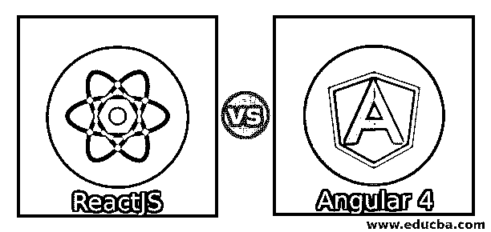
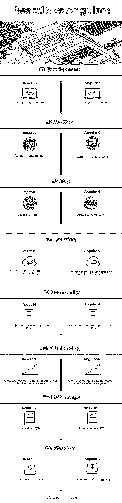

# 反应与角度 4

> 原文：<https://www.educba.com/reactjs-vs-angular-4/>

## ReactJS 和 Angular 4 之间的差异

React 是一个 JavaScript 库，用于构建应用程序的前端或用户界面。它由脸书开发和维护。React 正在处理 web 应用程序和移动应用程序的视图层。它可以作为单页或移动应用程序开发的基础。React framework 的特性开发和未来的改进可以通过 React Fiber 来完成，React Fiber 是 React framework 库的一个新的核心算法，用于构建用户界面。Angular 4 是一个基于 typescript 的开源前端 web 应用平台，由 Google 的 Angular 团队领导。Angular 是实际构建 Angular JS 的同一个团队的完全重写。但是 Angular 和 Angular JS 完全不一样。Angular 和 Angular JS 的架构有很大的不同。Angular 4 于 2017 年 3 月发布，这被证明是一个重大突破，也是继 Angular 2 之后最新的 Angular 团队发布。

### React JS 是什么？

React JS 允许开发人员创建可重用的 UI 组件。目前，它可以被称为最流行的 JavaScript 库之一。它有一个坚实的基础和一个庞大的社区支持它。在开始使用 React 之前，需要了解 HTML、CSS 和 JavaScript。大多数开发人员在 MVC(模型-视图-控制器)框架中充当“视图”。React 聪明地从开发人员那里抽象出 DOM(文档对象模型),提供了一个简单的编程模型和更好的性能。React 也可以使用 Node 在服务器端呈现。本机应用程序也可以使用 React native。它实现了单向的反应式数据流，这大大减少了样板代码，并且比传统的数据绑定更容易整合到当前的数据流中。React 使用 JSX，即 JavaScript 语法扩展；尽管并不要求必须使用 JSX，但建议 React JS 开发使用它。

<small>网页开发、编程语言、软件测试&其他</small>

### 什么是角 4？

Angular 4 向后兼容 Angular 2。这意味着在 Angular 2 中开发的项目在 Angular 4 中将没有任何问题。angular 社区对 Angular 4 进行了一些重大改进，因此，主要版本号从 2 更改为 4，跳过了 3。直接跳到版本 4 背后的原因是路由器包在版本 3.x 中，因此团队没有将所有东西都升级到 3.0 并将路由器升级到 4.0，而是选择将所有 ng 模块的版本升级到 4.0。Angular 4 中引入了一些重大变化。TypeScript 2.1 和 2.2 带来了不错的特性；添加了一个新的 SystemJS 插件，它为开发人员动态地将 TemplateURL 和 StyleURLs 中的组件相对路径转换为绝对路径。Angular 在构建过程中编译模板，生成 JS 代码；在实时模式下，编译是在运行时完成的。提前编译有几个好处，在构建时，模板正确性是已知的，而不必等到运行时。此外，在 Angular 4 中，将动画包从核心中分离出来，作为一个独立的专用包。模板标记现在已被弃用。虽然它仍然可以工作，但是我们可以使用 ng-template 标签。与 Angular 2 相比，Angular 4 的应用更小、更快。

### ReactJS 和 Angular 4 之间的直接比较

下面是 ReactJS 与 Angular 4 之间的 8 大差异

### ReactJS 和 Angular 4 的主要区别

以下是描述反应与角度 4 之间差异的要点列表

1.  ReactJS 是脸书开发的 JavaScript 库，而 Angular 4 是谷歌开发的完整 MVC 框架。
2.  对于那些已经熟悉 JavaScript 的人来说，ReactJS 可能更容易学习，而学习 Angular 4，即使对 JavaScript 有所熟悉，仍然是一个挑战。
3.  ReactJS 最适合用于动态和单页面应用程序，因为它使用虚拟 DOM，可以快速响应数据变化，而 Angular 4 最适合创建跨平台的移动应用程序和渐进式企业 web 应用程序和软件。
4.  ReactJS 是一个 JavaScript 库；因此，它是使用 JavaScript 创建的，而 Angular 4 是一个完整的框架，它是使用 TypeScript 创建的。
5.  ReactJS 使用单向数据绑定，这意味着任何模型更改都会影响视图，但反之亦然，而 Angular 4 使用双向数据绑定，这意味着任何模型更改都会影响视图，反之亦然。
6.  ReactJS 使用虚拟 DOM，这是 DOM 的简化版本，而 Angular 4 使用浏览器的 DOM。
7.  ReactJS 在单页面应用程序的性能方面更好，因为虚拟 DOM 可以快速渲染页面，而 Angular 4 使用传统浏览器的 DOM，与 ReactJS 相比，它的性能有点迟钝。
8.  ReactJS 背后有不错的社区支持，而 Angular 4 有强大的社区支持系统，因为它比 ReactJS 利用得更多。
9.  ReactJS 完全向后兼容以前的版本，而 Angular 4 也向后兼容 Angular 2 及更高版本，但 Angular 2 以下的版本不向后兼容。
10.  ReactJS 完全是用 JavaScript 编写的，因为它是另一个 JavaScript 库，而 Angular 4 是用 TypeScript 编写的，这是一个全功能的 MVC 框架。

### ReactJS 与 Angular 4 的比较

主要比较如下所述:

| **比较的基础** | **反应 JS** | **角度 4** |
| **开发** | 由脸书开发 | 由谷歌开发 |
| **写成** | 用 JavaScript 写的 | 使用 TypeScript 编写 |
| **类型** | JavaScript 库 | 完整框架 |
| **学习** | 由于考虑到库，学习曲线是最小的 | 学习曲线很陡，因为它是一个完整的框架 |
| **社区** | 相当大的社区支持 | 与 React 相比，强大的社区支持 |
| **数据绑定** | 允许单向数据绑定；模型影响视图，但反之亦然 | 允许双向数据绑定；模型影响视图，反之亦然 |
| 天赋用途 | 使用虚拟 DOM | 使用浏览器的 DOM |
| **结构** | React 只是 MVC 中的一个‘V’ | 功能全面的 MVC 框架 |

### 结论

ReactJS 和 Angular 4 都采用完全不同的方法进行前端应用程序开发。这些技术既强大又灵活，各有优缺点。ReactJS 只是 MVC 框架中的一个视图部分，完全使用 JavaScript 编写，而 Angular 4 不仅仅是一个视图；它是一个完整的 MVC 框架，使用 TypeScript 编写。

两者都为高质量、可伸缩和反应式的基于 web 的应用程序提供了一套健壮的工具。那些喜欢用传统 JavaScript 编码的开发人员可能会发现 ReactJS 比 Angular 4 更受欢迎。对于寻找成熟和复杂解决方案的其他开发人员来说，Angular 4 可能是最佳选择。虽然没有孰优孰劣，但它取决于做出最终选择的业务应用程序目标和系统约束。

### 推荐文章

这是 ReactJS 与 Angular 4 之间的主要差异的指南。在这里，我们还讨论了 ReactJS 与 Angular 4 的主要区别，并提供了信息图表和比较表。您也可以看看以下文章，了解更多信息–

1.  [Angular JS vs Angular 有什么好处](https://www.educba.com/angular-js-vs-angular/)
2.  [vue . js vs Angular-Awesome 差异](https://www.educba.com/vue-js-vs-angular/)
3.  [淘汰赛](https://www.educba.com/angular-vs-knockout/) [vs 棱角分明](https://www.educba.com/angular-vs-knockout/)
4.  [JQuery](https://www.educba.com/angular-vs-jquery/)[vs Angular——有用的比较](https://www.educba.com/angular-vs-jquery/)
5.  [Angular JS vs Angular 2-想了解好处](https://www.educba.com/angular-js-vs-angular-2/)
6.  [Vue。JS vs React。JS:有什么好处](https://www.educba.com/react-js-vs-vue-js/)
7.  [Angular 2 vs Vue JS:想知道有什么区别](https://www.educba.com/angular-2-vs-vue-js/)
8.  [React Native vs React](https://www.educba.com/react-native-vs-react/)
9.  [React Native vs Swift | 12 大差异&信息图](https://www.educba.com/react-native-vs-swift/)

