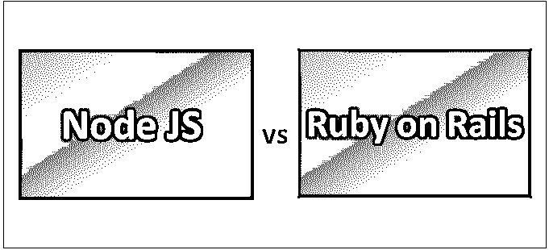
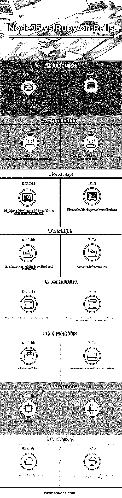

# Node JS 与 Ruby on Rails

> 原文：<https://www.educba.com/node-js-vs-ruby-on-rails/>

## Node JS 和 Ruby on Rails 的区别

Node JS 是一个跨平台的运行时库和环境，用于在浏览器之外创建运行的 JavaScript 应用程序。它是免费和开源的，用于创建服务器端 JS 应用程序。Node JS 允许开发者在服务器端执行他们的代码。Ruby on Rails (Rails)是一个用 Ruby 语言编写的服务器端 web 应用框架。Rails 有助于快速应用程序开发方法，用许多内置特性帮助开发人员，这样开发人员就可以专注于应用程序业务逻辑。开源 Rails 框架是开发数据库支持的 web 应用程序的理想选择。

### 节点 JS

*   Node JS 提供了一种更快的方式来编写可伸缩的轻量级脚本。开发人员可以编写实时应用程序，同时，它为移动应用程序开发提供了空间。人们可以很容易地将 Node JS 用于前端和后端开发，因为它允许使用相同的 JavaScript。
*   Node JS 中广泛提供了服务器端功能；开发人员可以在计算机上监听并回复 HTTP 请求，监听流量网络，同时可以直接从计算机访问数据库。
*   Node JS 使用基于事件的模型来解决可伸缩性问题，并为 JavaScript 模块提供丰富的 JavaScript 库，这有助于简化编码。
*   基于 Node JS 的框架有很多，比如 Express JS，Partial JS 等等。在构建快速且可伸缩的服务器端应用程序时，Node JS 无疑是赢家。基本上，Node JS 使 JavaScript 能够通过其 API 与 I/O(输入/输出)设备进行交互，并与用各种其他语言编写的其他外部库进行连接。

### Ruby on Rails

*   Rails 是基于 MVC(模型-视图-控制器)的框架，为数据库、网页和 web 服务提供结构。用于数据传输的 JSON 和 XML 等 Web 标准是由 Rails 推动的。Rails 还推广和支持其他一些范例，比如 CoC(约定优于配置)、DRY(不要重复)和活动记录模式。
*   Rails 包含了几个使开发人员更有效率的特性，比如元编程。另一个框架从头开始使用大量的代码生成，但是 Rails 使用元编程技术。Rails 也使用代码生成，但是对于繁重的任务，它依赖于元编程。活动记录会将对象保存到数据库中。Rails 也不需要太多的配置，更喜欢传统的方法。
*   2000 年代出现的 Rails 通过诸如无缝数据库表创建和迁移等创新特性极大地影响了 web 开发，从而支持快速应用程序开发。它对其他框架的影响是非常明显的。
*   Rails 还包括一些工具，可以使常见的开发任务变得更容易，比如 scaffolding，它可以自动构建网站所需的一些模型和视图。另一个工具是 WEBrick，这是一个随 Ruby 发布的 Ruby web 服务器。这些工具和 Rails 一起提供了一个基本的开发环境。Rails 也广泛支持 JavaScript 库。最初，它将轻量级 SOAP 用于 web 服务，但后来被 REST web 服务所取代。

### Node JS 和 Ruby on Rails 的比较

下面是 Node JS 和 Ruby on Rails 的 8 大区别

<small>网页开发、编程语言、软件测试&其他</small>

### Node JS 和 Ruby on Rails 的主要区别

Node JS 和 Ruby on Rails 都是市场上流行的选择

1.  Node JS 是开发小型项目的理想选择，而 Rails 是一个 web 应用程序框架，非常适合 MVC 模式中的数据库支持的 web 应用程序，于 2008 年发布。
2.  NodeJS 是用 JavaScript 写的，而 Rails 是用 Ruby 写的，Ruby 很容易学，理解语法，在 MIT 许可下发布。
3.  NodeJS 最适合 I/O 非阻塞、基于事件的应用程序，而 Rails 更适合元编程和数据库支持的现代 web 编程。
4.  NodeJS 源自事件驱动的模型架构，而 Rails 遵循模型-视图-控制器模式；模型表示在活动记录中处理的数据。
5.  NodeJS 提供创建自己的 web 服务器的能力，这些服务器将异步处理 HTTP 请求，而 Rails 使用 WEBrick、Apache、NGINX、Cherokee。
6.  NodeJS 有一个相当大的社区，有很多 Github 项目可用，而 Rails 有一个巨大而强大的开发人员社区以及一个巨大的 Github 库。
7.  精通 JavaScript 的程序员可以高效地学习 NodeJS 概念，而 Rails 的学习曲线非常陡峭，适合经验丰富的程序员。
8.  NodeJS 有一个基于异步调用的事件驱动模型，而 Rails 的哲学围绕着约定胜于配置原则。
9.  NodeJS 更容易安装一些需要安装在系统上的归档文件，而 Rails 的安装过程比 NodeJS 长。
10.  NodeJS 有一个解释器，用于解释和执行 JavaScript 代码，而 Rails 有一个内置的静态编译，默认使用 CoffeeScript。

### Node JS 与 Ruby on Rails 比较表

下面是最上面的比较

| **比较的基础** | **节点 j** | **轨道** |
| **语言** | 一个框架是用 C，C++，JavaScript 写的 | 基于 Ruby 的框架 |
| **应用** | 快速和可伸缩的服务器端应用程序 | 数据库支持的 web 应用程序，元编程 |
| **用途** | 当需要可伸缩且更快的应用程序时非常有用 | 最适合大规模应用 |
| **范围** | 开发人员可以在客户端和服务器端利用它 | 服务器端框架 |
| **安装** | 需要在系统上安装归档文件 | 需要通过 RubyInstaller /RailsInstaller 预编译的 Ruby 版本 |
| **可扩展性** | 高度可扩展 | 与 NodeJS 相比，可伸缩性较差 |
| **性能** | 整个站点的页面加载速度更快 | 与 NodeJS 相比更慢 |
| **市场** | 巨大的市场需求 | 在当前的市场情况下，没有 NodeJS 受欢迎 |

### 结论

Rails 是一个非常流行的框架，受到全球许多开发人员的喜爱，但是 NodeJS 有两个主要优点。首先，它是基于 JavaScript 的，这是全世界大多数开发者都知道的。其次，它基于事件驱动的架构，这使得它非常适合移动应用程序、聊天应用程序或任何使用 rest 服务作为后端的应用程序。

同时 NodeJS 可以有点不一致；它的 API 以频繁的间隔不断变化。任何 Express 应用程序结构都是高度灵活和自由的，这对于任何应用程序来说都是一个宽松的方面。Rails 非常严格，所以很难写出糟糕的代码；不习惯异步编程的开发人员对 NodeJS 中的大量回调有一个问题，这完全是基于事件驱动的模型。

这些技术各有利弊，但都是很棒的技术。因此，项目的每个方面都应该根据具体情况进行评估，而不是认为某个方面比其他方面更好。开发人员的易用性和技能将及时为项目开发铺平道路。

### 推荐文章

这是 Node JS 和 Ruby on Rails 之间主要区别的指南。在这里，我们还讨论了 Node JS 与 Ruby on Rails 的关键区别，并提供了信息图表和比较表。您也可以看看下面的 Node JS vs Ruby on Rails 文章来了解更多信息

1.  [Go vs Java——有什么好处](https://www.educba.com/go-vs-java/)
2.  [JavaScript vs Node JS–惊人的差异](https://www.educba.com/javascript-vs-node-js/)
3.  [角度 JS 与节点 JS——哪个更好](https://www.educba.com/angular-js-vs-node-js/)
4.  Django 和 Ruby On Rails:哪个更好
5.  [Go vs Ruby |信息图表的主要差异](https://www.educba.com/go-vs-ruby/)

