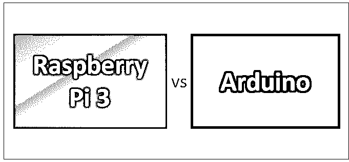
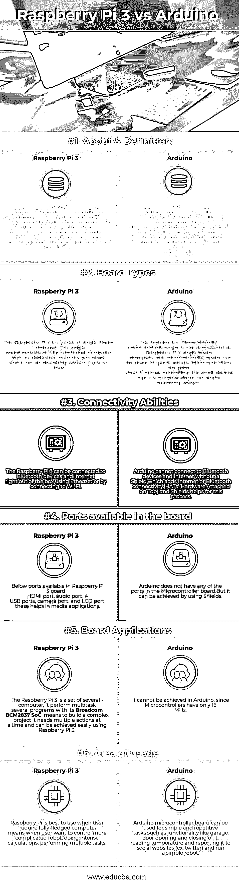

# 树莓 Pi 3 vs Arduino

> 原文：<https://www.educba.com/raspberry-pi-3-vs-arduino/>

## 树莓 Pi 3 和 Arduino 的区别

Raspberry Pi 是一台信用卡大小的低成本计算机，它可以插入计算机显示器或电视，用户可以使用标准的键盘和鼠标来操作它。树莓派是一系列单板电脑。这是为了在世界各地的学校中促进和培养对基础计算机科学的认识而开发的。Arduino 是一种微控制器主板。微控制器是一台简单的计算机，一次只能运行一个程序。它非常容易使用。Arduino 是一个基于软件和硬件的开源原型平台。

### 树莓 Pi 3

Raspberry 是由英国的 Raspberry Pi 基金会开发的。最新版本的 Raspberry Pi 电脑是 Raspberry Pi 3 Model B，这是一款非常微小的信用卡大小的电脑。只要连接鼠标、键盘、显示器、电源、micro SD 卡，并在其中安装 Linux 发行版，就可以高效地使用这一功能。这使得一台完全成熟的电脑，用户可以运行从文字处理器和电子表格到游戏的所有应用程序。

<small>网页开发、编程语言、软件测试&其他</small>

Raspberry Pi 3 是一款用 PHP 语言编写的在线开源网站创建工具。它是最流行的开源内容管理系统。Raspberry Pi，3 Model B，是第一个从一开始就开源的 Raspberry Pi 模型。Raspberry Pi 3 是一款四核处理器，它比以前的 Raspberry Pi 型号更快、更强大。

**树莓 Pi 3 Model B 相对于前代产品的优势:**

*   Raspberry Pi 3 Model B 中的新主板能够以每秒 60 帧的速度播放 1080p MP4 视频，这提高了 Pi 的媒体中心证书。
*   Raspberry Pi 3 配有内置 Wi-Fi 和蓝牙，有助于支持开箱即用的无线互联网。
*   Pi 3 板支持远程更新 Pi。此外，在多台计算机之间共享操作系统的映像，如引导过程，可以通过使用 USB 连接的硬盘驱动器或笔驱动器直接完成，并支持从网络连接的文件系统引导。

### 阿尔杜伊诺

Arduino 是一个基于软件和硬件的开源原型平台。它很容易使用。Arduino 是整体的微控制器主板，它有现成的软件叫 Arduino IDE(集成开发环境)；该软件用于编写计算机程序代码并将其上传至物理电路板。

**下面列出了 Arduino 领域的一些特性:**

*   Arduino 中的微控制器主板能够读取来自不同传感器的模拟/数字输入信号，然后将这些信号转换为输出过程，如打开/关闭 LED、激活电机等。
*   用户可以通过使用 Arduino IDE 软件向微控制器电路板发送信号(指令集)来控制电路板的功能。
*   Arduino 不需要任何额外的硬件/编程器来加载新的程序到主板上。这可以通过使用 USB 电缆来完成。
*   由于 Arduino IDE 使用的是更简单的 C++版本，所以学习编程语言进行编程是非常容易的。

### Raspberry Pi 3 和 Arduino 的正面比较(信息图)

以下是树莓 Pi 3 与 Arduino 的 6 大区别

### 树莓 Pi 3 和 Arduino 的主要区别

两者都是市场上的热门选择；让我们讨论一些主要的区别:

1.  树莓 Pi 3 是一系列单板电脑。单板由一台全功能计算机及其专用内存、处理器和操作系统(运行在 Linux 上)组成。而 Arduino 是微控制器板，这种板不如 Raspberry Pi 3 单板计算机强大，但微控制器板对于快速设置非常有用。
2.  树莓 Pi 3 比 Arduino **、**快得多，这意味着树莓 Pi 3 有 1.2 GHz，而 Arduino 只有 16 MHz。这有助于处理播放视频、网上冲浪、听音乐等任务。，与 Arduino 相比非常快。
3.  Arduino 是一种简单的方法，对于构建项目来说更有吸引力。Arduino 与模拟传感器、电机或其他组件的接口方便且用户友好，而 Raspberry Pi 3 获取传感器读数的路径非常复杂，如安装软件、库等。
4.  Raspberry Pi 3 是为运行操作系统而设计的，而 Arduino 不是为运行操作系统而设计的。

### 树莓 Pi 3 与 Arduino 对比表

下面是最上面的比较

|  **对比的依据** | **树莓派 3** | Arduino |
| **关于&的定义** | The latest version of the Raspberry Pi computer is the Raspberry Pi 3 Model B.

树莓派是一系列单板电脑。这是一种信用卡大小的低成本计算机，它可以插入计算机显示器或电视，用户可以使用标准的键盘和鼠标来操作它。

 | An Arduino is a microcontroller motherboard. A microcontroller is a simple computer in that only one program can be run at a time. It is very easy to use.Arduino 是一个基于硬件和软件的开源原型平台，易于使用。 |
| **Board Types** | 树莓 Pi 3 是一系列单板电脑。单板由一台全功能计算机及其专用内存、处理器和操作系统(运行在 Linux 上)组成。 | The Arduino is a Microcontroller board, and this board is not as powerful as Raspberry Pi 3 single-board computers, but the microcontroller board can be great for quick setups.当涉及到控制小型设备时，微控制器是很好的，但是不可能运行整个操作系统。 |
| **Connectivity Abilities** | Raspberry Pi 3 可以通过以太网或 Wi-Fi 连接到蓝牙设备和互联网。 | 如果没有添加互联网或蓝牙连接的屏蔽，Arduino 无法连接到蓝牙设备和互联网。帽子(硬件附在顶部)和盾牌有助于这个过程。 |
| **板上可用的端口** | Below ports available in Raspberry Pi 3 board :HDMI 端口、音频端口、4 个 USB 端口、摄像头端口和 LCD 端口有助于媒体应用。 | Arduino does not have any of the ports on the Microcontroller board.

但是可以通过使用护盾来实现。

 |
| **Board Applications** | 树莓派 3 是一套几台电脑；它使用 Broadcom BCM2837 SoC 执行多个程序的多任务处理，这意味着构建一个复杂的项目需要一次执行多个操作，使用 Raspberry Pi 3 可以轻松实现。 | 这在 Arduino 中无法实现，因为微控制器只有 16 MHz |
| **使用区域** | Raspberry Pi 最适合在用户需要一台完全成熟的计算机时使用，也就是说，当用户想要控制一个更复杂的机器人，进行密集的计算，执行多项任务时。 | Arduino 微控制器板可以用于简单和重复的任务，例如车库门的开关、读取温度并将其报告给社交网站(例如:Twitter)以及运行简单的机器人。 |

### 结论

Arduino 和 Raspberry Pi 3 各有优劣，各有千秋。

如果有人正在构建一个同时涉及几个功能的项目，需要轻松访问互联网，还需要媒体访问能力，那么 Raspberry Pi 3 将是一个完美的选择。

如果有人正在构建一个项目，需要从更容易连接到模拟传感器的地方轻松读取数据，并期望根据传感器数据只进行一些输出，轻松地与其他机器部件通信，等等。，那么 Arduino 也是一个不错的选择。我希望现在你已经对 Arduino 和 Raspberry Pi 3 有了更公平的认识。请继续关注我们的博客，获取更多类似的文章。

### 推荐文章

这是树莓 Pi 3 和 Arduino 之间最大区别的指南。在这里，我们还将讨论信息图和比较表的主要区别。你也可以看看下面的 Raspberry Pi 3 vs Arduino 文章，了解更多信息

1.  [树莓 Pi 3 vs 比格犬骨黑](https://www.educba.com/raspberry-pi-3-vs-beaglebone-black/)
2.  [树莓派 3 vs 树莓派 2](https://www.educba.com/raspberry-pi-3-vs-raspberry-pi-2/)
3.  [树莓派 vs Arduino](https://www.educba.com/raspberry-pi-vs-arduino/)
4.  [树莓派 vs 香蕉派](https://www.educba.com/raspberry-pi-vs-banana-pi/)
5.  [C++向量 vs 数组:惊人的特性](https://www.educba.com/c-plus-plus-vector-vs-array/)
6.  [Wi-Fi 与以太网的比较](https://www.educba.com/wifi-vs-ethernet/)
7.  【to Raspberry Pi vs ODROID 指南

