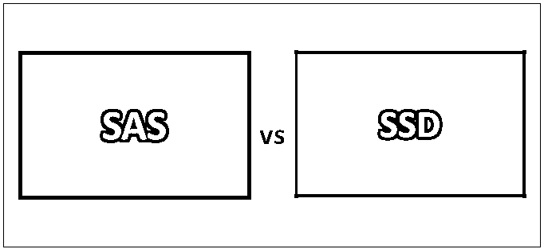
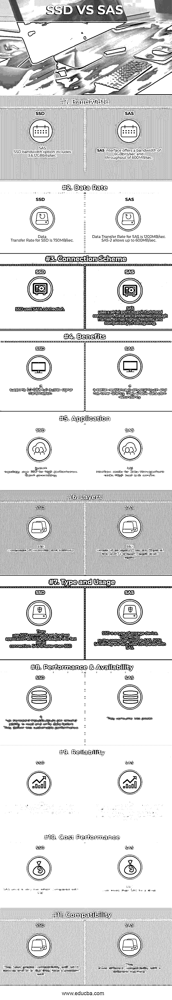

# SAS 与 SSD

> 原文：<https://www.educba.com/sas-vs-ssd/>

## SAS 与 SSD 的区别

SAS 是基于串行连接 SCSI 的串行驱动器接口。SAS 同时支持 SCSI 和 ATI。 [SAS 的性能优于传统的 SCSI](https://www.educba.com/career-in-sas/)。它们是为高性能企业设计的。它允许不同尺寸的多个设备使用更长的电缆进行连接。这些电缆可以热插拔。它是一种点对点协议，将数据移入和移出计算机存储设备。SSD 是一种驱动器技术，类似于 cd、DVD 和固态驱动器(也称为闪存驱动器)。SSD 数据存储在闪存芯片上，因此可以在没有电源的情况下保留数据。基本上，与 SD 卡或移动设备中的非易失性存储器使用的是同一类型的存储器。

### 什么是 SAS？

SAS 设备有两个端口；每个都位于不同的域中。在故障转移的情况下，如果一条路径出现故障，它将采用另一条独立的路径进行通信。SAS 端口属于传输层和物理层。SAS 的每个驱动器都有明确定义的唯一地址/ID。

<small>Hadoop、数据科学、统计学&其他</small>

通俗的说就是连接服务器主板和硬盘的连接器。它们取代了传统的 SCSI 驱动器。关键属性是串行互连。

### SSD 是什么？

第一个 SSD 是在 1970 年为 INM 超级计算机推出的。固态硬盘是指一种内部技术。它们由硅存储芯片制成，没有移动部件和旋转延迟，从而缩短了响应时间。它们提供端到端的数据完整性，并包括纠错等功能来提高可靠性。

### SAS 和 SSD 之间的直接比较(信息图表)

以下是 SAS 和 SSD 之间的 11 大区别:

### SAS 和 SSD 的主要区别

让我们讨论一下 SAS 和 SSD 之间的一些主要区别:

*   固态硬盘对于需要有限容量提供高性能的应用来说非常有价值。它们没有噪音，因为它们不是机械的。
*   SSD 的特殊之处在于数据保持能力；例如，如果从服务器上卸下 SSD，存储的一条信息将可以使用多年。由于 SSD 没有可移动的部分，它很可能会保护我们的数据安全。
*   它消耗更少的能量，不受数据碎片的影响，这是它的主要优势。
*   SSD 使用 SSD 缓存机制来存储活动数据的临时副本。
*   固态硬盘具有零延迟和更高的随机 IOPS 率。
*   SSD 有缺点:它们消耗更多的电池电量；它们在处理顺序工作负载时速度不是很快，但在处理随机工作负载时速度很快。他们有有限的
*   SAS 驱动器适合多端口存储阵列，以便商业企业用来存储数据。SAS 磁盘可以提供连续的数据速率。
*   SAS 通过减少物理连接器的数量来降低存储系统的故障率。
*   SAS 驱动器的平均故障间隔时间更长( [MTBF](https://www.educba.com/mtbf-formula/) )。他们有先进的数据完整性纠错。
*   SAS 允许每台设备利用多台设备的全部带宽。SAS 接口支持 150MBps 的 SATA(串行 ATA)设备。
*   对于非关键服务器，SAS 是一个好的 SAS 协议，是一个稳定和更快的协议，并确保高用户数据和具有高可靠性。
*   SAS 有一个缺点:存储容量小，成本高。

### SAS 和 SSD 对照表

下面是 SAS 和 SSD 之间最顶层的比较。

| **SAS 与 SSD 的比较基础** | **SAS** | **固态硬盘** |
| **类型和用途** | 他们将应用程序的 SCSI 命令集用作 SCSI，并使其适应快速串行连接。SAS 比 SSD 快。 | SSD 是一种通过 SAS、SCSI、SATA 连接到计算机的存储设备。与 SAS 相比，它们非常慢。 |
| **性能&可用性** | 它增加了每秒的输入/输出(更快地读写数据的能力)。它们的可持续性较差。 | 它们消耗更少的能量。 |
| **可靠性** | 它们的磁盘速度高达 15，000 RPM，可靠性更高。采用双端口技术增强了可靠性。 | 由于没有活动部件，它们在振动或高温下不会失效。它们具有更高的可靠性，是长期存储数据的理想选择。 |
| **性价比** | 与固态硬盘相比，SAS 的价格非常低。 | 固态硬盘的成本高于 SAS 硬盘。 |
| **兼容性** | 它们与 SATA 设备和 SCSI 有更好的兼容性。但是他们有一个问题 | 它们显示出与不同机器的不同兼容性。 |
| **带宽** | SAS 接口提供 6gb/秒的带宽和 600 MB/秒的吞吐量。 | SAS 固态硬盘带宽选项包括 3、6、12 千兆位/秒。 |
| **数据速率** | SAS 的数据传输速率为 1200 MB/秒。SAS-2 允许高达 600 MB/秒。 | 固态硬盘的数据传输速率为 750 MB/秒。 |
| **连接方案** | SAS 使用串行点对点协议连接。数据通过帧传输，在配置上具有更高的灵活性和兼容性。 | 固态硬盘使用 SATA 连接。 |
| **好处** | 它对物理触摸具有更好的抵抗性，并且具有更低的延迟。它们支持数据路径冗余。 | 它支持 3.0 GB/s 的全双工信号传输。 |
| **应用** | SAS 接口适用于数据管理任务、高负载 web 服务器 | 系统拓扑使用固态硬盘实现高性能、批处理。 |
| **层** | SSD 由六层组成。它们是物理层、链路层、端口层、传输层和应用层。 | 由控制器和内存组成的固态硬盘 |

### 结论

在决定选择 SSD 还是 SAS 时，客户应该同时考虑 SSD 和 SAS 的性能和成本比。SAS 适用于企业服务器存储。管理服务器上的多个 sa 需要 SCSI。使用 SAS 存储将降低数据丢失的风险，并从整体上减少托管带来的麻烦。SAS 驱动器用于银行交易和商业(高可靠性)。

SSD 在实现高存储 I/O 性能方面变得非常重要。它满足了当今充满挑战的环境的需求。SSD 很难擦除和恢复。配备固态硬盘的电脑将在几秒钟内启动，传输文件更快。它们在高端笔记本电脑如 MAC 中变得越来越普遍。

### 推荐文章

这是 SAS 与 SSD 之间最大差异的指南。我们还将讨论 SAS 与 SSD 的直接比较、主要差异以及信息图和比较表。你也可以看看下面的文章来了解更多。

1.  [SPSS 与 SAS |最大差异](https://www.educba.com/spss-vs-sas/)
2.  [Laravel 与 Codeigniter 对比](https://www.educba.com/laravel-vs-codeigniter/)
3.  [萨斯 vs SCSS](https://www.educba.com/sass-vs-scss/)
4.  [SASS 与 CSS 的重要区别](https://www.educba.com/sass-vs-css/)
5.  [数据科学家 vs 数据挖掘](https://www.educba.com/data-scientist-vs-data-mining/)

