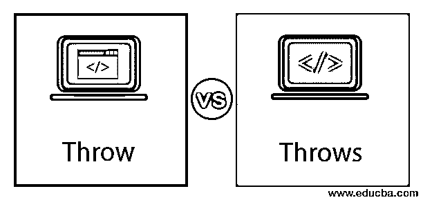
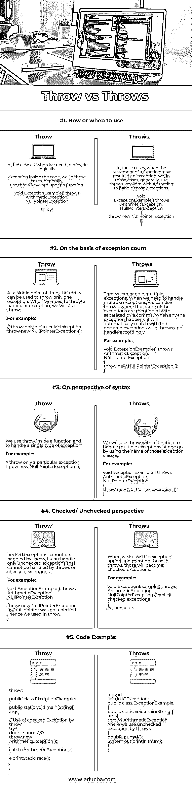

# 投掷 vs 投掷

> 原文：<https://www.educba.com/throw-vs-throws/>




## Java 中抛出和抛出的区别

异常是在 java 程序执行期间发生的事件，它基本上阻碍了代码的整体执行。有时系统会默认处理异常，但在某些情况下，我们需要根据我们的代码或情况显式地处理异常。定制方式的异常处理可以通过使用:try、catch、throw、throws 和最后的关键字来处理。当我们想要在代码中定义异常时，我们将使用抛出，而当我们想要显式定义多个异常时，我们将使用抛出。在这个主题中，我们将讨论投掷和投掷之间的比较。

### 什么是投掷？

当我们想要处理代码中任何未检查的异常时，我们将使用 throw。可以在我们的代码中使用 throw 来以显式的方式处理异常。记住，使用 throw 我们一次只能处理一种类型的异常。如果你想多次使用 throw，你需要多次使用 throw。

<small>网页开发、编程语言、软件测试&其他</small>

**语法:**

```
throw <exception_instance>
```

**举例:**

```
throw new ArithmeticException();
```

那些异常实例被要求是称为 Throwable 的下层类。这是因为，Throwable 有一个名为 Exception 的子类，所有用户定义的异常类都位于该子类下。因此，请确保您使用的异常实例是 throwable 行下的子类。

现在，让我们来理解一下用它来抛的时候程序的流程。代码将一直流下去，直到它到达 throw，在这之后，它将搜索 try-catch 块。检查 try 块以检查 catch 块中是否有任何语句，该语句提到了一个类似于该事件的异常。如果是，那么控制被转移到那个。如果没有，它将搜索下一个 try-catch 块，这将继续。假设它没有找到任何这样的 try-catch 块来处理异常，那么系统将使用默认的异常处理程序来处理异常，并且代码将被终止。

### 什么是投掷？

当我们根据经验假设一个方法可能在我们的代码中显示一些异常时，我们通过使用 throws 关键字提到所有的方法签名异常。所有的例外都会被提到，用逗号隔开。

**语法:**

```
<method_type> <method_name> () throws <excpetion_name1>, <exception_name2>
```

**举例:**

```
void ExceptionExample() throws ArithmeticException, NullPointerException
{
//code
}
```

既然你已经了解了 throw 和 throws 的作用，让我们来看看 throw 和 throws 之间的区别，如下所示:

### 投掷和投掷之间的头对头比较(信息图)

下面是 Java 中 Throw 和 Throw 之间的 5 大区别




### 投掷和投掷的主要区别

让我们来看看 java 中 Throw 与 Throws 的主要区别，如下所示:

*   当我们想在代码中定义一个异常时，我们会使用 throw。但是，当我们想要显式定义异常时，我们将使用抛出。
*   如果我们使用 throw，在检查异常的情况下，代码不能流动。当检查到异常时，可以使用 throws 进行处理。
*   语法上，我们写一个变量，比如在 throw 之后。而我们在抛出后用逗号分隔异常类。
*   我们在方法定义下使用 throw。而我们在方法的签名中声明抛出异常。
*   Throw 有一个限制，一次只能处理一个异常。另一方面，抛出可以处理多个异常。

### 投掷与投掷对比表

我们来讨论一下 Java 中 Throw 与 Throws 的顶级对比。

| **比较的基础** | **投掷** | **投掷** |
| **如何或何时使用** | 在这些情况下，当我们需要在代码内部提供逻辑异常时，我们通常会在函数下使用 throw 关键字。

```
void ExceptionExample() throws ArithmeticException,
NullPointerException
{
throw
```

 | 在这些情况下，当函数的语句可能导致异常时，我们通常在函数中使用 throws 关键字来处理这些异常。

```
void ExceptionExample() throws ArithmeticException,
NullPointerException
{
throw new NullPointerException ();
}
```

 |
| **基于异常计数** | At a single point in time, the throw can be used to throw only one exception. When we need to throw a particular exception, we will use throw.例如:

```
// throw only a particular exception
throw new NullPointerException ();
```

 | Throws can handle multiple exceptions. When we need to handle multiple exceptions, we can use throws, where the name of the exceptions are mentioned with separated by a comma. When any exception happens, it will automatically match with the declared exceptions with throws and handle accordingly.例如:

```
void ExceptionExample() throws ArithmeticException,
NullPointerException
{
throw new NullPointerException ();
}
```

 |
| **从句法的角度看** | We use throw inside a function and to handle a single type of exception.例如:

```
// throw only a particular exception
throw new NullPointerException ();
```

 | We will use throw with a function to handle multiple exceptions at one go by using the name of those exception classes.例如:

```
void ExceptionExample() throws ArithmeticException,
NullPointerException
{
throw new NullPointerException ();
}
```

 |
| **选中/未选中视角** | Checked exceptions cannot be handled by throw. It can handle only unchecked exceptions that cannot be handled by throws or checked exceptions.例如:

```
void ExceptionExample() throws ArithmeticException,
NullPointerException
{
throw new NullPointerException (); //null pointer was not checked
, hence we used in throw
}
```

 | When we know the exception apriori and mention those in throws, those will become checked exceptions.例如:

```
void ExceptionExample() throws ArithmeticException,
NullPointerException //explicit checked exceptions
{
//other code
}
```

 |
| **代码示例** | 扔:

```
public class ExceptionExample {
public static void main(String[] args)
{
// Use of checked Exception by throw
try {
double num=1/0;
throw new ArithmeticException();
}
catch (ArithmeticException e)
{
e.printStackTrace();
}
}
}
```

 | 抛出:

```
import java.io.IOException;
public class ExceptionExample {
public static void main(String[] args)
throws ArithmeticException //here we use unchecked
exception by throws
{
double num=1/0;
System.out.println (num);
}
}
```

 |

### 结论

这些是 Java 中 throw 和 throws 的区别。throw 可以让你自由地一次使用多个异常，但是 throw 不能。主要基于这种区别，如果需要一次提供多个异常，就必须使用 throws 如果您不确定，那么只需使用 throw 来逐个放置异常。

### 推荐文章

这是 Java 中 Throw vs Throws 的指南。这里我们讨论信息图和比较表的主要区别。您也可以浏览我们推荐的其他文章，了解更多信息——

1.  [Java 列表 vs 数组列表](https://www.educba.com/java-list-vs-array-list/)
2.  [JavaScript vs VBScript](https://www.educba.com/javascript-vs-vbscript/)
3.  [PHP vs JavaScript](https://www.educba.com/php-vs-javascript/)
4.  [C vs Java](https://www.educba.com/c-vs-java/)


