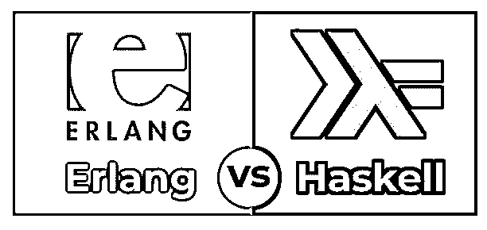
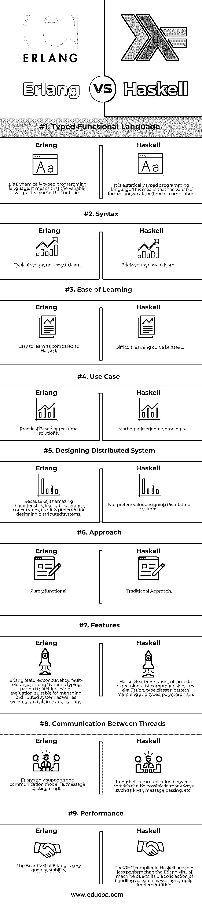

# Erlang vs Haskell

> 原文：<https://www.educba.com/erlang-vs-haskell/>

## Erlang 和 Haskell 的区别

在本文中，我们将看到 Erlang vs Haskell 的概要。在这方面，Haskell 是一种计算机编程语言。它是一种纯静态类型的函数式语言，具有模块化和多用途的本质。这种语言是以哈斯凯尔·布鲁克斯·加里的名字命名的，他在数学方面的成就是当今函数式语言发展的结果。Haskell 是一种函数式编程语言，专门用来处理列表处理和符号计算。函数式编程类似于数学中的函数；因此，它可以相加，也可以相乘，等等。作为一种函数式语言，Haskell 告诉计算机“它是什么”,而不是像其他传统语言那样问“做什么”和“怎么做”。Haskell 拥有静态类型语言，这有助于开发人员不必提及所有声明变量的类型。它也是模块化的，这使得它易于使用和成本效益。

与 Haskell 类似，Erlang 也是一种函数式编程语言，也有运行时环境。这种编程语言对健壮性、并发性和分布性有完整的支持。与其他函数式语言相关的目标也是评估表达式而不是执行命令，其中表达式利用函数来推断基本值。尽管 Erlang 是一种函数式语言，但它与 Java 有一些相似之处，因为它支持多线程的概念，并且有一个虚拟机。Java 语言专注于 Web 开发，而 Erlang 擅长健壮的服务器和嵌入式系统。Erlang 是一种开源语言，由于它能够编写健壮的程序并在网络中的分布式计算机上工作，因此被程序员广泛使用。

<small>网页开发、编程语言、软件测试&其他</small>

### Erlang 和 Haskell 的面对面比较(信息图)

下面是 Erlang 与 Haskell 的 9 大对比 **:**

### Erlang 和 Haskell 的主要区别

让我们讨论一下 Erlang 和 Haskell 之间的一些主要区别

就函数式编程语言而言，Erlang 和 Haskell 都是市场上最受欢迎的选择。让我们探讨一下 Erlang 和 Haskell 之间的一些重要区别:

1.  Erlang 是动态类型的，这意味着直到运行时才知道变量的类型。而另一方面，Haskell 是静态类型的，这意味着所有变量的类型在编译时都是已知的。
2.  Erlang 是一种实用的语言，更适合在生产系统上使用。另一方面，Haskell 是一种抽象语言，与学术和数学有关。
3.  Erlang 更适合分布式环境和开发分布式系统，因为它具有健壮性、并发性等特性。另一方面，Haskell 用于数学和科学方法的应用程序。
4.  Erlang 是一种基于字节码概念的动态类型函数语言。另一方面，Haskell 是一种纯粹的函数式编程语言。
5.  Erlang 多用于电信行业、电子商务、银行业等。，因为它专门支持设计分布式系统。另一方面，Haskell 是一种传统的编程语言，它被用于国防和航天工业、金融等领域。
6.  Erlang 的语法不好学。另一方面，Haskell 有更简洁的语法，更适合传统编程。
7.  Erlang 对于基于并发的系统来说是令人满意的。另一方面，Haskell 在并发性方面没有优势。
8.  Erlang 以其实用的方法，在开发生产系统方面很受欢迎。另一方面，尽管 Haskell 是纯动态类型的，但它不太适合开发生产系统。
9.  Erlang 具有出色的并发支持，可以在具有多个节点的分布式系统上高效运行。另一方面，Haskell 是一种纯粹的函数式编程语言，它被设计成只能在单个节点上运行。
10.  Erlang 常用于设计分布式系统，但与 Haskell 不在同一水平上。另一方面，Haskell 可以用递归定义和 lambdas 决定性地抽象和形式化语义。

### Erlang 与 Haskell 的对比表

下表总结了 Erlang 和 Haskell 的比较 **:**

| **关键因素** | **二郎** | 哈斯克尔 |
| **类型化函数语言** | 它是一种动态类型的编程语言。这意味着变量将在运行时获得它的类型。 | 它是一种静态类型的编程语言。这意味着变量形式在编译时是已知的。 |
| **语法** | 典型的句法不好学。 | 这个简短的语法很容易学。 |
| **易学性** | 与 Haskell 相比更容易学习。 | 困难的学习曲线，即陡峭的曲线。 |
| **用例** | 基于实践或实时的解决方案。 | 面向数学的问题。 |
| **设计分布式系统** | 因为它具有容错、并发等惊人的特性。，它是设计分布式系统的首选。 | 不适合设计分布式系统。 |
| **接近** | 纯功能性的。 | 传统方法。 |
| **特性** | Erlang 具有并发性、容错性、强动态类型、模式匹配、快速评估等特性，适用于管理分布式系统以及处理实时应用程序。 | Haskell features consist of lambda expressions, list comprehension, lazy evaluation, type classes, pattern matching, and typed [polymorphism](https://www.educba.com/polymorphism-in-java/). |
| **线程间的通信** | Erlang 只支持一种通信模型，即消息传递模型。 | 在 Haskell 中，线程之间的通信可以通过多种方式实现，比如 Mvar、消息传递等。 |
| **性能** | 二郎的梁 VM 稳定性很好。 | Haskell 中的 GHC 编译器提供的性能不如 Erlang 虚拟机，这是因为它在执行工作和编译器实现方面的恶劣行为。 |

### 结论

Erlang 和 Haskell 两者，各有利弊。Haskell 是纯函数式的、传统的、静态类型的、面向数学的，并且具有简洁的语法。此外，Haskell 的学习曲线很陡。它具有类似递归定义的特性，并使用 lambda 演算，这反过来有助于形式化抽象语义的使用。此外，在设计生产系统时，Erlang 比 Haskell 更受青睐，因为它具有某些特性，如容错性、并发性等。由于其特性，它也最适合于分布式系统。

### 推荐文章

这是关于 Erlang vs Haskell 的指南。在这里，我们还讨论了 Erlang 和 Haskell 的关键区别，包括信息图和比较表。您也可以看看以下文章，了解更多信息–

1.  [微处理器 vs 微控制器](https://www.educba.com/microprocessor-vs-microcontroller/)
2.  [吉拉 vs Github](https://www.educba.com/jira-vs-github/)
3.  [围棋 vs 二郎](https://www.educba.com/go-vs-erlang/)
4.  [神童 vs 神童](https://www.educba.com/wunderlist-vs-todoist/)

