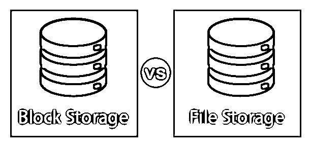
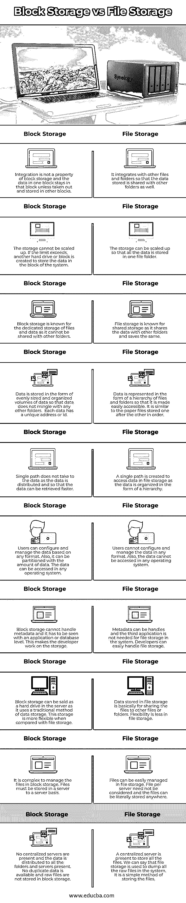

# 块存储与文件存储

> 原文：<https://www.educba.com/block-storage-vs-file-storage/>

## 块存储与文件存储的区别

块是具有字节或位序列的物理记录。块大小是指在其长度内拥有最大数量的记录。当数据像这样构造时，它就被称为在块中。数据是分块存储的，这个过程叫做分块，而提取数据的过程叫做去块。数据以分层结构存储在文件存储或基于文件的存储中。数据存储在计算机硬盘或网络连接存储设备中。多个用户可以通过不同的数据位置访问和共享相同的数据。

### 块存储和文件存储的直接比较(信息图表)

以下是块存储和文件存储的 13 大对比 **:**

<small>网页开发、编程语言、软件测试&其他</small>

### 数据块存储和文件存储的主要区别

让我们从以下几点来讨论块存储和文件存储之间的一些关键区别:

*   在[块存储](https://www.educba.com/what-is-block-storage/)中，数据存储在块中，而在文件存储中，数据存储为文件。许多块连接在一起形成一个文件。因此，几个块存储形成文件存储。这些块有一个地址，这个地址用于将数据连接到相应的应用程序。这些块最终被组合在一起。
*   大容量存储是在块存储中创建的，每个块都被视为一个硬盘。这些块由服务器控制的操作系统控制，并且如果需要格式化，可以格式化每个块，并且可以存储数据。在文件存储中，硬盘有一个协议，如 NFS 和 SMB/CIFS，在那里文件可以被访问和大量使用。
*   当比较文件存储和块存储时，文件存储简单易行，实现数据存储的步骤较少。文件存储用于网络连接系统。块存储部署在网络环境中；通常，与文件存储相比，SAN 及其实施并不容易。
*   当系统与这种类型的存储连接时，块存储会引导系统，因此系统有内存来存储数据。作为文件存储器，文件不容易被访问。文件存储具有数据不可见性，它与用户和开发人员存储在相同的位置和相同的文件夹中是一样的。
*   [虚拟机](https://www.educba.com/what-is-virtual-machine/)文件系统和特殊数据库使用块存储来存储数据，因此有点昂贵，并且需要资源来维护存储。可以创建和维护特殊的应用程序，而不会在块存储中出现安全缺陷。与块存储相比，文件存储更便宜且易于维护。我们不能在文件存储方面开发任何特殊的应用程序。
*   以块形式存储的数据可以很容易地从一个文件夹或系统传输到其他文件夹或系统，并且可靠高效。文件存储中的数据不容易传输，效率也不高。文件存储需要时间来存储数据，但它可以访问所有文件存储目录。

### 块存储和文件存储对照表

下表总结了块存储和文件存储的比较 **:**

| **块存储** | **文件存储** |
| 集成不是一个块存储属性，一个块中的数据留在那个块中，除非取出并存储在其他块中。 | 它与其他文件和文件夹集成，以便存储的数据也可以与其他文件夹共享。 |
| 存储无法扩展。如果超出限制，将创建另一个硬盘驱动器或块，以将数据存储在系统的块中。 | 存储可以扩展，以便所有数据都存储在一个文件夹中。 |
| 众所周知，块存储是文件和数据的专用存储，因为它不能与其他文件夹共享。 | 文件存储被称为共享存储，因为它与其他文件夹共享数据并保存相同的数据。 |
| 数据以大小均匀、组织有序的数据卷形式存储，因此数据不会与任何其他文件夹混杂在一起。每个数据都有一个唯一的地址或 id。 | 数据以文件和文件夹层次结构的形式表示，以便于访问。它类似于按顺序一个接一个存储的纸质文件。 |
| 由于数据是分布式的，因此不会有单一的数据路径，因此可以更快地检索数据。 | 创建单个路径来访问文件存储中的数据，因为数据是以层次结构的形式组织的。 |
| 用户可以基于任何格式配置和管理数据。此外，还可以根据数据量进行分区。这些数据可以在任何操作系统中访问。 | 用户不能配置和管理任何格式的数据。此外，任何操作系统都无法访问这些数据。 |
| 块存储不能处理元数据，必须从应用程序或数据库级别来看待它。这使得开发人员在存储上工作。 | 元数据可以是句柄，系统中文件存储不需要第三个应用。开发人员可以轻松处理文件存储。 |
| 块存储可以说是服务器中的硬盘，因为它使用传统的数据存储方法。与文件存储相比，这种存储更加灵活。 | 存储在文件存储器中的数据基本上是为了与其他文件或文件夹共享文件。文件存储的灵活性较差。 |
| 管理块存储中的文件很复杂。文件必须以服务器为基础存储在服务器中。 | 在文件存储中可以很容易地管理文件。不需要考虑每个服务器上的文件，文件可以存储在任何地方。 |
| 不存在集中的服务器，数据被分发到所有存在的文件夹和服务器。没有重复数据可用，原始文件不存储在块存储中。 | 有一个中央服务器来存储所有文件。我们可以说文件存储用于转储系统中的所有原始文件。这是存储文件的一种简单方法。 |

### 推荐文章

这是块存储与文件存储的对比指南。在这里，我们讨论了块存储与文件存储的直接比较、键差异以及信息图和比较表。您也可以看看以下文章，了解更多信息–

1.  [戈 CD vs 詹金斯](https://www.educba.com/gocd-vs-jenkins/)
2.  [什么是块存储？](https://www.educba.com/what-is-block-storage/)
3.  [对象存储与块存储](https://www.educba.com/object-storage-vs-block-storage/)
4.  [反应本地本地存储](https://www.educba.com/react-native-local-storage/)

