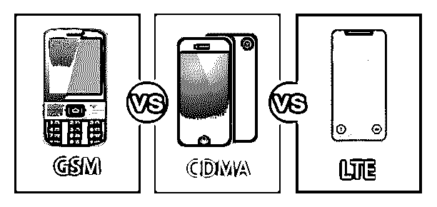
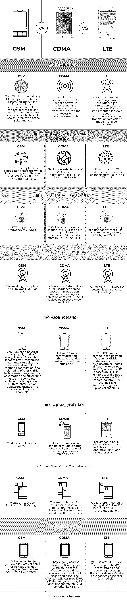

# GSM vs CDMA vs LTE

> 原文：<https://www.educba.com/gsm-vs-cdma-vs-lte/>

## GSM、CDMA 和 LTE 的区别

近年来，通信技术中无线通信的高级演进已经变得普遍。而现在，移动通信成为人类生活的重要组成部分，记录他的日常活动，准备他的待办事项，记住他的日程安排，计算他消耗和摄入的卡路里，等等。GSM、CDMA 和 LTE 移动通信技术的区别和比较将在下一篇文章中讨论。

### GSM、CDMA 和 LTE 之间的直接比较(信息图表)

以下是 GSM、CDMA 和 LTE 之间的主要对比:

<small>网页开发、编程语言、软件测试&其他</small>

### GSM、CDMA 和 LTE 的主要区别

让我们讨论一下 GSM 和 CDMA 以及 LTE 之间的一些主要区别:

#### 1.无线技术的传播

GSM 技术原理上工作在 FDMA 和 TDMA。时隙被分成八个，并且具有唯一的载波频率，该载波频率是通过 GSM 连接建立的。GSM 用户已经给出了具有时隙的单载波信道来共享数据。CDMA 工作在隔离的 64 个信道上，遵循扩频技术、跳频和混合 CDMA 技术。LTE 工作在 SC-FDMA 和 OFDM 上，有相关的接入理论和信号保持器。

#### 2.无线技术的频道

GSM 具有诸如 1800 MHz 和 900 MHz 的双频带的系统频率，并被称为 GSM-900 和 DCS-1800。FDMA 将 25 MHz 分成 124 个时隙的载波频率。信道宽度校准为 200 MHz，TDMA 过程将载波频率分成 8 个时隙。824 MHz 到 894 MHz 的频率是 CDMA 提供的，灵活多变，称为 3G GSM。它也被称为宽带 CDMA。顾名思义，它拥有最大的数据容量。它需要宽信道，被称为通用移动电话系统。每个国家 LTE 的几个频率都有设定的限制。在频分双工中分配 1 到 25 个频带，而 LTE 在时分双工中从 33 到 43 个频带。

#### 3.无线技术的拓扑

GSM 具有基站子系统、用户设备和核心网络的拓扑结构。交互层位于系统需求和协作规则之间。CDMA 的体系结构由码分层构成，并在比特处理上具有最大能力。LTE 是从上一代 UMTS 发展而来的。它由生成的核心数据包组成，具有 E-UTRAN、node-B、移动管理、用户计划和接入网关八个核心组件。

### GSM、CDMA 和 LTE 对比表

让我们来看看 GSM、CDMA 和 LTE 之间的主要对比。

| **行为和身体属性** | **GSM** | **CDMA** | **LTE** |
| **描述** | GSM 被扩展为全球移动通信系统。这是一个著名的无线通信，定义了蜂窝网络的协议，并与全球四分之三的市场可以使用的手机集成。 | CDMA 被用作移动网络的扩展频谱，允许多个无线用户以替代方法传输或扩展电波。 | LTE 可以扩展为长期演进。这是一种无线宽带技术，用于高速通信。数据传输可以在手机内进行。 |
| **每个通道的带宽** | 全世界的频段分为四类。它们是 GSM 900、DCS 1800、PCS 1900 和 GSM 850。 | CDMA 的带宽信道用于分离，如 50 MHz 和 20 MHz | LTE 的支持扩展到 1 到 25 和 33 到 43 的频率信道。 |
| **频率带宽** | GSM 支持 200KHz 的频率 | CDMA 具有 1.25 MHz 的频率信道，并且它被分成 64 个代码信道。它的工作频率范围是 824 兆赫至 894 兆赫 | LTE 支持 3MHz、5MHz、10MHz、15MHz、20MHz 等八种带宽的频率。 |
| **工作原理** | GSM 的工作原理遵循 FDMA 或 TDMA | 它遵循直接序列扩频调制的 DS-CDMA。混合码分多址的跳频与检测。它是在很宽的带宽上发展起来的。 | SC-FDMA 中的上行链路和 OFDMA 的下行链路之后是 LTE |
| **架构** | GSM 具有由多个模块组成的物理层，例如前向误差、交织方法、复用、差分编码方法、调制和 GMSK 的加密。该技术由基站和用户端组成。完整的架构依赖于频分双工，分为逻辑和物理信道。 | 它遵循 3G 无线电通信方法。它提供了最大的频谱效率。 | LTE 在频分双工和时分双工上具有其完整的拓扑。它对 e-node 和 UE 起不同的作用，其中 UE 基于 SC-FDMA 进行交互，而 e-node 在 e-node B 上工作。它被分成三个信道，如传输、逻辑和物理信道 |
| **MIMO 方法** | 2*2 MIMO 之后是 GSM | 它基于通过正交频分复用获得的多径衰落的快速性。 | LTE 的标准遵循 8*8、4*4 MIMO，并且还支持协作 MIMO 和多用户 MIMO |
| **调制技术** | It works on Gaussian Minimum Shift Keying. | 调制方法在精细的代码划分上更有效，并且每个代码都用不同的密钥进行编码。 | 正交相移键控(64 QAM 和 16 QAM)之后是 LTE 调制。 |
| **用例** | 它是为音频通话、数据通话和 GPRS 实现的，提供了 SAIC、MSRD 和 VAMOS 等高级功能。 | .CDMA 方法使得多个用户能够在相同的频率上工作，并且时间分配是分配的空间频带。CDMA 上的威瑞森无线移动有自己的 sim 卡。它不能在像 AT & T 这样的 GSM 网络上运行。 | 它用于数据呼叫，并有助于 MIMO、波束成形和载波聚合，在第十版的高级版本中支持更多功能。 |

### 结论

一些移动技术应用是导航、空间探索、广播、军事应用，并且根据个人需求而个性化。但是所有移动应用背后的整合原则和真理保持不变。无论经历多少次变革，移动通信都有一些局限性，这些局限性可以在即将到来的软件更新中得到克服。

### 推荐文章

这是 GSM vs CDMA vs LTE 的指南。在这里，我们通过信息图和比较表来讨论 GSM、CDMA 和 LTE 的主要区别。您也可以浏览我们的其他相关文章，了解更多信息——

1.  Django Vs Ruby On Rails
2.  [坞站 vs VM](https://www.educba.com/docker-vs-vms/)
3.  [ITIL Vs 德沃普斯](https://www.educba.com/itil-vs-devops/)
4.  [ITIL Vs ITSM](https://www.educba.com/itil-vs-itsm/)

