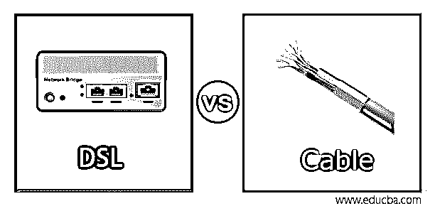
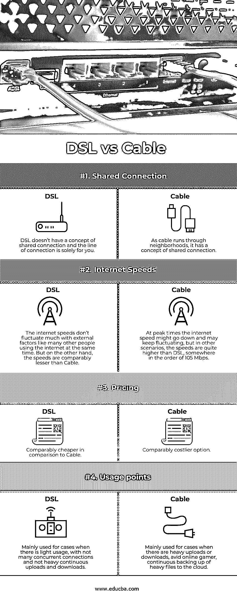

# DSL 与电缆

> 原文：<https://www.educba.com/dsl-vs-cable/>

## DSL 与电缆的区别

DSL 与电缆相比，DSL 是数字用户链路的简称。在这方面，标准的铜电话线用于运行连接到我们的家。从今以后，这很方便，因为即使我们不再使用座机，我们仍然有有线连接。因此，到达使用 DSL 的每个用户是相当容易的。即使在农村地区，DSL 连接的可访问性也已经建立，使用 DSL 调制解调器，我们可以将电话线连接到互联网，互联网服务提供商也提供出租 DSL 调制解调器，但为了节省一些现金，最好还是购买一个。在我们的童年时代，我们显然都遇到过有线电视这个词。是的，你是对的，这就是我们将要谈论的同一根电缆，只是为了适应让互联网到达你家的需要而进行了修改。在大多数情况下，我们可能会获得比 DSL 更高的速度，但在同一地区大量并行使用有线互联网时，速度也可能会大幅下降。

### DSL 与电缆的直接比较(信息图)

以下是 DSL 和电缆之间的主要比较:

<small>网页开发、编程语言、软件测试&其他</small>

### DSL 与电缆的主要区别

让我们研究一下 DSL 和电缆之间的一些重要差异:

现在，我们对 DSL 和有线互联网连接有了一个合理的理解，并对这些类型的互联网选项有了一个合理的类比，现在是时候来看看这两者之间的差异，并在需要在这两者之间做出决定时，正确设置我们的上下文和优先级。

我们要比较的第一个类型是两个候选人有共同的联系。在这种情况下，仅仅设置一个共享连接的借口就意味着相同的连接在多个订户之间共享。如果我们使用电话线的相似性，它需要是一个家庭的私有。相比之下，一条电缆可能贯穿整个街区，如果我们记得在有线电视中，我们所有的街区过去都接收相同的频道，而不管他们是否想看。因此，我们可以公平地说 DSL 是非共享连接，而 Cable 是共享连接。

第二种类型是从第一种类型延伸而来的互联网速度。在我们之前的讨论中，我们知道 DSL 不是共享连接，而电缆是共享连接，因此当很多人同时访问互联网时，电缆的网速可能会降低，可能是在晚上的黄金时间。相比之下，DSL 连接即使在黄金时间也能提供与非黄金时间相似的速度。对网速的比较还有另一种眼光。一般来说，DSL 连接的速度限制在 6-7 Mbps，而有线互联网的速度可以高达 105 甚至 150 Mbps(对于使用光纤的网络)。此外，DSL 连接有一个限制，即当一个人离开主 ISP 集线器时，速度会开始下降。

我们要看的第三种类型是定价点，如果手头紧，这基本上是我们要看的第一件事！这一点在本质上也是非常主观的，因为它在内部取决于其他因素，如您居住地区的互联网选项的可用性、您正在寻找的提供商以及需求是否已经达到饱和。但是如果我们需要在所有外部因素都相同的情况下进行比较，DSL 在价格上确实比电缆连接便宜。

最后但同样重要的是，这种类型是关于最适合这种联系的环境类型。在这种情况下，如果您的需求是轻度到中度的互联网使用，同时连接 3 个或更少的互联网，并且对预算敏感，那么您肯定应该选择 DSL。但在其他大量使用互联网的情况下，如同时进行在线游戏、将大量文件备份到云中、大数据分析用例，以及对预算不太敏感的情况下，电缆是您的首选。

### DSL 与电缆对比表

下面是对比表:

| 型 | **DSL** | **电缆** |
| 共享连接 | DSL 没有共享连接的概念，连接的线路是你一个人的 | 由于电缆穿过居民区，它有一个共享连接的概念。 |
| 互联网速度 | 网速不会像许多人同时使用互联网那样随着外部因素波动很大。但另一方面，速度相对低于电缆。 | 在高峰时间，网速可能会下降，并可能保持波动，但在其他情况下，速度比 DSL 高得多，大约为 105 Mbps。 |
| 定价 | 与电缆相比相当便宜 | 相对昂贵的选择。 |
| 使用要点 | 它主要用于使用量较轻、没有太多并发连接以及没有大量持续上传和下载的情况。 | 它主要用于有大量上传或下载、狂热的在线游戏玩家以及持续将大量文件备份到云的情况。 |

### 结论

作为总结，最终重要的是理解我们自己对互联网的真正需求，以判断最适合工作和预算友好的最佳选择。最后，如果你是一个没有太多要求的普通用户，快速上网总是 DSL 是最好的选择，但在大量使用互联网的情况下，电缆是最好的选择。

### 推荐文章

这是 DSL 与电缆的对比指南。在这里，我们讨论 DSL 和电缆之间的区别、信息图、主要区别和比较表。您也可以浏览我们的其他相关文章，了解更多信息——

1.  [调制解调器 vs 路由器](https://www.educba.com/modem-vs-router/)
2.  [什么是路由器？](https://www.educba.com/what-is-router/)
3.  [网络设备的类型](https://www.educba.com/types-of-network-devices/)
4.  [计算机网络的类型](https://www.educba.com/types-of-computer-network/)

