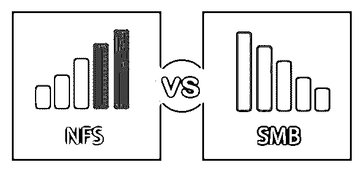
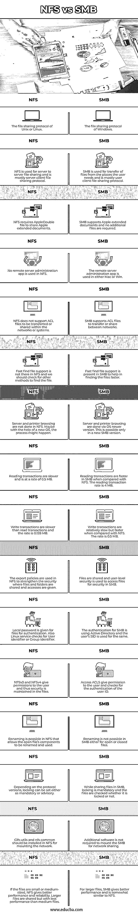

# NFS vs 中小企业

> 原文：<https://www.educba.com/nfs-vs-smb/>

## NFS 与中小企业的区别

在本文中，我们将看到 NFS 与中小企业的概述。网络文件系统或 NFS 是一种文件共享协议，由 Sun Microsystems 于 1984 年推出。它允许拥有系统的用户访问网络中共享的文件。这些文件就像本地文件一样存储，并以相同的方式访问。开放网络计算远程过程调用是 NFS 使用的协议。服务器消息块(SMB)或通用 Internet 文件系统是客户端和服务器在网络中共享文件、打印机和其他资源的通信协议。其他协议也用于进程间的通信。SMB 是 IBM 在 1983 年开发的。

### NFS 与中小企业的直接比较(信息图表)

以下是 NFS 与中小企业的 16 大对比 **:**

<small>网页开发、编程语言、软件测试&其他</small>

### NFS 与中小企业的主要区别

让我们从以下几点来讨论 NFS 与中小企业之间的一些关键区别:

*   Windows 文件共享通常通过 SMB 实现，Linux/Unix 文件共享通过 NFS 实现。虽然 NFS 可以部署在 windows 服务器上，但 NFS 允许 Linux 和 Windows 与其他系统或网络共享文件。如果 NFS 安装在 Linux 中，windows 文件也可以使用 NFS 系统共享。
*   SMB 需要名为 Samba 的附加软件来访问 Linux/Unix 文件，而 NFS 共享 windows 文件不需要附加文件。但是，SMB 可以很好地处理 Windows 文件。
*   CMB 需要更多的文件进行通信，因此需要更多的文档才能在网络中共享文件。NFS 默默地做着它的工作，不需要许多用于交流和文档目的的文件。
*   CMB 允许在广泛的网络中共享文件，因此它的覆盖范围很大。虽然 NFS 允许在系统之间共享 Windows 和 Linux/Unix 文件，但是它的覆盖范围并不广。
*   NFS 在服务器、台式机或笔记本电脑之间是透明的。客户可以在 NFS 提前看到这个过程。SMB 不透明，不考虑文件共享的透明性。
*   NFS 允许用户在 NFS 的网络和协议的帮助下，通过用户的系统更新或编辑任何其他系统或位置中的文件。SMB 不允许用户编辑位于远程位置或不同系统的文件。透明度在这里起着关键作用。
*   NFS 使用 TCP/IP 协议，而 SMB [仅使用 TCP 协议](https://www.educba.com/what-is-tcp-protocol/)。大多数情况下，NFS 运行在任何版本的协议上，这取决于文件共享中使用的协议类型。此外，中小型企业和 NFS 都有文件安全方面的顾虑，并且非常重视安全性。
*   与 NFS 相比，中小型企业的客户端用户支持更高。这是由于在发达时期 NFS 的安全薄弱。现在安全性已经很发达了，可以和 SMB 相媲美。
*   NFS 更受服务器客户端的欢迎，而招商银行更受用户客户端的欢迎。这是由于两种共享协议所使用的协议造成的。

### NFS 与中小企业对比表

下表总结了 NFS 与中小企业的对比 **:**

| **NFS** | **中小企业** |
| Unix 或 Linux 的文件共享协议。 | Windows 的文件共享协议。 |
| NFS 用于服务器到服务器的文件共享，主要是一种服务器-客户端文件共享协议。 | SMB 用于从用户需要的地方传输文件，主要是一种用户客户端文件共享协议。 |
| NFS 需要 AppleDouble files 来共享 Apple extended 文稿。 | SMB 支持 Apple 扩展文档，不需要额外的文件。 |
| 在 NFS 没有使用远程服务器管理应用程序。 | 远程服务器管理应用程序可在 Mac 或 Win 中使用。 |
| NFS 不支持在网络或系统内传输或共享 ACL 文件。 | SMB 支持 ACL 文件在网络之间传输或共享。 |
| NFS 没有快速查找文件支持，我们应该检查其他方法来查找文件。 | SMB 中提供了快速查找文件支持，有助于更快地找到文件。 |
| 服务器和打印机浏览不是在 NFS 完成的。也许在新操作系统的帮助下，这个过程可能会发生。 | 服务器和打印机浏览通过操作系统更新版本完成。这只有在新的 SMB 版本中才有可能。 |
| 读取事务较慢，速率为 0.5 MB。 | 与 NFS 相比，中小型企业的读取事务处理速度更快。读取事务速率为 4 MB。 |
| 写事务比读事务慢，速率为 0.128 MB。 | 与 NFS 相比，写事务相对较慢，但速度更快。速率为 0.5 MB。 |
| 在 NFS，导出策略用于加强共享文件和文件夹以及授予访问权限的安全性。 | 在 SMB 中，文件是共享的，用户级安全性用于访问文件以获得安全性。 |
| 为文件提供本地密码以进行身份验证。此外，Linux 服务检查用户标识符或组标识符。 | SMB 的身份验证使用 Active Directory，用户的 SID 也用于此目的。 |
| NFSv3 和 NFSv4 向用户授予权限，因此文件中的安全性得到了维护。 | 访问 ACLS 向用户授予权限，并检查用户 ID 的身份验证。 |
| 重命名在 NFS 是可能的，允许打开文件的组件被重命名和使用。 | 在 SMB 中，不能对打开或关闭的文件进行重命名。 |
| 根据协议版本，锁定可以设置为强制或建议。 | 在 SMB 中共享文件时，锁定是强制性的，并且会检查文件是否锁定。 |
| 为了安装网络，应在 NFS 安装 CIFS 公用电话和 NFS 公用电话。 | 安装 SMB 进行网络共享不需要额外的软件。 |
| 如果文件是小型或中型，NFS 提供更好的性能和可靠性。较大的文件可以共享，但性能不如中等文件。 | 对于较大的文件，SMB 提供了更好的性能，有点类似于 NFS。 |

### 结论

最好使用平台交叉共享的业务网络，这样所有文件都可以共享，而无需检查 windows 或 Linux 操作系统。这也有助于共享相同的服务器卷。在共享和访问文件时，文件的可靠性和安全性应该是主要考虑的问题。

### 推荐文章

这是 NFS 与中小企业之间最大差异的指南。在这里，我们还将通过信息图和比较表来讨论 NFS 与中小型企业的主要区别。您也可以看看以下文章，了解更多信息–

1.  如何在你的 Linux 系统中设置 NFS？
2.  [Linux 中的 Samba 服务器是什么？|它是如何工作的？](https://www.educba.com/samba-server-in-linux/)
3.  [什么是 Linux 内核？](https://www.educba.com/what-is-linux/)
4.  [CIFS 协议概述和特点](https://www.educba.com/cifs-protocol/)

