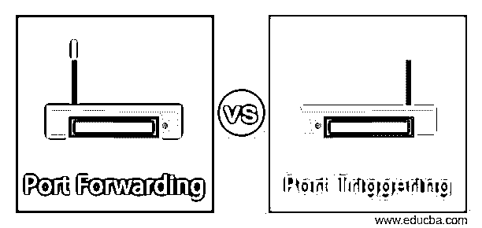
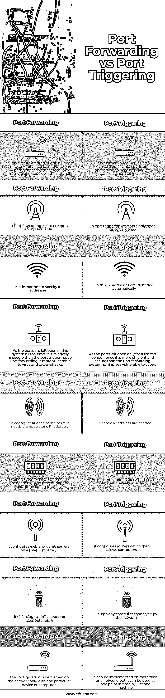

# 端口转发与端口触发

> 原文：<https://www.educba.com/port-forwarding-vs-port-triggering/>

## 端口转发与端口触发的区别

以下文章提供了端口转发与端口触发的概要。端口转发或端口映射是从一个节点上的端口到另一个节点的数据转发技术的名称。通常，从一个设备到另一个设备的数据被捕获和转移。在用户想要从远程位置访问联网的计算机或连接到互联网的服务的情况下，使用端口转发。

端口转发有许多不同的类型，例如:

<small>网页开发、编程语言、软件测试&其他</small>

*   **本地端口转发:**从一个 web 应用程序发送一个系统中的数据。为了连接到本地计算机和绕过防火墙，使用本地端口转发。
*   **远程端口转发:**支持 SSH 服务器端应用程序访问客户端资源。
*   **动态端口转发:**通过防火墙或 NAT 寻找漏洞进行转发。

端口转发模型的一种动态形式是端口触发。通常，当用户希望使用端口转发来访问多台本地计算机时，会使用端口触发。但是当应用程序必须打开不同于输出端口的输入端口时，就使用端口触发。网络管理员使用端口触发器将一个或多个端口映射到单个本地设备。

端口转发是一种将互联网流量从广域网(WAN)端口传输到另一个局域网端口(LAN)的方法。而当用户选择使用动态 IP 地址来端口转发更多计算机和其他设备而不是单个端口时，实现端口触发。

转发是非常必要的，因为它允许用户通过互联网远程访问局域网。转发数据包意味着最终用户可以穿越防火墙并在网络内连接资源。此外，这一点至关重要，因为大多数网络上都有防火墙来阻止传入端口。为了保证网络安全，防火墙会封锁这些端口。由于它使其他计算机容易受到未来的攻击，它被证明是相对危险的。另一方面，端口触发使调制解调器上的端口在给定的时间内保持打开。这就是所谓的自动转发变体或带开关的端口转发。

### 端口转发与端口触发的直接比较(信息图)

以下是端口转发与端口触发之间的 9 大区别:

### 

### 主要差异

让我们讨论一下端口转发与端口触发之间的一些主要区别:

*   端口转发是一种配置网络端口的静态方法，用于通过互联网上的远程终端节点连接的节点之间。而在端口触发中，端口仅在被触发后才打开。
*   在端口转发中，选定的端口总是可用的，指定 IP 地址很重要。这是一种端口转发的动态方法，在这种方法中，端口在需要时打开，在不使用时关闭。
*   在端口转发中，由于该系统中的端口一直是开放的，因此比端口触发相对不安全，因此端口转发更容易受到病毒和网络攻击。另一方面，由于端口只在有限的时间内开放，它比端口转发系统更高效、更安全，因此不太容易受到网络攻击。
*   在端口转发中，需要在每个端口配置一个唯一的静态 IP 地址。
*   在端口转发中，传输数据的端口在通信过程中一直是打开的。而在端口触发中，端口仅在被启用时打开固定时间。
*   端口转发方法在本地计算机上配置 web 和游戏服务器。在端口触发中，它配置路由器，然后允许计算机。
*   在端口转发中，仅使用单个管理员或计算机。在端口触发中，它使用任何连接到网络的计算机。

### 端口转发与端口触发对照表

让我们讨论端口转发与端口触发之间的主要比较:

| **端口转发** | **端口触发** |
| 这是一种配置网络端口的静态方法，用于通过互联网上的远程终端节点连接的节点之间。 | 这是一种端口转发的动态方法，在这种方法中，端口在需要时打开，在不使用时关闭。 |
| 在端口转发中，选定的端口始终可用。 | 在端口触发中，端口仅在触发后打开。 |
| 指定 IP 地址很重要。 | 在这种情况下，会自动识别 IP 地址。 |
| 由于该系统中的端口一直是开放的，因此它比端口触发相对不安全，因此端口转发更容易受到病毒和网络攻击。 | 由于端口只在有限的时间内开放，因此它比端口转发系统更加高效和安全，因此它不太容易受到网络攻击。 |
| 要在每个端口进行配置，它需要一个唯一的静态 IP 地址。 | 需要一个动态 IP 地址。 |
| 在通信过程中，传输数据的端口一直是打开的。 | 这些端口仅在启用时在固定时间内打开。 |
| 它在本地计算机上配置 web 和游戏服务器。 | 它配置路由器，然后允许计算机。 |
| 它只使用一个管理员或一台计算机。 | 它使用任何连接到网络的计算机。 |
| 仅使用一台特定的设备或计算机在网络上执行配置。 | 它可以在一个以上的网络上实现，但在一个时间点上只能由一台机器使用。 |

### 推荐文章

这是端口转发与端口触发的指南。这里我们分别讨论信息图和比较表的主要区别。您也可以看看以下文章，了解更多信息–

1.  [核心 Java vs Java](https://www.educba.com/core-java-vs-java/)
2.  [窄带与宽带](https://www.educba.com/narrowband-vs-broadband/)
3.  [C++向量 vs 数组](https://www.educba.com/c-plus-plus-vector-vs-c-plus-plus-array/)
4.  [Python class method vs static method](https://www.educba.com/python-classmethod-vs-staticmethod/)

