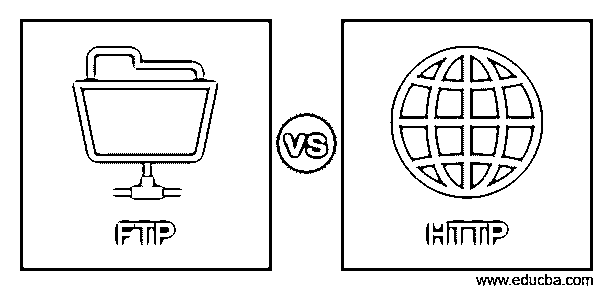
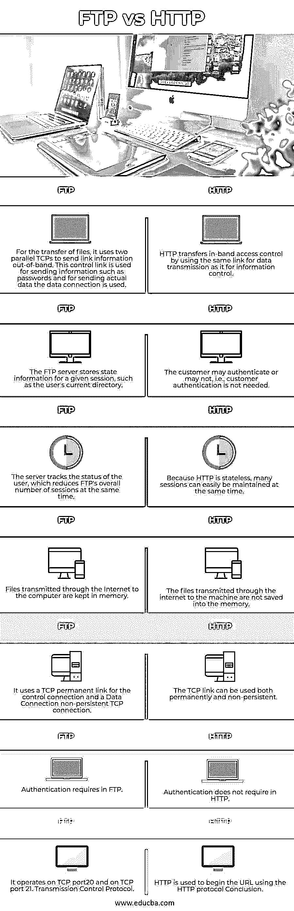

# FTP 与 HTTP

> 原文：<https://www.educba.com/ftp-vs-http/>

## FTP 和 HTTP 的区别

超文本传输协议(HTTP)和文件传输协议(FTP)是两种应用层协议，允许在两个系统之间传输文件，但两个系统之间的区别是什么——哪个工作得更好？或者，是否有更好的方法来实现这两者？请阅读学习！在这个主题中，我们将学习 FTP 和 HTTP。

### 什么是 FTP

FTP 是一种文件传输协议。它用于将文件从服务器复制到主机。将文件从一台主机复制到另一台主机时，通信主机的文件名、不同的目录结构和不同的数据表示方式可能会有所不同。FTP 解决了所有这些问题。FTP 用于在两台配置不同的主机之间共享信息。为了在客户端和服务器之间传输文件，FTP 使用 TCP 服务。FTP 建立两个连接:TCP 的端口 20 用于数据传输，端口 21 用于控制信息(命令和响应)。独立的数据和命令链接使 FTP 更加高效。控制链路有基本的通信规则，但由于传输数据的多样性，数据连接有复杂的规则。当安全不是主要问题时，就建立了 FTP

<small>网页开发、编程语言、软件测试&其他</small>

### 什么是 HTTP？

HTTP 是超文本的传输协议。它支持通过万维网获取信息。HTTP 的运行方式类似于 FTP 和 SMTP 的组合功能。与 FTP 类似，它通过 TCP 服务和 FTP 传输文件。然而，在 HTTP 中仅使用一个 TCP 链接，即数据连接，而没有单独的控制连接。在端口号 80 上，HTTP 使用 TCP 服务。HTTP 类似于 SMTP，因为 SMTP 消息看起来像客户端和服务器之间传输的 SMTP 数据。但是 HTTP 通知并不是为了让人们在 web 和 web 浏览器上阅读而设计的。而不是立即存储和转发 HTTP 消息，这与 SMTP 消息相反。客户端命令通过请求消息发送到 web 服务器。网络服务器将向所请求的材料发送回复消息。HTTP 不提供保护，而是在安全套接字层上运行以确保安全性。

### FTP 与 HTTP 的直接比较(信息图表)

下面是 FTP 和 HTTP 之间的主要区别

### FTP 与 HTTP 的主要区别

让我们讨论一下 FTP 和 HTTP 之间的一些主要区别:

*   HTTP 和 FTP 的根本区别在于 HTTP 用于访问各种互联网网站。另一方面，FTP 用于向另一台主机传输文件。
*   HTTP 仅创建数据链路，而 FTP 同时建立数据和控制连接。HTTP 高效传输网页之类的小文件，FTP 高效传输大文件。
*   在该用户的存储器中，通过 HTTP 传输到设备的网页或数据内容不会被保存，而通过 FTP 提供给设备的数据会保存在该设备的存储器中。
*   HTTP 仅创建数据链路，而 FTP 同时建立数据和控制连接。
*   FTP 有文件格式的概念，所以数据可以作为 ASCII 或二进制(或更多)传输，而 HTTP 发送二进制的东西。当在不同类型的系统之间发送文件时，FTP 还支持文本转换。

### FTP 与 HTTP 的比较表

让我们来讨论一下 FTP 和 HTTP 之间的主要比较

| **Sr 号** | **FTP** | **HTTP** |
| **1** | 对于文件传输，它使用两个并行的 TCP 在带外发送链接信息。该控制链路用于发送密码等信息，而对于发送实际数据，则使用数据连接。 | HTTP 通过使用与信息控制相同的数据传输链路来传输带内访问控制。 |
| **2** | FTP 服务器存储给定会话的状态信息，例如用户的当前目录。 | 客户可以认证，也可以不认证，即不需要客户认证。 |
| **3** | 服务器跟踪用户的状态，这同时减少了 FTP 的会话总数。​ | 因为 HTTP 是无状态的，所以可以很容易地同时维护许多会话。 |
| **4** | 通过互联网传输到计算机的文件保存在内存中。 | 通过互联网传输到机器的文件不会保存到内存中。 |
| **5** | 它将 TCP 永久链路用于控制连接，将数据连接用于非持久 TCP 连接。 | TCP 链接可以永久使用，也可以非永久使用。 |
| **6** | FTP 中需要身份验证 | 在 HTTP 中不需要身份验证 |
| **7** | 它在 TCP 端口 20 和 TCP 端口 21 上运行。传输控制协议。 | HTTP 用于开始使用 HTTP 协议的 URL。 |

### 推荐文章

这是一个关于 FTP 和 HTTP 的指南。这里我们用信息图和比较表来讨论 FTP 和 HTTP 的主要区别。您也可以看看以下文章，了解更多信息–

1.  [戈多 vs 尤尼蒂](https://www.educba.com/godot-vs-unity/)
2.  [离子 vs 共价](https://www.educba.com/ionic-vs-covalent/)
3.  [SOAP vs HTTP](https://www.educba.com/soap-vs-http/)
4.  [Figma vs Sketch](https://www.educba.com/figma-vs-sketch/)

