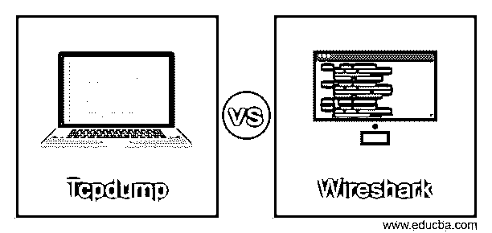
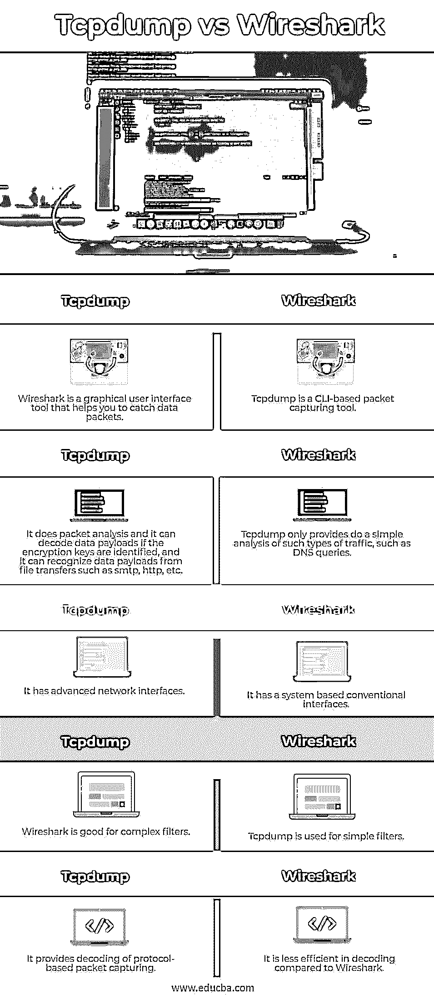

# Tcpdump 与 Wireshark

> 原文：<https://www.educba.com/tcpdump-vs-wireshark/>

## Tcpdump 与 Wireshark 的区别

**Wireshark**

Wireshark 是一个流行的网络嗅探工具，它提供 GUI 来解码许多协议和过滤器。Wireshark 是一种在网络接口上运行的网络流量监控工具。它是现在最常用的网络管理应用程序。设备运营商、网络工程师、网络安全专家以及黑帽黑客都使用 Wireshark。

<small>网页开发、编程语言、软件测试&其他</small>

**Tcpdump**

Tcpdump 也是最常用的网络分析工具之一，因为它在一个界面中提供了简单性和效率。它是一个数据包分析器，跟踪并记录网络和运行它的机器之间的 TCP/IP 流量。Tcpdump 是一个免费的开源网络实用程序，在 BSD 许可下获得许可。Tcpdump 使用命令行接口，根据所使用的命令以各种格式提供数据包内容定义。
日志分析、流量分析和数据包捕获分析对网络安全至关重要。数据包捕获和数据包处理用于分析流量。网络的流量本质上是数据包的流动。现在，能够拦截和检查这些数据包对于确定网络中哪些类型的流量应该受到保护至关重要。Wireshark & tcpdump 用于此分析。我们将会看到它们之间的区别。

### Tcpdump 与 Wireshark 的面对面比较(信息图表)

以下是 Tcpdump 与 Wireshark 之间的主要区别

### Tcpdump 与 Wireshark 的主要区别

以下是下面提到的主要区别

Tcpdump 是一个基于 CLI 的数据包捕获工具。它接受许多过滤器，并允许您通过 SSH 会话远程查看进出接口的数据包的数据。过滤器语法起初可能令人生畏，但一旦用户掌握它，它将非常有效，而 Wireshark 是一种图形用户界面工具，可以帮助您捕获(或查看捕获的捕获)进出接口的数据包，类似于 tcpdump。在分析数据包时，您可以添加过滤器来捕获和折叠您不关心的字段。此外，Wireshark 还可以帮助您分离流，例如整个 TCP 会话的聊天。

Tcpdump 最常用于基于系统的传统接口。另一方面，Wireshark 映射其他网络接口。

Tcpdump 仅提供对此类流量的简单分析，如 DNS 查询。

另一方面，Wireshark 在协议和数据包分析方面灵活得多；如果加密密钥被识别，它可以解码数据有效负载，并且它可以识别来自文件传输(如 smtp、http 等)的数据有效负载。

PCAP 是分析文件和监控网络活动的有用工具。Wireshark 和其他数据包收集软件可帮助您收集网络流量，并将其转换为人类可读的格式。此 pcap 文件可以在任何设备上创建，方法是捕获该系统上的文件，与另一个设备共享这些文件，并分析从该 pcap 文件捕获的数据包。tcpdump 和 Wireshark 都可以从文件目录中读取数据包捕获，这意味着它们可以读取 pcap 文件。

然而，在这两种工具中构造 pcap 文件的方法是不同的。

Wireshark 和 tcpdump 都使用点编码来转换源和目的 IP 地址。它显示通信的端口号。

Wireshark 和 tcpdump 会将源和目的 IP 地址转换为点编码格式。它表示通信的端口号。

默认情况下，Tcpdump 将主机地址解析为主机名，即使它执行这种点格式转换。Tcpdump 可用于与通常与该端口相连的实用程序交换端口号。(–n)flag
Wireshark 的设备协议允许根据协议及其特定字段进行有效的数据包过滤。它还支持 tcp 流或会话，这有助于我们轻松地重组和查看 tcp 会话的双方，确保您可以访问完整的双向数据交换。

### Kivy 和 Tkinter 之间的比较表

| **服务请求编号** | **Wireshark** | **Tcpdump** |
| **1** | Wireshark 是一个图形用户界面工具，可以帮助您捕获数据包。 | Tcpdump 是一个基于 CLI 的数据包捕获工具。 |
| **2** | 它进行数据包分析，如果加密密钥被识别，它可以解码数据有效负载，并且它可以识别来自文件传输(如 smtp、http 等)的数据有效负载。 | Tcpdump  only provides do a simple analysis of such types of traffic, such as DNS queries. |
| **3** | 它有先进的网络接口 | 它具有基于系统的传统接口 |
| **4** | Wireshark 适用于复杂的过滤器 | Tcpdump 用于简单的过滤器。 |
| **5** | 它提供基于协议的数据包捕获的解码。 | 与 Wireshark 相比，它的解码效率较低。 |

### 结论

虽然 Wireshark 在效率上似乎比 tcpdump 更好，但 tcpdump 更适合用于快速和基于速记的数据包捕获。tcpdump 的性能精度最适合快速扫描和数据包捕获。另一方面，Wireshark 总是复杂扫描的首选。所以在本文中，我们看到了 Wireshark 和 Tcpdump 之间的差异。您可以根据自己的需求选择任何一种。我们希望这篇文章对您有所帮助。

### 推荐文章

这是 Tcpdump vs Wireshark 的指南。在这里，我们通过信息图和比较表来讨论 Tcpdump 与 Wireshark 的主要区别。您也可以看看以下文章，了解更多信息–

1.  [OpenGL vs DirectX](https://www.educba.com/opengl-vs-directx/)
2.  [MyBatis vs Hibernate](https://www.educba.com/mybatis-vs-hibernate/)
3.  [Minitab vs SPSS](https://www.educba.com/minitab-vs-spss/)
4.  [Figma vs Sketch](https://www.educba.com/figma-vs-sketch/)

