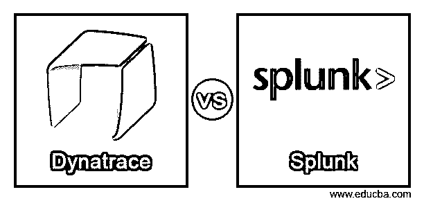
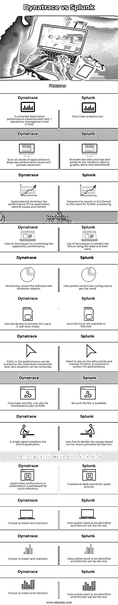

# Dynatrace 与 Splunk

> 原文：<https://www.educba.com/dynatrace-vs-splunk/>

## **Dynatrace 与 Splunk** 的区别

Dynatrace 是一款强大且根深蒂固的应用性能监控工具(APM)。它能够通过与应用程序平台集成来生成关键的 APM 数据。它在每个用户级别、数据库级别、代码级别收集性能数据，并与收集的其他指标、日志和元数据一起进行分析，以便为性能问题提供实时解决方案。

Splunk 是一款强大的数据分析工具。它分析输入其中的日志和其他应用程序性能数据，并将结果以生动的仪表盘形式呈现给用户。它在应用程序性能监控方面缺乏 Dynatrace 的深度和穿透力。仪表板、日志监控和基本服务器监控是 Dynatrace 和 Splunk 之间重叠的 3 项功能。让我们在本文中详细分析这些工具的功能。

<small>网页开发、编程语言、软件测试&其他</small>

#### Dynatrace

**组织:【2005 年由 Dynatrace Software GmpH 在奥地利成立。它的第一个成熟的 APM 产品是以它在初期收购的一家公司 Compuware 命名的。2014 年，产品名称更改为 Dynatrace，并成为 APM 工具领域的强势参与者。软件智能是该工具的 USP，它提供 APM、云基础设施监控、it 运营中的机器学习和用户体验(UX)管理方面的软件服务。**

**产品**

*   托管服务和软件即服务(SaaS)–Dynatrace
*   应用性能监控–app mon
*   监控云基础架构
*   使用 ML-ai ops 管理 IT 运营
*   用户监控和管理 IOT，移动应用–数字体验管理

#### Splunk

**组织:**一家总部位于旧金山的跨国公司，专门从事大数据分析、监控和搜索运营领域的软件开发。Splunk 以索引的形式捕获机器生成的数据，而不将其存储在数据库中，并分析实时数据以生成警报、仪表盘、报告、图形和视觉效果。它从收集的数据中诊断问题，并为企业提供情报。该工具能够管理应用程序，遵守应用程序中的安全性和合规性要求，并提供令人印象深刻的分析。IT 部门和关键业务用户都使用这些见解

**产品**

1.  通过与应用程序/物理设备接口的标准 API 收集机器生成的数据，并分析大数据以生成见解。–核心 Splunk 产品
2.  从收集的关于身份管理、恶意软件、端点、网络、访问和漏洞的安全功能的大数据中提取洞察力——Splunk 企业安全(es)和安全信息和事件管理(SIEM)
3.  交钥匙基础上的托管服务–Splunk Strom
4.  Hadoop 数据分析工具——Hunk
5.  适用于中小型 IT 环境的 Splunk 核心产品的轻型版本
6.  Splunk 与谷歌云平台产品的集成
7.  威胁分析–针对勒索软件的 Splunk 洞察
8.  从 IIOT 设备收集信息并生成关键警报–Splunk 工业资产智能

### Dynatrace 与 Splunk 之间的直接比较(信息图表)

以下是 Dynatrace 与 Splunk 之间的 12 大区别:

### Dynatrace 与 Splunk 的主要区别

以下是 Dynatrace 与 Splunk 之间的主要区别:

#### Dynatrace

*   提供完整的应用性能管理解决方案。
*   端到端管理应用程序的所有功能。
*   自动测量应用或微服务的性能。
*   对用户可用的所有应用程序堆栈的完全可见性有助于提高性能。
*   任何问题的调试和根本原因分析涵盖了应用环境的整个拓扑结构，从网络、计算设备、应用到第三方接口软件。
*   广泛使用人工智能技术来预测性能故障，并向用户发出预警警报
*   易于安装/维护配置。整个操作由一个代理管理。
*   具有外部应用程序的用户友好界面。

#### Splunk

*   基本上是一个数据分析工具。它分析数据，将日志输入其中，并在实时模式下提供令人印象深刻的使用见解。交付件采用报告/仪表板/图表/警报形式。
*   实时呈现给用户的即时结果减少了对问题进行故障排除的时间，并快速找到解决方案。Splunk 的输出还有助于进行根本原因分析并永久解决问题。
*   建立人工智能技术来分析数据，以达到可预测的结果。
*   该工具为获取特定数据提供了广泛的搜索工具。
*   处理所有格式的数据
*   方便用户使用数据点增强应用程序的性能。
*   它创建了一个丰富的数据存储库供将来使用
*   加快应用程序开发。
*   提供灵活的实时监控工具
*   为所有类型的用户提供足够的业务数据点以实现高效运营。

### Dynatrace 与 Splunk 对比表

Dynatrace 与 Splunk 的比较如下:

| **Sr 号** | **Dynatrace** | **Splunk** |
| **特性** |
| One | 完整的应用性能测量和 IT 运营管理工具(ITOM)。 | 纯数据分析工具 |
| Two | 扫描所有应用程序堆栈，以诊断性能问题并提供解决方案。 | 分析数据和日志，并在报告、图表、警报和控制面板中呈现结果 |
| Three | 自动监控应用程序的性能，发现问题并进行纠正。 | 将结果以 GUI 格式呈现给用户以供进一步处理 |
| **监控** |
| Four | 使用人工智能技术监控应用程序性能。 | 使用人工智能技术，利用数据预测故障并提醒用户 |
| Five | 监控包括软件和硬件两个方面。 | 数据点需要根据需要进行配置。 |
| Six | 具有实时监控用户的功能。 | 这种功能在该工具中不可用。 |
| Seven | 性能中的小故障可以跟踪到代码级、事务级，并且情况可以得到纠正。 | 需要依靠数据点和手动直觉来校正性能。 |
| Eight | 数据库和 SQL 也可以作为 APM 的一部分进行监控。 | 没有这样的设施。 |
| Nine | 单个代理监控整个应用程序 | 用户必须根据该工具提供的结果来决定课程。 |
| **性能、安装和维护** |
| Ten | 应用程序性能显示在仪表板中，以供快速参考。 | 令人印象深刻的快速行动仪表板 |
| Eleven | 易于安装和维护 | 需要识别数据点，剩下的工作将由这个工具来完成。 |
| Twelve | 监控数据存储在 Dynatrace 服务器中 | 数据存储为索引 |

### 结论

Dynatrace 是一个自动化的独立应用程序监控工具，最受用户欢迎。虽然 Dynatrace 在应用程序监控领域与 Splunk 竞争，但它们可以在某些环境中合作，例如 Dynatrace 可以为 Splunk 发送数据以进行分析并为业务提供见解。

### 推荐文章

这是 Dynatrace 与 Splunk 的对比指南。在这里，我们还将通过信息图表和比较表来讨论 dynatrace 与 Splunk 的主要区别。您也可以看看以下文章，了解更多信息–

1.  [相扑逻辑 vs Splunk](https://www.educba.com/sumo-logic-vs-splunk/)
2.  [AppDynamics vs Dynatrace](https://www.educba.com/appdynamics-vs-dynatrace/)
3.  [Dynatrace 的竞争对手](https://www.educba.com/dynatrace-competitors/)
4.  [Icinga vs Nagios](https://www.educba.com/icinga-vs-nagios/)

