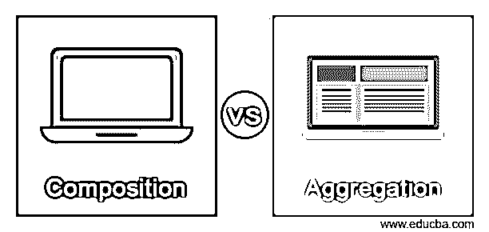
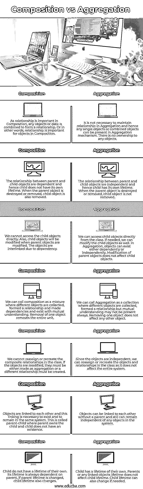

# 组合与聚合

> 原文：<https://www.educba.com/composition-vs-aggregation/>

## 组合与聚合的区别

组合和聚合是任何编程语言中都会用到的概念。组合解释说，在一个关系中，没有对象可以单独存在，每个对象都依赖于父对象。如果父对象被销毁，则合成中同一类中的子对象也会被销毁。聚合描述了相反的情况，即任何对象都可以在没有父对象的情况下单独存在。对象独立于父对象，因此即使关系不存在，对象也不能被销毁。组合是关联的一部分，但与聚合相比，它以不同的方式描述了这种关系。

### 组合与聚合的直接比较(信息图)

以下是合成与聚合之间的 7 大区别:

<small>网页开发、编程语言、软件测试&其他</small>

### 合成与聚合的主要区别

合成与聚合之间的主要区别如下:

*   借助例子可以最好地解释这种关系。人体有不同的部分，如心脏、肺、肝脏和大脑。当人体被摧毁时，整个部分也被摧毁。没有这些部分中的任何一个，人体就不能独立生存。这种关系叫作文。最初是说人体有心脏，人体有肺等等。这种“有-有”的关系叫做聚合。心脏与人体的关系叫做聚合。我们也有一对多的关系，我们可以说人体有两只眼睛。聚合可以是一对一、一对多、多对一的关系。
*   当我们在程序中定义一个类时，复合对象应该保持在同一个类中，如果两个不同的类都是独立的，那么它们之间就不能建立关系。对象应该保持在相同的范围和相同的系统中。聚集对象可以在单个类中，也可以在不同的类中，因为它不改变对象的关系。对象应该在相同的范围内，但不一定在相同的对象系统上，如这里所解释的类。
*   空菱形用来表示成分。带有实心菱形的箭头表示父实体与子实体之间的关系。聚合由空心菱形表示。指向子对象的空心菱形箭头表示父对象和子对象的关系，其中子对象是独立的。
*   合成和聚合的关系都可以这样来总结。当聚合提供“有”关系时，组合提供“部分”关系。因此，聚合适用于汽车的部件，我们可以说汽车有四个轮子或汽车有一个引擎。但是不能用聚合指定工作或操作。当我们说车轮或发动机是汽车的一部分时，没有车轮或发动机，汽车就不能行驶。这就是构图。他们不是一个独立工作的实体。组合解释了对象的所有者，并将父对象的各个部分描述为一个实体。
*   组合和聚合都属于关联，这是对象描述彼此之间关系的一个类别。由于对象关系是依赖的，组合具有强关联，而聚集由于关系中的独立性而具有弱关联。
*   组合和聚合的关系是不同的。在构图中，父母拥有孩子，如果父母不在场，孩子对象就不存在。而在聚合中，这种关系可能存在，也可能不存在。如果这种关系存在，那么父母就和孩子有关系，没有所有权。

在编程语言中，关系在类中很重要，无论是组合还是聚合。这两种关系都有助于构成一个成功输出的整个程序。我们可以与其他类共享对象，并在聚合中将任务重新分配给它们，因此对于每个关系，需求应该是相对的。

### 构成与聚集比较表

组成与聚集之间的比较如下:

| **构图** | **聚合** |
| 关系在组合中很重要，任何对象或数据都组合在一起形成关系。或者换句话说，关系对于构图中的物体很重要。 | 没有必要在聚合中维护关系，因此任何单个对象或组合对象都可以出现在聚合机制中。没有任何对象的所有权。 |
| 父对象和子对象之间的关系是依赖的，因此子对象没有自己的生存期。当父对象被销毁或移除时，子对象也被移除。 | 父对象和子对象之间的关系是独立的，因此子对象有自己的生存期。当父对象被销毁或移除时，子对象不会被移除。 |
| 我们不能直接访问子对象。此外，当父对象被修改时，子对象也将被修改。这些对象由于依赖关系而相互链接。 | 我们可以直接从类中访问子对象。如果需要，我们也可以修改子对象。在聚合中，对象可以相互依赖或独立存在。父对象的修改不会影响子对象。 |
| 我们可以将不同的对象收集在一起，形成一种关系，并在相互理解的情况下依赖和存在，这样的组合称为混合物。移除一个对象会移除整个单元。 | 我们可以称聚合为一个集合，其中不同的对象聚集在一起，形成一种关系，但相互理解可能并不总是存在。移除一个对象不会影响任何其他对象。 |
| 我们不能重新分配或重新创建类中的复合关系。如果修改了对象，则必须将它们作为聚合，或者必须创建不同的关系。 | 由于对象是独立的，我们可以重新分配或重新创建类中的对象和关系，因为它不会影响整个系统。 |
| 对象是相互联系的，这种联系是存在并保持在同一系统中所必需的。这就是所谓的亲子关系，父母拥有孩子，而孩子并不存在。 | 对象可以在没有父对象的情况下相互链接，并且仍然可以独立于系统中的任何对象。 |
| 孩子没有自己的一生。它的生存期总是依赖于父代。如果父生存期更改，子生存期也会更改。 | 孩子有属于自己的一生。父对象或任何链接对象的生存期不影响子对象的生存期。如果需要，子生存期也可以更改。 |

### 推荐文章

这是一个关于组合和聚合的指南。在这里，我们还将通过信息图和比较表来讨论组合与聚合的主要区别。您也可以看看以下文章，了解更多信息–

1.  [UML 聚合与组合](https://www.educba.com/uml-aggregation-vs-composition/)
2.  [什么是混合云？](https://www.educba.com/what-is-hybrid-cloud/)
3.  [Java 中的作文](https://www.educba.com/composition-in-java/)
4.  [C++聚合](https://www.educba.com/c-plus-plus-aggregation/)

