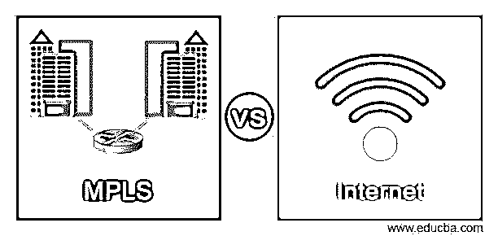
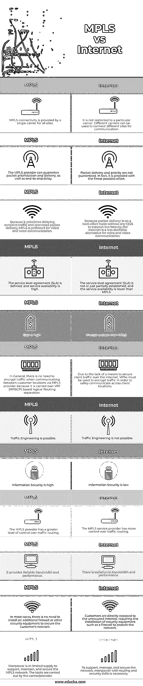

# MPLS 与互联网

> 原文：<https://www.educba.com/mpls-vs-internet/>

## MPLS 与互联网的区别

MPLS 和 Internet 是客户在企业的多个位置检查连通性的两个核心选项。虽然 MPLS 连接是一种安全和非常可靠的方案，但费用很高，因特网是另一种企业可能研究的低成本选择，尽管它有某些缺点。MPLS 以及互联网网络实现了跨站点的全网状通信，允许每个位置通过 MPLS 或互联网连接到每个其他位置，允许站点到站点的直接联系。MPLS 和 Internet 网络都可以在各种第 1 层介质上终结，包括 T1、以太网、DSL、无线、电缆和光纤。

### MPLS 与互联网的直接比较(信息图表)

以下是 MPLS 与 Internet 之间的 12 大区别:

<small>网页开发、编程语言、软件测试&其他</small>

### MPLS 与互联网的主要区别

MPLS 与 Internet 之间的一些关键区别是:

*   MPLS 连接由一个运营商为所有站点提供。而在互联网上，它不限于特定的运营商。不同的运营商可以用来连接不同的站点进行通信。
*   MPLS 提供商可以保证数据包的优先级和传送，以及端到端的延迟。另一方面，在互联网上，包的传递和优先级没有保证。事实上，我们尽了最大努力。
*   由于 MPLS 优先延迟敏感流量并促进数据包传输，因此它是视频和语音通信的首选。然而，因为分组传送是基于尽力而为的，没有任何 QOS 来支持低延迟，所以因特网不是语音和视频通信的理想选择。
*   在 MPLS 中，定义了服务等级协议(SLA)，服务可用性高。而在互联网上，服务水平协议(SLA)没有建立或只是部分建立，服务可用性低于 MPLS。
*   MPLS 的成本高，互联网的成本比 MPLS 低。
*   一般来说，当通过 MPLS 提供商在客户位置之间进行通信时，不需要加密流量，因为它是通过基于 VRF (MPBGP)的逻辑路由分离来承载的，而由于缺乏保护互联网上的客户端流量的手段，所以必须使用 VPN 来加密流量，以便安全地跨客户端位置进行通信。
*   在 MPLS 中，流量工程是可能的，而在互联网上，流量工程是不可能的。
*   MPLS 的信息安全性很高。互联网的信息安全性很低。
*   MPLS 提供商对流量路由有更大程度的控制，而互联网提供商对流量路由有更多的控制。
*   它提供可靠的带宽和性能。而带宽和性能有所不同。
*   在 MPLS 中，在大多数情况下，当客户直接暴露于不安全的因特网时，不需要安装额外的防火墙或其他安全设备来保护客户的网络，而需要安装诸如防火墙之类的安全设备来保护网络。
*   在 MPLS 中，支持、维护和保护 MPLS 网络的人力是有限的。这些任务由运营商/提供商执行，而在互联网中，要支持、管理和保护网络，具有路由和安全技能的人力是必要的

### MPLS 与互联网对比表

让我们讨论一下 MPLS 与 Internet 之间的主要比较:

| **Sr 号** | **MPLS** | **互联网** |
| One | MPLS 连接由一个运营商为所有站点提供。 | 它不限于特定的运营商。不同的运营商可以用来连接不同的站点进行通信。 |
| Two | MPLS 提供商可以保证数据包的优先级和传送，以及端到端的延迟。 | 数据包的传送和优先级没有保证。事实上，我们尽了最大努力。 |
| Three | 由于 MPLS 优先延迟敏感流量并促进数据包传输，因此它是视频和语音通信的首选。 | 因为数据包传送是基于最大努力，没有任何 QOS 来支持低延迟，所以 Internet 不是语音和视频通信的理想选择。 |
| Four | 定义了服务级别协议(SLA)，服务可用性很高。 | 服务水平协议(SLA)没有建立或只是部分建立，服务可用性低于 MPLS。 |
| Five | 成本很高 | 成本比 MPLS 低 |
| Six | 一般来说，当通过 MPLS 提供商在客户位置之间通信时，不需要加密流量，因为它是通过基于 VRF (MPBGP)的逻辑路由分离来承载的。 | 由于缺乏保护互联网上客户端流量的方法，因此必须使用 VPN 来加密流量，以便安全地跨客户端位置进行通信。 |
| Seven | 流量工程是可以的。 | 流量工程是不可能的。 |
| Eight | 信息安全性高。 | 信息安全性低。 |
| Nine | MPLS 提供商对流量路由有更大程度的控制。 | MPLS 服务提供商对流量路由有更多的控制。 |
| Ten | 它提供可靠的带宽和性能。 | 带宽和性能存在差异。 |
| Eleven | 在大多数情况下，不需要安装额外的防火墙或其他安全设备来保护客户的网络。 | 客户直接暴露在不安全的互联网中，需要安装防火墙等安全设备来保护网络。 |
| Twelve | 支持、维护和保护 MPLS 网络的人力供应有限。这些任务由运营商/提供商执行。 | 为了支持、管理和保护网络，需要具备路由和安全技能的人力。 |

### 推荐文章

这是一个关于 MPLS 和互联网的指南。在这里，我们还通过信息图和比较表讨论了 MPLS 和 Internet 的主要区别。您也可以看看以下文章，了解更多信息–

1.  [达芬奇解决 vs Filmora](https://www.educba.com/davinci-resolve-vs-filmora/)
2.  [securect vs Putty](https://www.educba.com/securecrt-vs-putty/)
3.  [回归测试 vs 冒烟测试](https://www.educba.com/regression-testing-vs-smoke-testing/)
4.  [Clojure vs Common lisp](https://www.educba.com/clojure-vs-common-lisp/)

