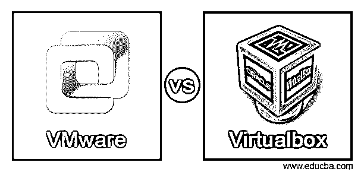
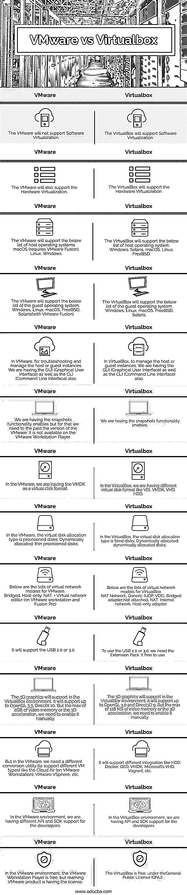

# VMware 与 Virtualbox

> 原文：<https://www.educba.com/vmware-vs-virtualbox/>

## VMware 与 Virtualbox 的区别

VMware 与 Virtualbox 之间的差异解释如下:

**什么是 VMware？**

<small>网页开发、编程语言、软件测试&其他</small>

VMware 是一个硬件虚拟化平台，支持创建新的虚拟实例。每个实例都像独立的操作系统、RAM、CPU 等一样充当独立的工作环境。但是它只共享实际的硬件资源。2019 年，VMware 在其产品中引入了一个新组件，即容器部分。它将由基础架构团队仅在虚拟机部署方面进行管理。但是在 DevOps 工作模型中，DevOps 团队将部署容器。1998 年，VMware 在加利福尼亚州的帕洛阿尔托基地成立。基本上，它是戴尔技术公司的子公司。2004 年，EMC 公司收购了 VMware。但在那之后，2016 年，戴尔技术公司将收购 EMC 公司。VMware 也在云上提供虚拟实例。根据要求，我们需要选择需要使用哪种类型的 VMware 平台。根据 VMware 平台，我们需要获得必要的许可证。出于学习和教育目的，VMware 是免费的。但出于商业目的，我们需要购买必要的 VMware 许可证。

注意:它不支持软件虚拟化平台。

**什么是 Virtualbox？**

VirtualBox 是开源软件，它将有助于虚拟化基于 x86 计算的架构。它充当管理程序。一旦软件安装完成，它将允许在基础硬件平台上创建新的虚拟实例。我们可以调用主机操作系统，在那里实际的 VirtualBox 软件将安装在操作系统上。类似地，我们可以调用客户操作系统，虚拟实例将在该操作系统上运行。在配置虚拟实例时，我们需要定义参数，如 RAM、CPU 数量、磁盘大小等。VirtualBox 运行在不同的平台上，如 Windows、Linux、Macintosh 和 Solaris 主机。同样，它也将支持不同的客户操作系统。

### VMware 与 Virtualbox 的直接比较(信息图表)

以下是 VMware 与 Virtualbox 之间的 14 大区别:

### VMware 与 Virtualbox 的主要区别

以下是 VMware 与 Virtualbox 之间的主要区别:

VirtualBox 和 VMware 之间的主要区别在于软件虚拟化。因此，VMware 无法像 VirtualBox 一样安装在现有的操作系统上。它需要一个专用的主机来安装。出于商业目的，VMware 是付费的，而 VirtualBox 是免费的。VMware 将主要用于生产支持。VirtualBox 将用于基础开发或测试前端。与 VirtualBox 环境相比，生产环境在 VMware 中的迁移要容易一些。

### VMware 与 Virtualbox 对比表

VMware 与 Virtualbox 的比较如下:

| **服务请求编号** | **虚拟盒** | **VMware** |
| One | VirtualBox 将支持软件虚拟化。 | VMware 不支持软件虚拟化。 |
| Two | VirtualBox 将支持硬件虚拟化 | VMware 也将支持硬件虚拟化 |
| Three | VirtualBox 将支持以下主机操作系统列表。Windows、Solaris、macOS、Linux、FreeBSD | VMware 将支持以下主机操作系统列表。
macOS(需要 VMware Fusion)、Linux、Windows。 |
| Four | VirtualBox 将支持以下客户操作系统列表。Windows、Linux、macOS、FreeBSD、Solaris、 | VMware 将支持以下客户操作系统列表。
Windows、Linux、macOS、FreeBSD、Solaris(采用 VMware Fusion) |
| Five | 在 VirtualBox 中，管理主机或客户实例。我们也有 GUI(图形用户界面)和 CLI(命令行界面)。 | 在 VMware 中，用于故障排除和管理主机或来宾实例。我们也有 GUI(图形用户界面)和 CLI(命令行界面)。 |
| Six | 我们启用了快照功能。 | 我们启用了快照功能，但为此我们需要购买 VMware 版本。它在 VMware Workstation Player 上不可用 |
| Seven | 在 VirtualBox 中，我们有不同的虚拟磁盘格式，如 VDI、VMDK、VHD、硬盘 | 在 VMware，我们将 VMDK 作为虚拟磁盘格式。 |
| Eight | 在 VirtualBox 中，虚拟磁盘分配类型是固定磁盘；动态分配:动态分配的磁盘； | 在 VMware 中，虚拟磁盘分配类型是调配磁盘；动态分配:精简配置的磁盘； |
| Nine | 以下是 VirtualBox 的虚拟网络模型列表。
NAT 网络，通用(UDP，VDE)，桥接适配器，未连接，NAT，内部网络，仅主机适配器， | 以下是适用于 VMware 的虚拟网络模型列表。
桥接、仅主机、NAT 虚拟网络编辑器(在 VMware workstation 和 Fusion Pro 上) |
| Ten | 要使用 USB 2.0 或 3.0，我们需要扩展包。它可以免费使用。 | 它将支持 USB 2.0 或 3.0。 |
| Eleven | 3D 图形将支持 VirtualBox 环境。它将支持 OpenGL 3.0 和 Direct3D 9。但最大 128 MB 的视频内存或 3D 加速，我们需要手动启用它。 | 3D 图形将支持 VirtualBox 环境。它将支持高达 OpenGL 3.3，DirectX 10。但最大 2GB 的视频内存或 3D 加速，我们需要手动启用它。 |
| Twelve | 它将支持不同的集成像硬盘，Docker，QED，VMDK，微软的 VHD，流浪者等。 | 但是在 VMware 中，我们需要不同的转换实用程序(以支持不同的虚拟机类型)，如 Cloud Air(在 VMware 工作站上)、VMware VSphere 等。 |
| Thirteen | 在 VirtualBox 环境中，我们为开发人员提供了 API 和 SDK 支持。 | 在 VMware 环境中，我们为开发人员提供不同的 API 和 SDK 支持。 |
| Fourteen | 在通用公共许可证(GNU)下，VirtualBox 是免费的 | 在 VMware 环境中，VMware Workstation Player 是免费的，但是 VMware 产品需要许可证。 |

### 结论

VirtualBox 和 VMware 环境都支持虚拟实例。但是 VMware 不支持软件虚拟化。因此，与 VirtualBox 环境相比，VMware 更快。VMware 是为商业目的付费的。VirtualBox 免费。对于小型开发任务，我们可以使用 VirtualBox 环境。但是对于部署和生产使用，我们需要使用 VMware 环境。

### 推荐文章

这是 VMware 与 Virtualbox 的对比指南。在这里，我们还将通过信息图和比较表来讨论 VMware 与 Virtualbox 的主要区别。您也可以看看以下文章，了解更多信息–

1.  [VMware 替代产品](https://www.educba.com/vmware-alternatives/)
2.  [Openstack 与虚拟化](https://www.educba.com/openstack-vs-virtualization/)
3.  [虚拟化技术](https://www.educba.com/virtualization-techniques/)
4.  [什么是流浪？](https://www.educba.com/what-is-vagrant/)

