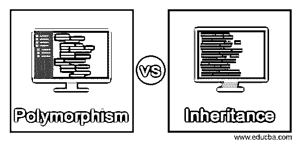
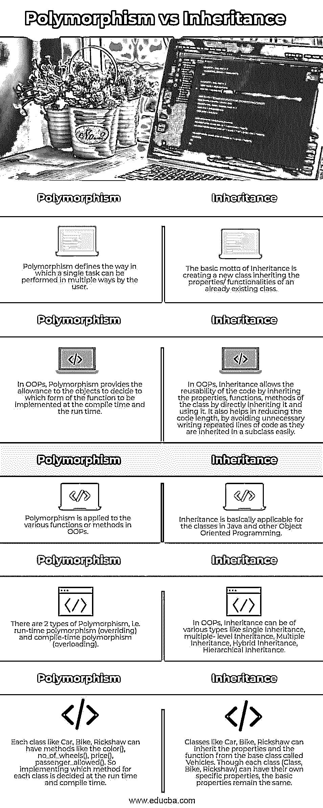

# 多态性与遗传

> 原文：<https://www.educba.com/polymorphism-vs-inheritance/>

## 多态性与遗传的区别

下面的文章提供了多态性与继承的概要。多态性是面向对象编程语言的一个重要概念，它提供了以多种方式创建函数/方法的机制，以便完成一项任务。它允许简单性、容易的代码可维护性以及处理各种场景的能力。它增加了代码长度，因为单个任务通过实现具有不同签名的方法以各种方式执行。

继承定义了代码的可重用性，其中一个类继承了已经存在的类的属性。这意味着子类(继承父类)不需要编写父类中已经存在的属性，它只需要继承它。继承减少了程序中的代码行数，因为通过继承父类可以直接重用代码。

<small>网页开发、编程语言、软件测试&其他</small>

### 多态与继承的直接比较(信息图)

以下是多态性与继承性之间的 5 大区别:

### 多态性与继承的主要区别

让我们讨论一下多态和继承之间的一些主要区别:

*   OOPs 中的继承意味着有一个子类(也称为派生类)继承基类(也称为超类)的属性。因此，当子类继承超类时，基类的所有成员也成为该子类的成员，而在多态中，“Poly”意味着“many”，“morph”意味着“forms”，因此它定义了以各种形式执行任何任务的方法。
*   OOPs 中继承的主要优点是它允许代码的可重用性。可重用性意味着程序员不需要编写一般的代码(与所有的类都一样)，而是只需要为每个类编写特定的代码。为了使用通用代码，专用类只需继承主类(基类),而多态通过提供函数具有多种形式的优势，并让函数决定在编译时和运行时调用哪种形式，从而允许简单、易于管理的代码。
*   继承允许程序员通过一个类继承另一个类并给出其属性和行为来创建类的层次结构，而多态允许用户为不同的需求创建不同的方法，并确保在调用对象类型的基础上执行正确的方法。
*   让我们借助一个例子来理解，有一个动物类具有动物的基本属性。有狗、猫、兔子等类继承了动物类，因为所有的动物都有一些共同的属性。但是 Dog，Cat，Rabbit 类可以有它们自己的特殊方法来定义它们各自的属性，这叫做继承，而在多态中，有一种方法叫做面积，计算几何图形的面积。因此，对于矩形、正方形、三角形，有不同数量的参数，就像正方形一样，有一个参数是必需的，对于矩形，长度和宽度都是必需的，对于三角形，底边和高都是必需的。因此，对于每个几何图形,“面积”方法需要以不同的方式实现。
*   多态性，它基本上有两种类型，即运行时多态性，称为方法覆盖(当一个类继承基类时，通过继承实现)，第二种是编译时多态性(当不同的方法用不同的签名在同一个类中定义时，实现)，称为方法重载，而有了继承，人们可以疯狂地根据需要创建任何级别，如单个、多个、多级、层次和混合。尽管面向对象语言 Java 不支持多重继承。
*   正如我们所理解的，当一个类继承一个已经定义的类的所有属性、特性和方法时，继承被应用于类，但是多态被应用于类的函数/方法，因为它涉及用相同的名称和不同的签名定义方法。尽管运行时多态性是通过只在类中实现继承来应用的。
*   谈到程序中的代码行，继承减少了代码行，因为子类通过继承来重用父类的代码，而在多态中，程序的总长度会增加，因为单个方法以不同的方式实现。

### 多态性与继承性对照表

让我们讨论一下多态性和继承之间的主要比较:

| **Sr 号** | **多态性** | **继承** |
| One | 多态性定义了用户以多种方式执行一个任务的方式。 | 继承的基本原则是创建一个继承已有类的属性/功能的新类。 |
| Two | 在 OOPs 中，多态性允许对象决定在编译时和运行时实现哪种形式的函数。 | 在 OOPs 中，通过直接继承和使用类的属性、函数和方法，继承允许代码的可重用性。它还有助于减少代码长度，避免不必要的重复代码行，因为它们很容易在子类中继承。 |
| Three | 多态性适用于 OOPs 中的各种函数或方法。 | 继承基本上适用于 Java 和其他面向对象编程中的类。 |
| Four | 有两种类型的多态性，即运行时多态性(覆盖)和编译时多态性(重载)。 | 在 OOPs 中，继承可以是各种类型的，如单一继承、多级继承、多重继承、混合继承、层次继承。 |
| Five | 像汽车、自行车、人力车这样的每个类都可以有像 color()、no_of_wheels()、price()、passenger_allowed()这样的方法。所以为每个类实现哪个方法是在运行时和编译时决定的。 | 像 Car、Bike、黄包车这样的类可以从名为 Vehicles 的基类继承属性和功能。尽管每个类(类、自行车、人力车)都可以有自己的特定属性，但基本属性保持不变。 |

### 结论

上面的描述清楚地解释了什么是多态和继承，以及两者之间的基本区别。多态和继承都是面向对象编程的基本概念。因此，为了编写真正的 OOPs 程序，程序员清楚地理解它们中的每一个是很重要的，因为它们都用于两个不同的目的，继承允许代码的可重用性，而多态性允许以多种方式定义一个函数。

### 推荐文章

这是多态性与继承的指南。这里我们分别讨论信息图和比较表的主要区别。您也可以看看以下文章，了解更多信息–

1.  [C 与 C++](https://www.educba.com/c-vs-c-plus-plus/)
2.  [Python class method vs static method](https://www.educba.com/python-classmethod-vs-staticmethod/)
3.  [Rust vs C++](https://www.educba.com/rust-vs-c/)
4.  [Rust vs Golang](https://www.educba.com/rust-vs-golang/)

