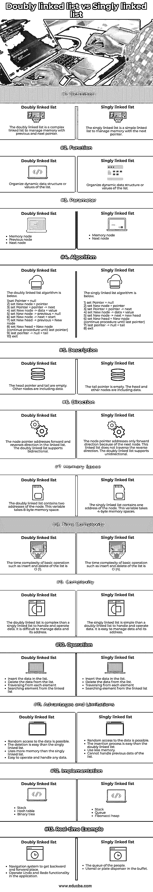

# 双向链表与单向链表

> 原文：<https://www.educba.com/doubly-linked-list-vs-singly-linked-list/>

## 双向链表和单向链表的区别

*   单链表和双链表是一种用来组织内存和信息的链表。
*   单向链表和双向链表是动态数据结构的一部分，以避免内存浪费和使用链表中的元素进行遍历。
*   双向链表是一个同时包含数据、下一个节点和上一个节点的函数。
*   单向链表是一个只包含数据和下一个节点的函数。
*   单向链表是一个简单的链表，从第一个节点单向遍历到下一个节点。
*   双向链表是一个复杂的链表，从一个节点到另一个节点来回遍历。
*   单链表包含内存和指针两部分，但是最后一个指针变成 null。
*   双向链表包含三个部分，比如前一个指针、存储节点和下一个指针，但是初始和最后一个指针变成 null。

### 双向链表和单向链表的比较(信息图)

下面是双向链表和单向链表的主要区别

<small>网页开发、编程语言、软件测试&其他</small>

### 双向链表和单向链表的主要区别

双向链表和单向链表的一些主要区别如下:

*   双向链表是双向的，因为有两个地址指针。因此，由于只有一个地址指针，单链表是单向的。
*   双向链表比单向链表占用了更多的内存空间。
*   简单的单链表，而双向链表，是一个复杂的动态数据结构的列表。
*   双向链表提供了一个空的头尾指针。因此，单链表只提供了一个空的尾部。
*   双向链表比单向链表更有效。
*   双向链表包含三个参数，单向链表包含两个参数。
*   下面给出了单链表的图像。

*   下面给出了双向链表图像。

*   双向链表的时间复杂度为 O(1)，而单向链表的时间复杂度为 O(n)。

### 对照表

*   双向链表是一个复杂的函数，而单向链表是一个简单的数据结构。
*   对照表显示了单向链表和双向链表的特性和描述。
*   下表显示了链表类型的相似之处和不同之处。

| **特性** | **双向链表** | **单链表** |
| **定义** | 双向链表是一个复杂的链表，用上一个和下一个指针来管理内存。 | 单链表是一个简单的链表，用 next 指针来管理内存。 |
| **功能** | 组织列表的动态数据结构或值。 | 组织列表的动态数据结构或值。 |
| **参数** | 

*   存储节点
*   前一个节点
*   下一个节点

 | 

*   Memory node
*   Next node

 |
| **算法** | The doubly linked list algorithm is below.1)设置指针=空2)设置新节点=指针3)设置指针=指针->下一个4)设置新节点->数据=值5)设置新节点-> previous = null6)设置新节点->下一个=开始7)设置新头->上一个=新节点

8)设置新头=新节点

(继续程序，直到最后一个指针)

9)最后一个指针-> null = tail

10)退出

 | The singly linked list algorithm is below.1)设置指针=空2)设置新节点=指针3)设置指针=指针->下一个4)设置新节点->数据=值

5)设置新节点->下一个=新头

6)设置新头=新节点(继续该过程直到最后一个指针)

7)最后一个指针-> null = tail

8)退出

 |
| **描述** | 头指针和尾指针都是空的。其他节点包括数据。 | 尾指针为空。头部和其他节点包括数据。 |
| **方向** | 节点指针在链表中正向寻址和反向寻址。双向链表支持双向。 | 因为有下一个节点，所以节点指针只寻址前向方向。这个链表不会遍历相反的方向。双向链表支持单向。 |
| **存储空间** | 双向链表包含节点的两个地址。这个变量占用 8 字节的内存空间。 | 单向链表包含节点的一个地址。这个变量占用 4 字节的内存空间。 |
| **时间复杂度** | The time complexity of basic operation such as insert and delete of the list isO (1)。 | The time complexity of basic operation such as insert and delete of the list isO (n)。 |
| **复杂度** | 处理和操作数据时，双向链表比单向链表复杂。很难管理数据及其地址。 | 单链表比双链表更容易处理和操作数据。管理数据及其地址很容易。 |
| **操作** | 

*   Insert data into the list.
*   Delete data from the list.
*   Traverse each element
*   Search for elements from linked list

 | 

*   Insert data into the list.
*   Delete data from the list.
*   Traverse each element
*   Search for elements from linked list

 |
| **优点和局限性** | 

*   Random access to data is possible.
*   It is easier to delete than single linked list.
*   Use more memory than single linked list.
*   Easy to operate and process any data.

 | 

*   Random access to data is possible.
*   The insertion process is easier than double linked list.
*   Use less memory.
*   Cannot process previous list data.

 |
| **实施** | 

*   shed
*   Hash Table
*   binary tree

 | 

*   storehouse
*   queue
*   fibonacci heap

 |
| **实时示例** | 

*   The navigation system obtains backward and forward locations.
*   Undo and redo functions in operating applications.

 | 

*   The queue of people.
*   The utensils or plates in the buffet.

 |

### 结论

*   单向链表和双向链表使应用程序变得可用、方便和易于管理。
*   单链表和双链表有助于管理和操作数据列表。

### 推荐文章

这是双向链表和单向链表的比较指南。这里我们用信息图和比较表来讨论双向链表和单向链表的主要区别。您也可以看看以下文章，了解更多信息–

1.  [Snapseed vs Lightroom](https://www.educba.com/snapseed-vs-lightroom/)
2.  [粉笔 vs Photoshop](https://www.educba.com/krita-vs-photoshop/)
3.  [Lumion vs V-Ray](https://www.educba.com/lumion-vs-v-ray/)
4.  [卢邦图诉徐本图](https://www.educba.com/lubuntu-vs-xubuntu/)

